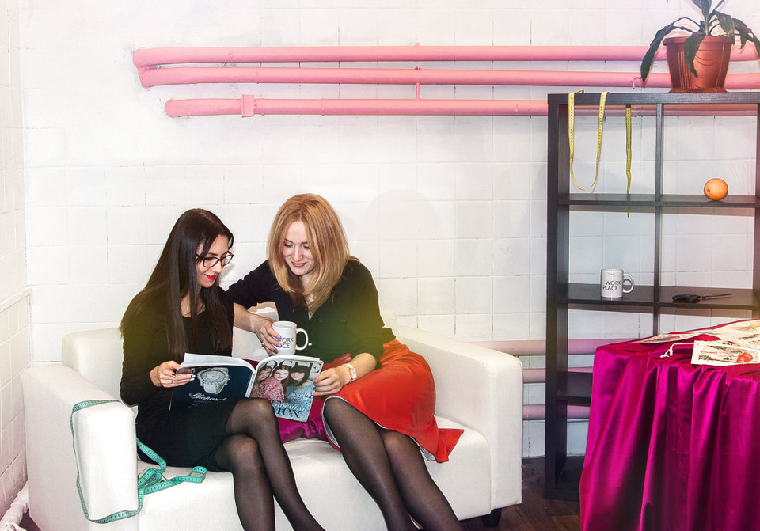

Воркплейс — это личный дом моды для дизайнеров одежды, конструкторов и портных. Именно здесь они работают над заказами своих клиентов, создают коллекции и проводят занятия по шитью.

Воркплейс оборудован всем необходимым оборудованием: здесь вы найдете бытовые и промышленные швейные машины, оверлоки, манекены, парогенератор. Рабочие места, зоны для проведения мастер-классов, большой раскройный стол и, конечно, комфортабельная примерочная созданы специально для всех тех, кто занимается шитьем.

Дизайнеры Дома моды создают новые модели, встречаются с клиентами и общаются с коллегами. В воркплейсе есть статичные и раздвижные манекены разных размеров — найти нужные формы будет в разы проще, чем дома.

Просторное и очень светлое пространство для вдохновения и творчества, невероятные проекты и яркие снимки! Рабочие зоны закрепляются за резидентами.

В доме моды есть промышленный оверлок и прямострочная машина, которыми может пользоваться каждый резидент. У этого оборудования более 3000 оборотов в минуту, — такая мощь способна дать невероятное качество вашим моделям.

Встречи с клиентами проходят в уютных примерочных.

Теперь вам, дорогие портные, нет нужды работать дома! В распоряжении резидентов воркплейса все пространство, где есть швейные машины, оверлоки, парогенератор, манекены, удобные рабочие места, раскройный стол, уборка, чай, кофе и wi-fi. А главное — уютная примерочная-шоурум для общения с клиентами.

### Как стать резидентом

Воркплейс подойдет тем мастерам, кто решил работать на себя не дома, а в специально оборудованном для этого пространстве. Сюда можно перевезти свои вещи и оборудование, используя при этом, ресурсы всего пространства. Будущий резидент воркплейса заключает договор по паспорту и ежемесячно пополняет свой баланс:

**8900 р. / месяц — постоянный абонемент** Вы можете находиться в воркплейсе с утра до вечера, принимать неограниченное количество клиентов в примерочных, привезти свое промышленное оборудование и хранить много материалов и вещей за своим закрепленным местом. Абонемент рассчитан на работу одного человека.

**80 р. / час — работа в воркплейсе по часам** Этот абонемент удобен, если вы не готовы перевезти свое рабочее место в воркплейс прямо сейчас. Для работы вы пополняете свой баланс минимум на 1000 руб., из которых будут списываться суммы за время, проведенное в «Доме моды». Вы можете использовать раскройный стол, швейное оборудование, парогенератор и, конечно, примерочные для встреч с клиентами.

**А также для резидентов:** Просторная индустриальная примерочная, большой раскройный стол, любое свободное швейное оборудование (как бытовые, так и промышленные машины), профессиональная гладильная система, доступ к интернету, возможность индивидуального оформления своего рабочего места, уборка рабочего места, чай и печенье.
