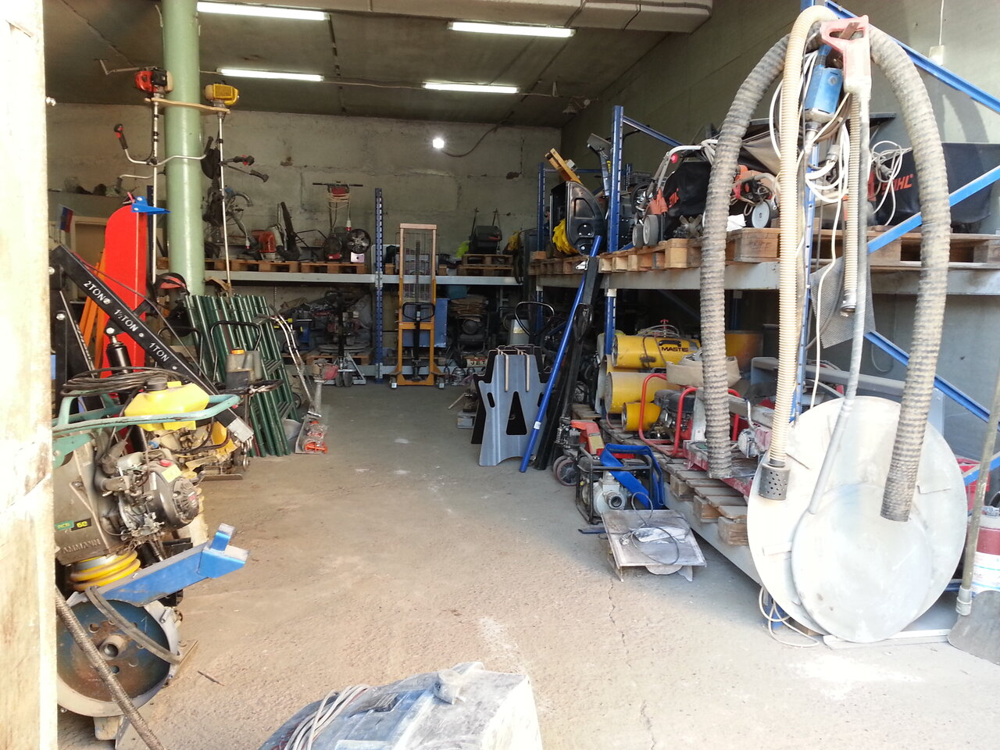

"Абама - прокат" предоставляет строительный инструмент и оборудование напрокат в Красноярске с 2009 года. За более чем 10 лет работы в прокате мы накопили большой опыт и склад инструмента и готовы предоставить нашим клиентам самые выгодные условия. На сайте prokatin.ru вы найдете полный перечень имеющегося инструмента и оборудования в наличии.

Предоставляя инструмент напрокат мы помогаем нашим партнерам:

- экономить деньги на приобретении оборудования для разовых работ
- избавляем от хлопот по ремонту и уходу за инструментом
- избавляем от затрат на аренду склада для хранения оборудования
- даём возможность воспользоваться редким и специализированным оборудованием
- поддерживаем экологическое движение по совместному пользованию вещами.

В компании "Абама - прокат инструмента и оборудования" вы можете взять в аренду строительный инструмент и оборудование на выгодных и гибких условиях.

В нашем ассортименте представлено более 100 позиций садового и строительного инструмента в прокат. Для выполнения разнообразных задач мы предлагаем качественный профессиональный инструмент и оборудование.

Прокат инструмента даёт вам возможность выполнять качественную работу даже не имея своего оборудования, при этом экономя значительные средства и время.

Что бы взять инструмент напрокат необходимо обратиться в наш офис, оформить договор и внести оговоренный авансовый платеж, все это занимает не более пяти минут.

### Для физических лиц

**Если вы решили воспользоваться услугами проката инструмента, вам необходимо:**

1. позвонить нам и уточнить наличие нужного инструмента;
2. приехать к нам в офис и оформить договор (при себе иметь паспорт с пропиской в г. Красноярске);
3. внести **авансовый платеж** за пользование инструментом, вносится даже при наличии прописки в Красноярске;
4. получить инструмент у нас в офисе.

- **Возможна аренда инструмента без документов** - авансовый платеж 100% от стоимости инструмента.
- **При заключении договора без паспорта** (по водительскому удостоверению, загранпаспорту, паспорту иностранного гражданина и тд) - авансовый платеж 50% от полной стоимости инструмента.
- **При отсутствии прописки в г. Красноярске** - авансовый платеж 50% от полной стоимости инструмента.

**Авансовый платеж** - денежные средства внесенные в счет оплаты услуг до их получения или выполнения. Возврат инструмента необходимо произвести в оговоренные договором сроки. При возврате, инструмент проверяется на работоспособность и отсутствие внешних механических повреждений. Арендатор не несет ответственности за неисправности связанные с естественным износом инструмента. Весь инструмент принадлежит арендодателю. Внесение авансового платежа не означает передачу инструмента в постоянное пользование.

### Для юридических лиц

1. позвонить нам и уточнить наличие нужного инструмента;
2. заключить договор аренды (необходимо предоставить реквизиты организации);
3. получить инструмент (требуется доверенность на получателя);
4. оплата производится после возврата инструмента.

## Каталог оборудования

- Бензорезы, штроборезы, плиткорезы
- Бетономешалки, миксеры, тачки
- Виброплиты, трамбовки, вибраторы
- Генераторы, стабилизаторы
- Домкраты, рохли, такелаж
- Дрели, шуруповерты, гайковёрты
- Измерительный, нивелиры, тепловизор
- Компрессоры, пистолеты, степлеры
- Лестницы, вышки, когти
- Мотобуры
- Обогреватели, пушки, осушители
- Перфораторы, отбойные молотки
- Пилы, лобзики, реноваторы
- Пылесосы, отпариватели, поломоечные
- Рубанки, фрезеры
- Ручной инструмент
- Садовая техника, измельчители, триммеры
- Сантехнический
- Сварочные аппараты, паяльники
- Специнструмент для автосервиса
- Шлифмашины, болгарки, затирочные машины

