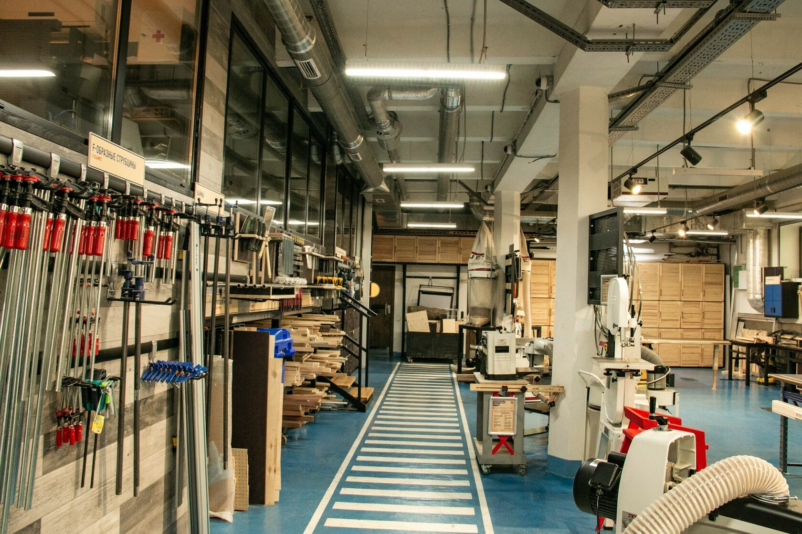
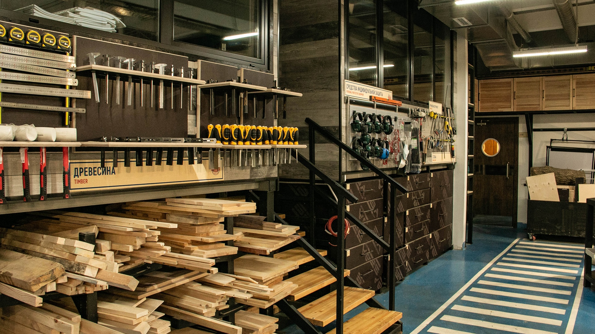
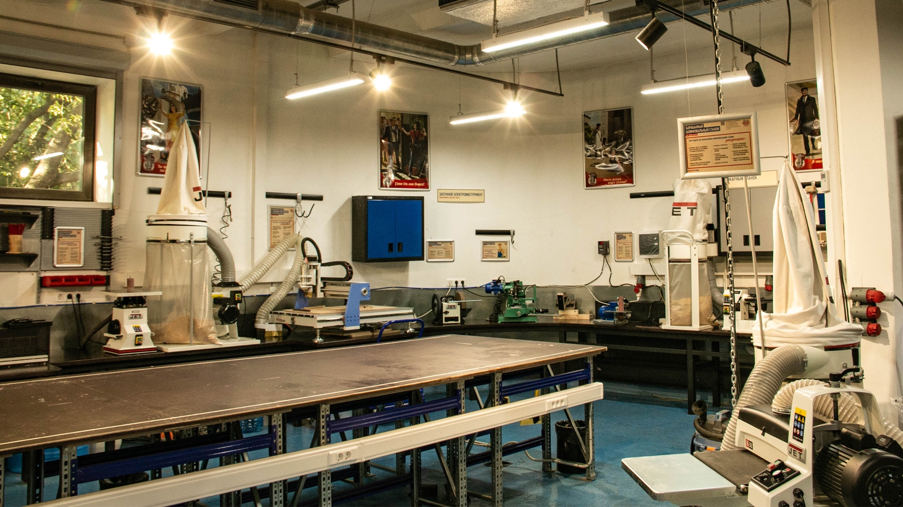
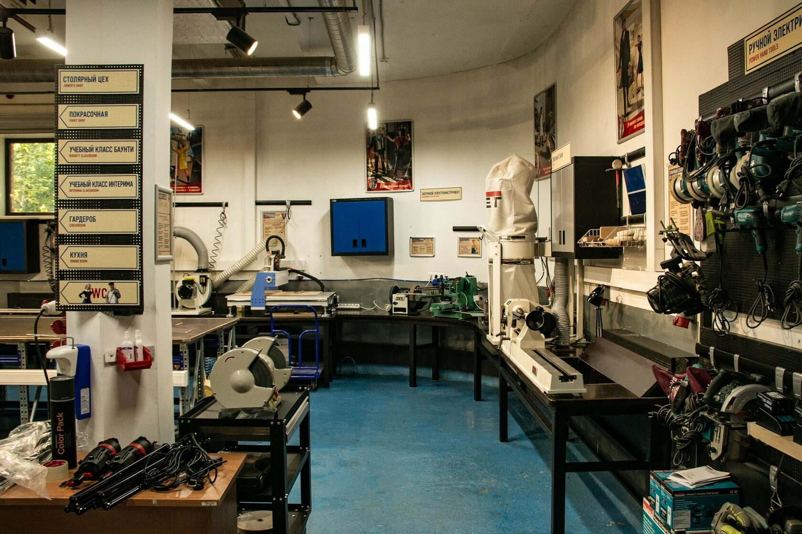
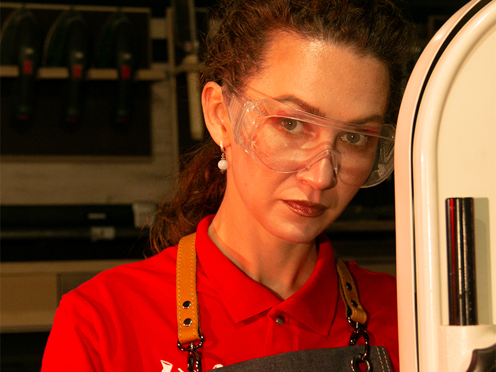
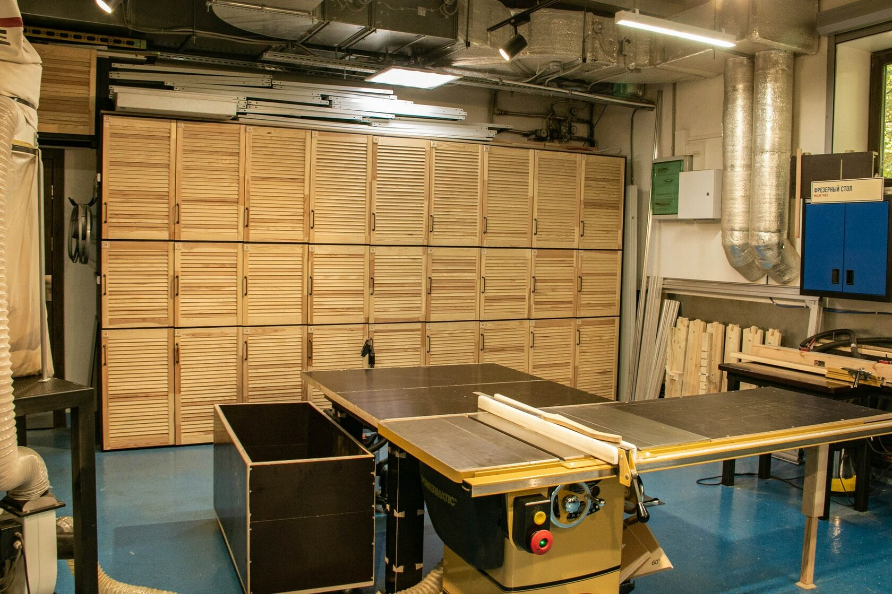
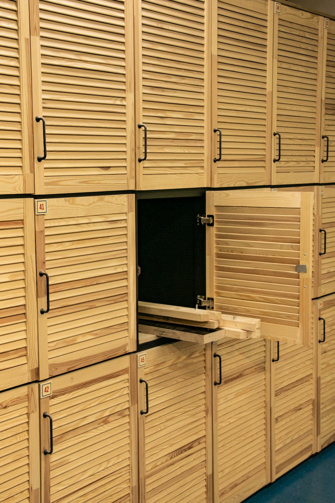

## Крафт-пространство мегаполиса

> Ремесленный центр для тех, кто хочет заниматься творчеством и делом.

1. Хранение
2. Фрезерный стол
3. Сверлильный станок
4. Шлифовально-полировальный станок
5. Ленточный шлифовальный станок
6. Токарный станок
7. Ручной электрический инструмент
8. Верстаки
9. Ленточнопильный станок
10. Фуговальный станок
11. Ручной инструмент, хранение слэбов, средства индивидуальной защиты
12. Компрессор
13. Рабочее место для покраски
14. Сушилка
15. Краскопульты
16. Настольный долбёжно-пазовальный станок
17. Тарельчато-ленточный станок
18. Торцовочно-усовочная пила
19. Осцилляционный шпиндельный шлифовальный станок
20. Фрезерный станок с числовым программный управлением
21. Заточной станок
22. Круглопильный станок
23. Рейсмусовый станок №1
24. Ленточнопильный станок
25. Барабанный шлифовальный станок
26. Заточный станок
27. Древесина, пиломатериалы, ваймы, F-образные струбцины, листовой материал

## За 1000 рублей в час вы получаете все, что необходимо:

- Все станки и оборудование
- Инструменты
- Консультации мастеров
- Гардеробная
- Комфортное пространство
- Интернет
- Уборка
- Комната отдыха
- Фотографирование без ограничений

 
## Какие еще форматы у нас есть?

- Мастер-классы и лекторий
- Хранение полуфабрикатов
- Программы для детей

## Наши наставники и мастера

### Захар Гордеев

- Закончил Московский государственный университет леса;
- Отучился в WorldSkills по специальности «Мастер производственного обучения»;
- Прошел путь от сборщика корпусной мебели до начальника производства.

---
  

### Ася Леонова

- Закончила 1-й Московский образовательный комплекс, факультет «Художественные ремесла» по специальности «Художник миниатюрной живописи»;
- Проводит тематические мастер классы и ведет кружок ИЗО у детей;
- Проходит обучение в Московском институте психоанализа по направлению «Арт-педагогика и арт-коучинг».

---

[Правила техники безопасности в мастерской](./tb/index.md)

