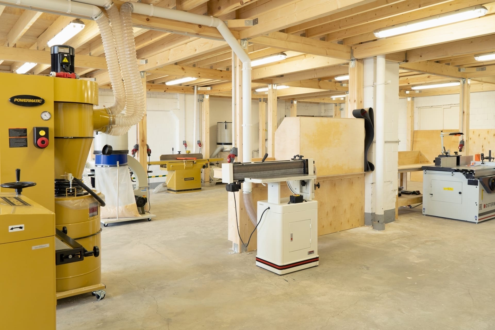
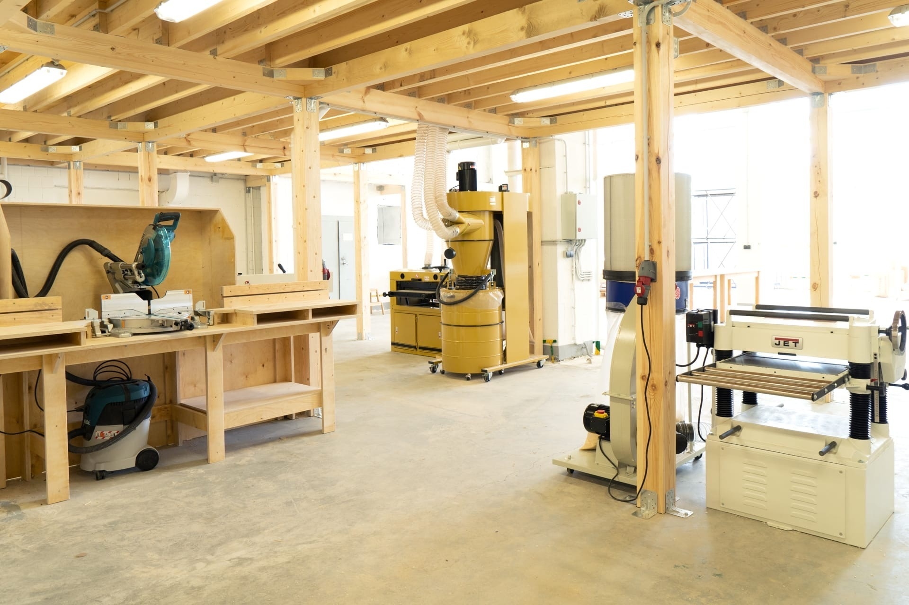
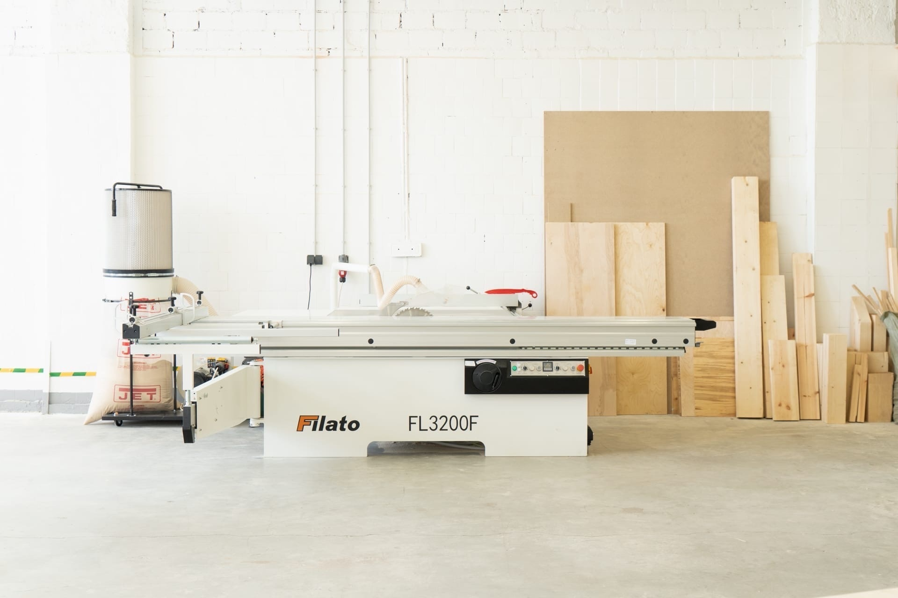
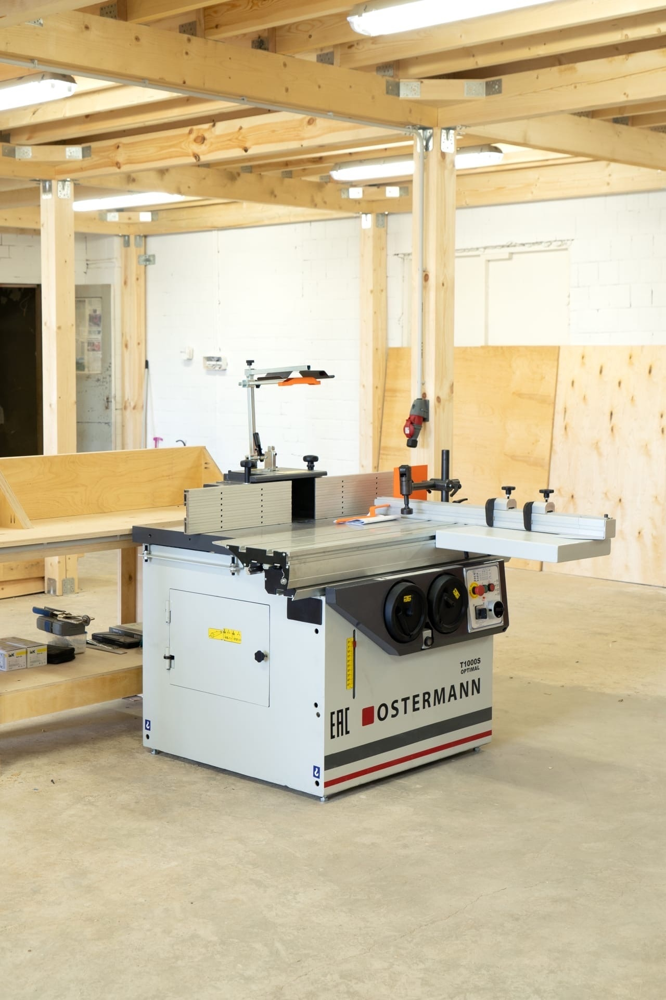
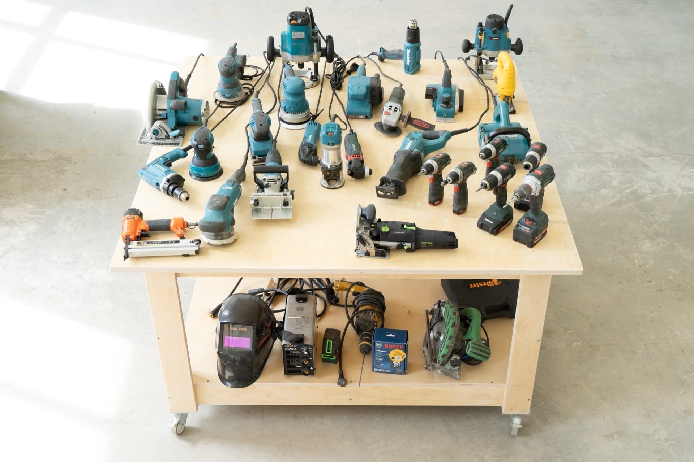

Доступ к станочному парку осуществляется после прохождения м/к.

## Наши станки:

- Форматно раскроечный станок - Filato FL 3200F;
- Станок круглопильный - WARRIOR W0702;
- Токарный станок по дереву - Record Power DML320;
- Фуговальный станок - Powermatic PJ-1285 HH;
- Рейсмусовый станок - Jet JWP-208-3;
- Шлифовальный станок - Powermatic DDS-225;
- Ленточный станок для шлифования - Jet EHVS-80;
- Осцилляционный шпиндельный шлифовальный станок - Jet JOSS-S;
- Тарельчатый шлифовальный станок - JET JDS-12X-M;
- Вертикальная ленточная пила по дереву Sabre-350;
- Фрезерный станок - Ostermann T1000;
- Вертикально-сверлильный станок BOSCH PBD 40.

