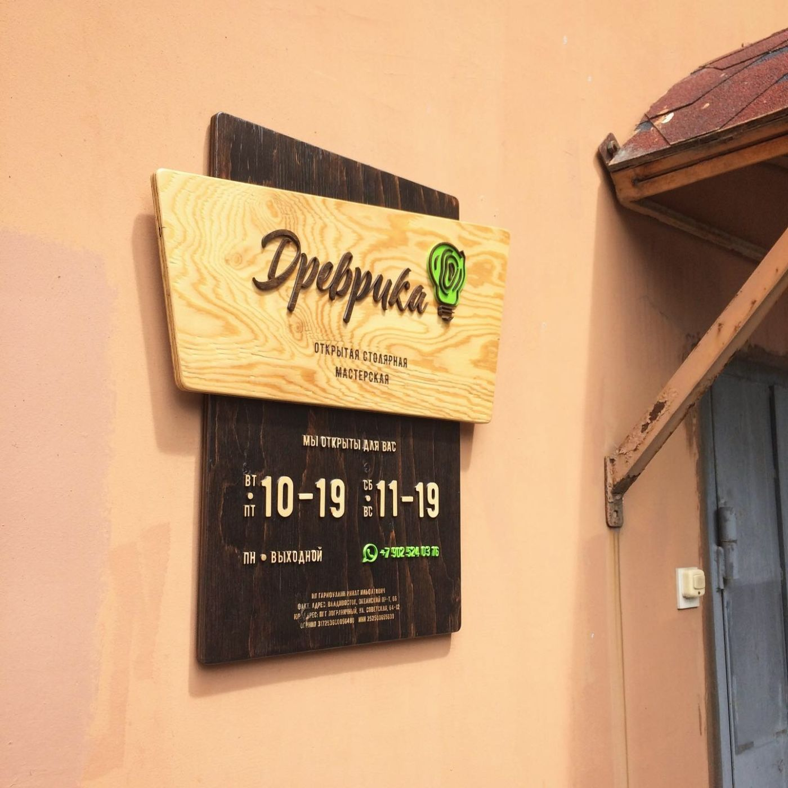
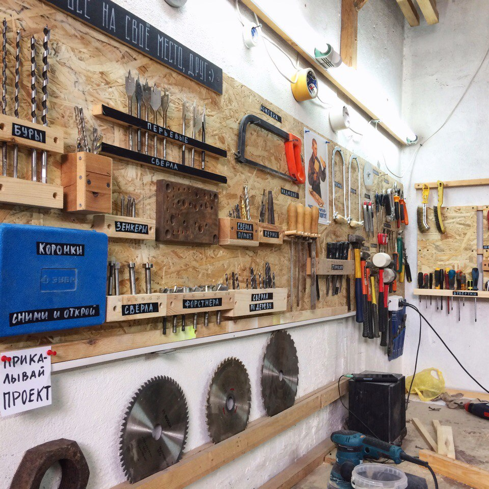

Открытая столярная мастерская «Древрика» — место для тех, кто:

- без ума от запаха дерева;
- желает найти себя в столярном деле;
- гадает, где и чем воплотить свою идею в жизнь;
- ищет, где обучить ребёнка полезным навыкам ручной работы;
- любит узнавать и пробовать новое.

Это доброе место с уютной атмосферой и морем инструментов, куда можно прийти, чтобы вдоволь напилиться, насверлиться, да и сколотить что-нибудь полезное. Опытные и обаятельные мастера вам в этом помогут.

### То место, где вы можете:

Наслаждаться запахом дерева, витающего в творческой атмосфере 2. Шуметь и пылить без звона в батареях и жалоб соседей 3. Использовать любой доступный инструмент для воплощения своей идеи 4. Найти себя в столярном деле и других промыслах 5. Вырастить из сына умелого мужчину.

Мы инструктируем каждого гостя и строго следим за соблюдением техники безопасности, учим работать с инструментами и помогаем воплотить идею в жизнь. Шкатулка, фотофон, журнальный столик, табурет и даже шкаф - всё это и многое другое осуществимо в нашей мастерской. Также вы можете отреставрировать и вдохнуть новую жизнь в старые предметы мебели и интерьера.

### C кем вы будете творить

За плечами наших мастеров-преподавателей множество смелых проектов, эффектных работ, радостных учеников и новичков-практиков. Нам в радость делиться с вами личным опытом и хитростями в современном столярном мастерстве. Мы делаем упор на дизайн и решение технических задач в творчестве, нежели на углубление в столярное дело «по-дедовски», так как время поменялось и нужны более актуальные знания для воплощения идей.
С нами вы в надёжных руках и в приятной компании ; -)

### Электроинструменты и станки:

- Распиловочный циркулярный станок Makita 2704
- Торцовочная пила Metabo KS216M
- Токарный станок Jet
- Лобзиковый станок
- Шлифовальный станок Энкор Корвет
- Электролобзики
- Фрезер 2 кВт
- Фуганок-электрорубанок Makita (до 110 мм)
- Шлифовальный станок Энкор Корвет-51
- Погружная пила
- Шуруповерты аккумуляторные
- Шуруповерт сетевой
- Дрели сетевые
- Перфоратор (ну а вдруг)
- УШМ (турбинки, болгарки)
- Шлифмашинки эксцентриковые (орбитальные)
- Шлифмашинка вибрационная
- Компрессор Metabo 24 л
- Паяльники

По ходу работы регулярно пополняем нашу коллекцию шуруповертами, дрелями и множеством ручных инструментов.

