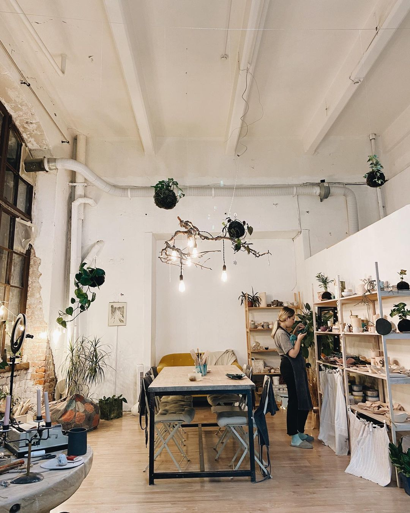

Гончарная мастерская "Глазурь", проводит мастер-классы по лепке и гончарному мастерству. У нас можно провести свидание, день рождения, корпоратив, а так же есть коворкинг для керамистов и гончарный курс для начинающих. Утильный и политой обжиг.

##### Роспись керамики (new)

В нашей студии можно не только, лепить или крутить на гончарном круге, но и расписать готовое изделие. С помощью необходимых инструментов вы сможете покрасить и декорировать свое изделие.

##### Самостоятельное творчество

Воплотите любую Вашу творческую идею в комфортных условиях оборудованной студии, где есть все необходимое оборудование и материалы для работы

##### Индивидуальное занятие с мастером

Если вы новичок и только знакомитесь с гончарным искусством, можно выбрать занятия под наблюдением мастера, который поможет Вам с изготовлением желаемого изделия

##### Занятие с мастером в группе ( свободная лепка )

Интересный формат мастер-класса по работе с глиной, который позволит не только создать собственное изделие (чашки, тарелки, блюдца, блюда и пиалы), но и найти друзей по интересам.

##### День рождения в гончарной мастерской

Если вы не знаете где отметить памятную дату (день рождения, девичник, корпоратив, 14 февраля, 23 февраля 8 марта и т.д.), а может быть у вас намечается своё мероприятие, тогда мы приглашаем вас к нам в мастерскую.

##### Романтическое свидание

Хочешь удивить свою половинку необычным подарком? Тогда приходите к нам в гончарную мастерскую на романтическое свидание. В нашей студии вы сможете создать памятную вещицу которая будет напоминать вам об этом моменте.

##### В стоимость 1 часа включено:

- 500 грамм базовой глины/базовой глазури
- Утильный или политой обжиг работ до 1 000 градусов
- Комплект необходимых инструментов и оборудования
- Чай, кофе, печенье

### Приходите с близкими, получите море эмоций от совместной работы за гончарным кругом
