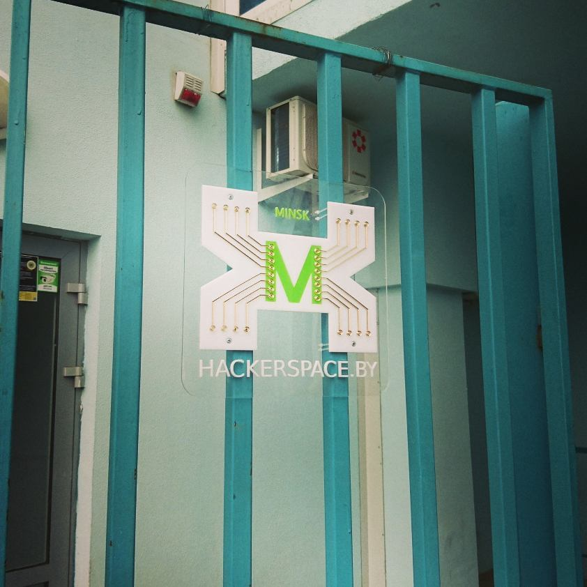
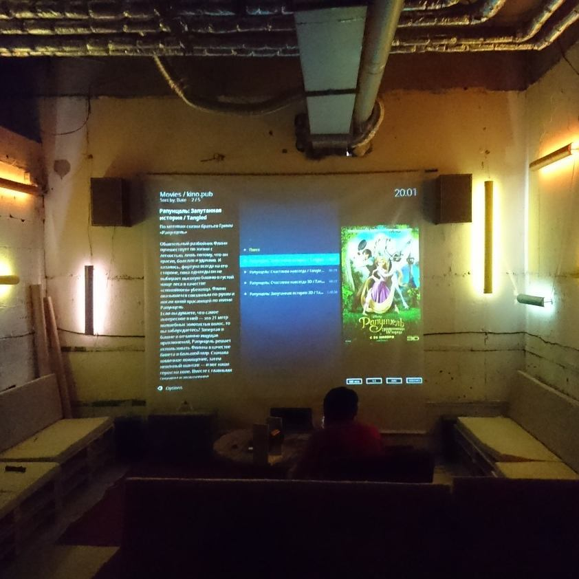
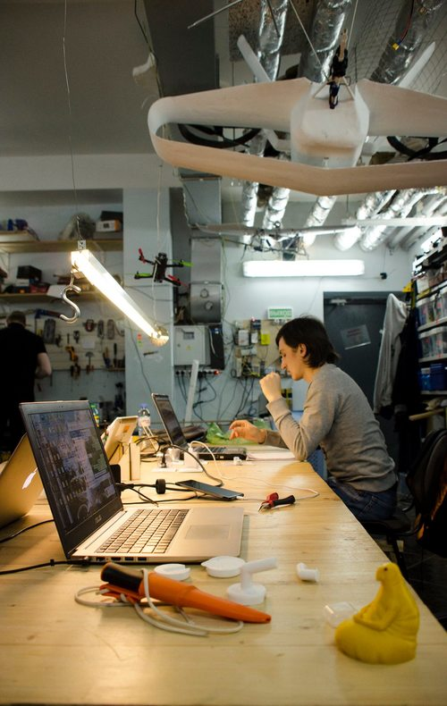
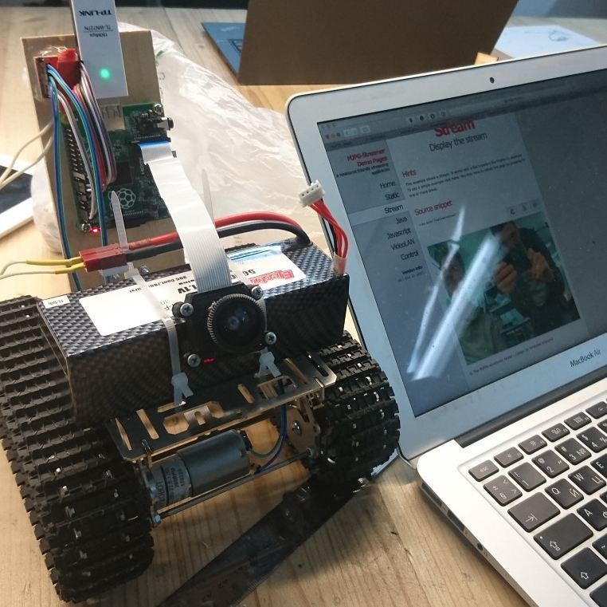
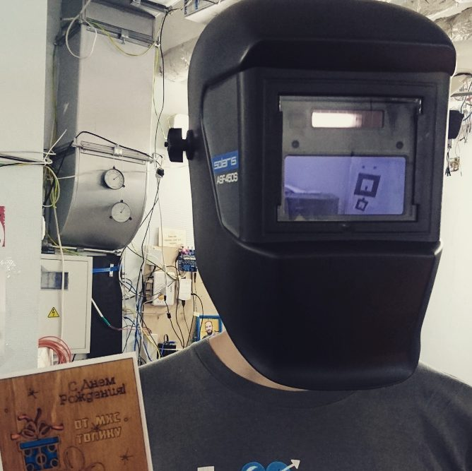
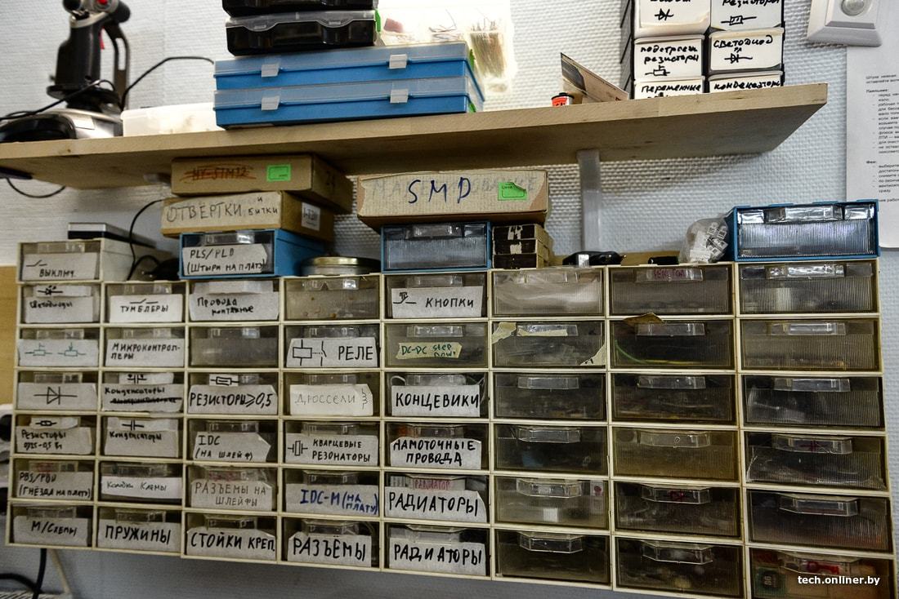
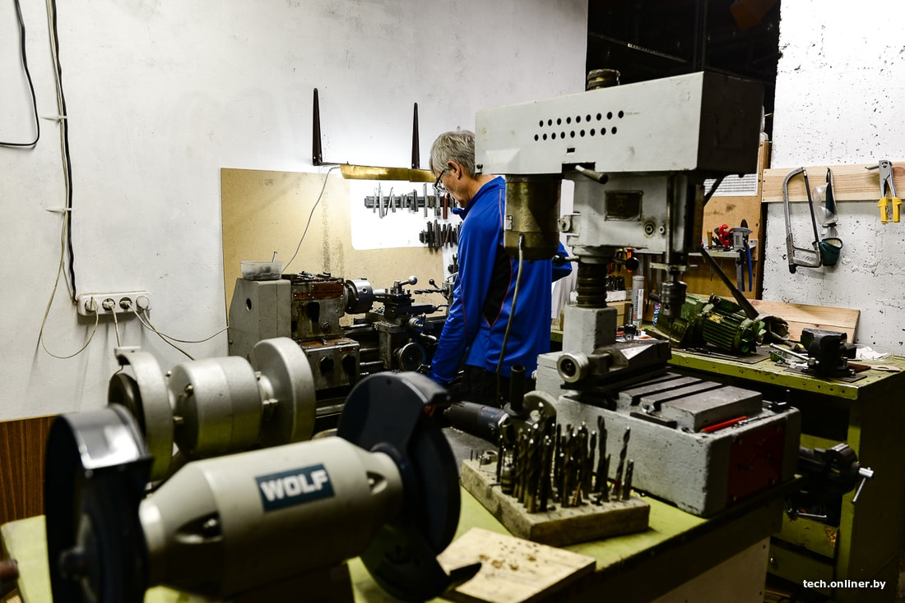

## Что это такое? Мастерская.

Хакерспейс (hackerspace) — мастерская-клуб, где энтузиасты могут заниматься любимым делом, будь то радиолюбительство, конструирование, программирование, моделирование или даже художественное творчество. В мире существует [множество](https://hackerspaces.org/) хакерспейсов различной направленности, но, прежде всего, это — клубы технического творчества.

## Чем мы здесь занимаемся? Мы творим.

Мы паяем, программируем, вырезаем из металла, пластика и дерева. Мы делаем роботов, дронов и строим станки ЧПУ. Мы собираем 3D-принтеры. Мы делаем печатные платы. Мы делимся опытом и совершаем ошибки. Придумываем новые [проекты](https://hackerspace.by/projects) и улучшаем старые.

## Как к нам присоединиться? Сколько это стоит?

Мы не оказываем услуг, мы не магазин. Мы — сообщество людей, объединённых общими интересами. Поэтому, чтобы попасть к нам, надо хотеть (а лучше и уметь) что-либо создавать своими руками. Разовые посещения — свободные (время согласовывайте).

Если же вы [хотите](https://hackerspace.by/procedure) стать частью сообщества: творить вместе с нами на постоянной основе, иметь свой ключ и пользоваться нашими печеньками (а также помочь в оплате аренды, коммунальных услуг, покупке расходников и новых классных инструментов), то мы попросим вас финансово поучаствовать в общем деле. В основном, участники вносят 50 рублей в месяц, студенты – 20, но есть и другие [тарифы](https://hackerspace.by/tariffs).

Вы также можете помочь проекту, написав о нем в своем блоге, сайте или просто оставив ссылку на стене в соцсети. Если у вас есть что-то, чем вы можете поделиться — запасы расходников, инструменты или просто знания — мы будем вам очень благодарны.

## Что у нас есть? Всякое.

Прежде всего, у нас есть прекрасный обжитой подвальчик на 50 квадратных метров для тихой работы с отдельным входом, прекрасной шумоизоляцией, санузлом и круглосуточным доступом. У нас есть дополнительно около 300 квадратных метров площади для творчества и экспериментов. У нас есть всё, что нужно, для создания новых проектов — паяльные станции, цифровой осциллограф, логический анализатор, 3D-принтер, ЧПУ фрезер, токарный и шлифовальный станки, лазерный резак, есть набор электрического и ручного инструмента, запас радиокомпонентов, двигателей и материалов. Если чего-то вдруг не хватит, прямо над нами есть магазин радиодеталей "Белчип". А ещё у нас есть люди, у которых всегда можно попросить совета и помощи.

## Как нас найти? Приходите.

Мы находимся по адресу: ул. Беды, 45 ([карта](https://www.mapillary.com/catalog/im/98iGzWktd9tuLs-agQWy2w/photo)). Вход со двора. Наш подвальчик – слева от третьего подъезда и салона "Slim". Важно! У нас нет вахтёра, а, значит, попасть к нам можно только вместе с кем-нибудь или в день открытых дверей. Поэтому, прежде чем приходить в первый раз, уточните время в [календаре](https://hackerspace.by/calendar), [рассылке](https://groups.google.com/d/forum/hackerspace-minsk), группе [Facebook](https://www.facebook.com/hs.minsk), [Вконтакте](https://vk.com/hackerspace_minsk) или в чате [Telegram](https://telegram.me/joinchat/Bxa3CT7ai59igvC1dP95Aw).

И не забудьте почитать [правила](/theory/research/minsk-rules/).

[Статья про хакерспейс на onliner.by](https://tech.onliner.by/2018/11/19/hackerspace)
[Статья на The Village](https://www.the-village.me/village/city/mechanism/262585-we-are-not-hackers)
[Хакерспейс в борьбе с Ковид-19](https://devby.io/news/hackerspace-stop)
