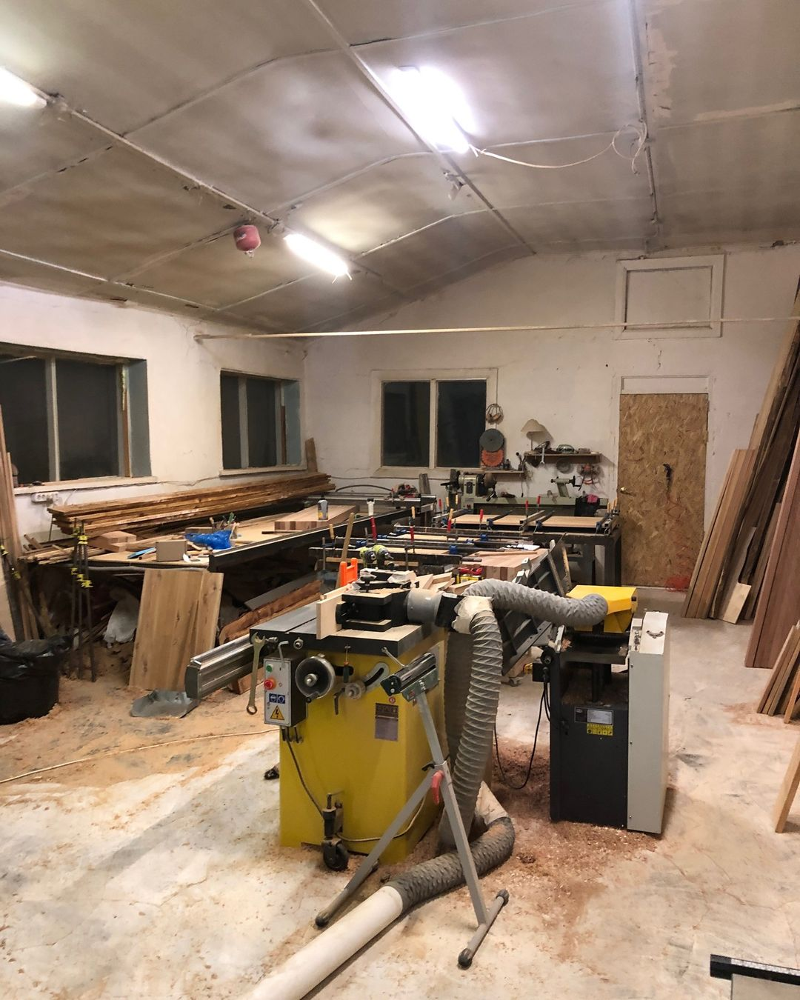

Здесь можно работать руками с деревом, пластиком и металлом. Проводятся курсы по работе с деревом, обучение по 3д печати, на фрезерном чпу и лазерном станке.

В стоимость абонементов входит пользование помещением мастерской и ее оборудованием. Расходные материалы: клей, шлиф. бумага, круги, ленты, скотч, паста полировальная, масла, лаки, краски, пленки и другие расходники.

**Внимание!**

Обязательное требование техники безопасности в столярной мастерской!

Если вы собираетесь использовать столярные станки, но не имеете необходимой квалификации работы на них, Вам необходимо сначала пройти мини-аттестацию, либо соответствующий мастер-класс в любое удобную для вас субботу.

## Еще мы можем помочь

- Лазерной резкой и гравировкой
  Режем и гравируем на поле 750х400 мм, толщиной фанеры до 8 мм
- Столярными работами
  Можем изготовить для вас любую вообразимую вещь)
- Монтажом
  И можем эту вещь установить у вас)
- Консультациями и проектированием
  Проектируем в SolidWorks, Correl, др программах и помогаем с ними)
- ЧПУ фрезеровкой
  Фрезеровка деталей на поле 1х1,5 м (высота детали до 40 мм)
- 3D печатью
  Печатаем разными пластиками на хороших принтерах)
