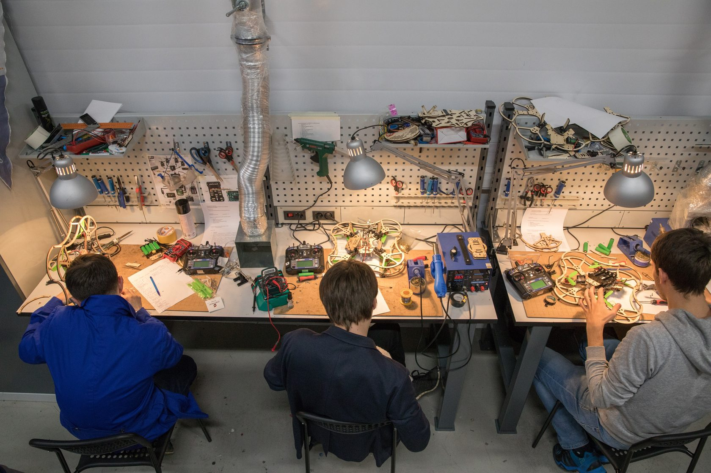

### О нас

ЦМИТ «Коптер» был создан на экспертной базе ООО «Коптер Экспресс», лидера на рынке образовательной летающей робототехники и разработчика мультироторных беспилотных летательных аппаратов для образования, автономного мониторинга территорий и доставки грузов.

На базе Центра проводятся развивающие мероприятия по конструированию, сборке, настройке, пилотированию и программированию квадрокоптеров, а также хакатоны.

### Курсы

Курсы рассчитанные как на детей, так и на взрослых, и дают учащимся понимание как устроен беспилотник, каковы особенности его управления, как его сделать своими руками и как грамотно совершить полет, управляемый или автономный.

### Мероприятия

Ваш ребёнок ещё не определился со сферой своих интересов в инновационном творчестве? Специально для Вас на базе ЦМИТ «Коптер» проводятся образовательные отраслевые мероприятия, благодаря которым ребёнок сможет попробовать себя в разнообразных направлениях индустрии беспилотников и найти для себя наиболее притягательную деятельность.

### Оборудование

Если у Вас есть навык работы с оборудованием, но нет к нему доступа, то мы можем предоставить удобное рабочее место и возможность воспользоваться лазерным резаком, 3д-принтером, фрезерным станком с ЧПУ, плоттером, токарным станком.

### Рабочее место в ЦМИТ «Коптер»

Для прошедших обучение в ЦМИТе по нашим программам — специальные условия, вплоть до бесплатного использования оборудования для одобренных проектов.

### 3D принтеры

3Д печать уже плотно вошло в проектную деятельность, а 3Д-принтер уже настолько привычное оборудование, как и обычный принтер. Для печати в основном мы применяем PLA пластик — экологичный, не токсичный и биоразлагаемый материал.

_Стоимость: 3д-печать пластиком PLA 20 руб./грамм_

**3D принтер DIY Prusa i3 Steel BiZon** Построение реального объекта по созданному на компьютере образцу 3D модели в формате STL, методом послойного «наращивания» материала.

**3D принтер Prusa i3 Steel BiZon DUO** Построение реального объекта по созданному на компьютере образцу 3D модели в формате STL, методом послойного «наращивания» материала с возможностью поочерёдной печати двумя материалами.

**3D принтер 3DQ Prism Pro V2** Послойное создание физического объекта по цифровой 3D-модели. Prism Pro V2 — 3D-принтер профессионального уровня, выполненный по схеме «дельта-робот». Принтер оснащен автоматической калибровкой, подогреваемым рабочим столом, закрытой рабочей камерой и системой охлаждения экструдера. Prism Pro печатает модели до 400 мм в диаметре и до 800 мм высотой, с минимальной толщиной слоя от 0,05 мм. Благодаря двустороннему обдуву модели при печати и механизму регулирования поджатия нити, принтер печатает всеми основными видами пластика: ABS, PLA, Watson, HIPS и FLEX.

**3D принтер Prusa i3 Steel BiZon (боуден)** Изготовление комплектующих для беспилотных летательных аппаратов.

### Фрезерные и токарные станки

Беспилотные Авиационные Системы испытывают значительные нагрузки в воздухе и для сохранения приемлемой массы и прочности требуют применение современных материалов, таких как карбон, стеклотекстолит и др. Для обработки этих материалов с высокой точностью и скоростью применяются Фрезерные станки с ЧПУ. Для обработки тел вращения — токарный станок.

_Стоимость:_ _Фрезерование на станке с ЧПУ 2000 руб./час (не включая материал)_ _Работа на токарном станке 1500 руб./час (не включая материал)_

**Станок фрезерно-гравировальный портальный вертикального типа с ЧПУ Cutmaster CM-D960S** Построение реального объекта по созданному на компьютере образцу 3D модели в формате STL, методом послойного «наращивания» материала.

**Wattsan A1 6090** Фрезерно-гравировальный станок с ЧПУ WATTSAN A1 6090 — один из самых экономичных и практичных станков. Станок выполняет резку и гравировку дерева, МДФ, ДСП, акрила, оргстекла, ПВХ, композита, алюминия. Также с помощью WATTSAN A1 6090 можно выполнять фрезерную 3D-резку.

**Станок фрезерный BF16 Vario** Введение во фрезерные работы

**Настольный Токарный станок Metalmaster MML 1830V** Предназначен для токарной обработки деталей. Имеется быстрозажимной трехкулачковый патрон 100 мм, с тавотницей на торцевой поверхности которая позволяет оперативно смазывать кулачки в труднодоступных местах.

### Лазерные резаки

Благодаря лазерным резакам открывается бескрайний горизонт применения для своих проектов таких материалов как фанера, поликарбонат, орг. стекло и др. Помимо резки на оборудовании можно выполнить гравировку.

_Стоимость:_ _Лазерная резка фанеры от 29 руб./метр при толщине материала 3 мм (Пластик, Оргстекло оговариваются индивидуально)_ _Цена гравировки 5 руб/кв.см._

**Станок для лазерной резки Kamach II 1060 AS** Построение реального объекта по созданному на компьютере образцу 3D модели в формате STL, методом послойного "наращивания" материала.

**Wattsan micro 0203** Аппарат подключается к компьютеру через USB порт и поддерживает программы CorelDraw и AutoCAD. Лазерный гравер поддерживает следующие графические форматы: BMP, PLT, CDR, DXF, AI, SVG и другие.

### Плоттеры

Распечатать чертежи к диплому или защите проекта — легко, когда под рукой широкоформатный плоттер! По нашему опыту оценки и судейства чужих проектов мы столкнулись с восприятием проектов из фанеры — как скворечников, именно поэтому мы предлагаем сделать выкройку на самоклеящейся плёнке и обклеить свой проект. Или же любые наклейки самой интересной формы.

_Стоимость:_ _Широкоформатная печать на плоттере 400 руб./кв.м. при 10% заполнении_ _Печать наклеек на режущем плоттере 1000 руб./кв.м._

**Струйный плоттер HP Designjet T520** Плоттер HP Designjet T520 36in незаменим в дизайнерском бюро или на производственном предприятии. Модель, осуществляющая печать в максимальном формате А0, подходит для печати масштабных проектов сооружений, интерьеров и схем оборудования. Встроенная память объемом 1 Гб обеспечивает быструю обработку данных. HP DesignJet T520 36in работает с листовыми и рулонными носителями, что позволяет выбрать предпочтительный вариант для поставленных задач.

**Режущий плоттер Mimaki CJV150-107** Плоттер Mimaki CJV150−107 незаменим в дизайнерском бюро или на производственном предприятии. Модель, осуществляющая печать в максимальном формате А0, подходит для печати масштабных проектов сооружений, интерьеров и схем оборудования.

_Паяльные станции и осциллограф_

Современная электроника достаточна требовательна к температурным режимам пайки — специально для этого мы выбрали качественные паяльные станции с высокой точностью удержания температуры и осциллограф для возможности проверки работоспособности компонентов и схем.

**Паяльная станция YIHUA 853D** Паяльная станция — инструмент для ремонта, монтажа, демонтажа и пайки самых различных предметов различных размеров: от крупных систем проводов до мельчайших микросхем. Управление паяльной станцией производится при помощи микроконтроллера, что обеспечивает высокую точность нагрева и предполагает профессиональное использование данной модели.

**Настольный осциллограф Hantek DSO-5102P** Производить замеры электрической частоты, импульсных и амплитудных колебаний

