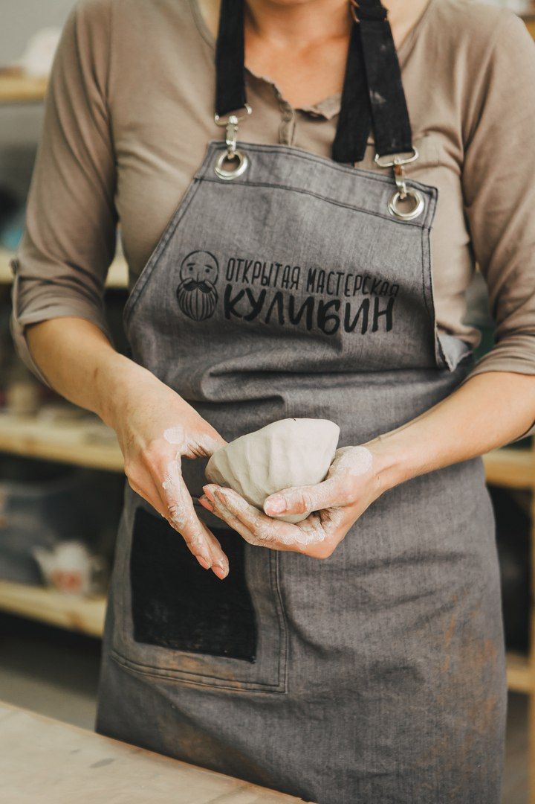
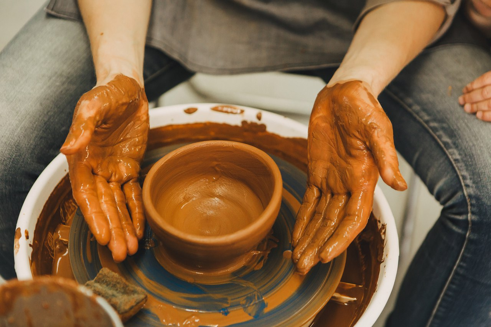
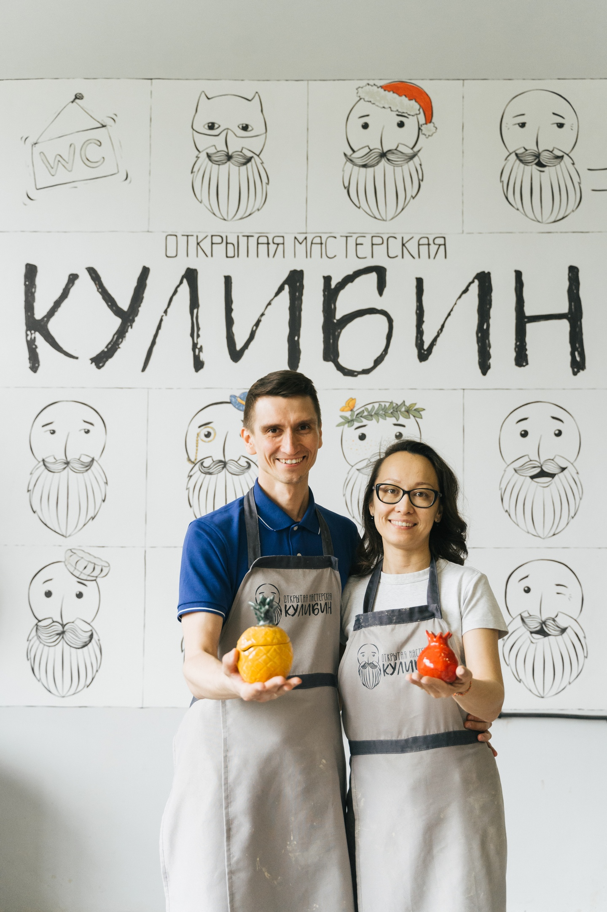

## Гончарная мастерская

Открытое пространство с комфортными условиями для hand-made мастеров по дереву, коже, керамике и ювелирному делу со свободным доступом ко всему необходимому оборудованию. Открытие состоялось 1 марта 2017 года.

Приглашаем к сотрудничеству умельцев мастерить руками и организаторов мероприятий.

<youtube-embed link="kuwJ5eWUkx4" />

## Основатели Гончарной мастерской "Кулибин"

### Гульшат и Артур

Идея создания гончарной мастерской пришла к нам в 2016 году, когда мы не нашли такого пространства в Уфе, где можно было бы с детьми или друзьями создавать своими руками изделия из глины. Так родилась Гончарная мастерская "Кулибин" - место где люди обретают знания и становятся счастливее.

## Франшиза

<youtube-embed link="PYf-Q2xeDsU" />

### Эта франшиза подходит тебе если:

* Творческий предприниматель — слова которые мотивируют тебя на создание бизнеса, который будет полезен людям
* Ты не видишь пользы в очередном барбершопе или «онлайн-школе чего-нибудь»
* В тебе достаточно тепла, чтобы делиться им с другими
* В тебе есть смелость и уверенность, чтобы встать на тернистую тропу собственного бизнеса
* У тебя есть надежный партнер, который смотрит на мир одними глазами с тобой

### В чем наша уникальность:

* В отличие от других, ниша гончарных мастер-классов сформировалась недавно и наполняется крайне медленно; достойных игроков — единицы
* За 2 года работы наша бизнес-модель была максимально сбалансирована, отстроены все внутренние процессы
* В основе нашего бизнеса лежат эмоции и впечатления гостей, которые делают их счастливее
* Возраст наших посетителей — от 5 до 60 лет, чаще всего один гость приводит от 3 до 45 своих знакомых
* Тарифы позволяют работать без роялти и даже под своим брендом.

### Кого мы НЕ видим в своей команде:

* Тех, кто ищет легких и быстрых денег
* Тех, кто не способен вдохновлять и объединять вокруг себя творческих людей
* Тех, кто думает, что продавая франшизу, основную работу будем делать мы. Мы даем удочку, а не рыбу
* Тех, кто хочет получать и при этом не способен отдавать

## Интервью с франчайзи

<youtube-embed link="UMm8NthH-0g" />

