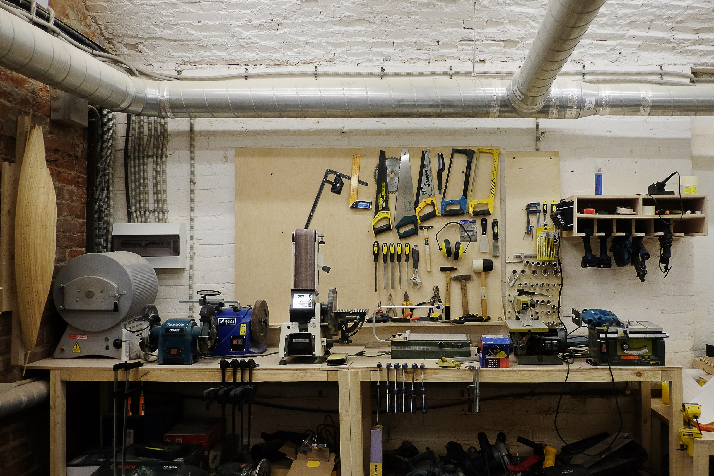

## Что такое Лаба?

Образовательная площадка, на которой проходит обучение компьютерным программам для черчения и 3д моделирования, проводятся мастер классы по 3д печати, 3д сканированию, робототехнике, работе с лазерными и фрезерными станками и другой технике. Обширная мастерская оснащена современным оборудованием и базой ручного инструмента, открыта для всех желающих прошедших курс.

## Создана энтузиастами для энтузиастов в 2017 году

Мы команда гиков и мы обожаем всякие электронные и цифровые штуки, которые производят другие штуки. Поэтому собрали для тебя в Центре Москвы, самые классные из них.
Мечтал ты о своей мастерской в гараже, или просто любишь современные технологии — заходи в гости, в любом случае ты не останешься равнодушным.

### Основные направления

* Макетная мастерская
* Мелкосерийное производство
* Мастерская по переработке отходов
* Образование

### Возможности

* Лазерная резка
* 3D - печать
* Фотополимерная печать
* Резка ЧПУ
* Плоттерная резка
* 3D - сканирование
* Столярка
* Силиконовая отливка

### Воркшопы

Короткие программы по изготовлению эксклюзивных предметов вместе с нашими мастерами
* Рисование эпоксидной смолой
  Нарисуй картину за один вечер и забери её домой
* Геометрический светильник
  Сделай себе домой эксклюзивный светильник и узнай геометрию с новой стороны
* Мастер-класс «Кулон с гербарием» в витражной технике Тиффани
  Создай свой витражный кулон с гербарием и унеси его домой

## Оборудование

#### Линейка 3D принтеров Raise 3D

Габариты печати до 305х305х610мм

Толщина слоя от 0.1мм

Материалы - PLA, ABS, Filaflex, PVA, PC, Hips, Nylon, Laywood и проч. (диаметр нити 1.75мм)

#### 3D принтер Formlabs Form 2

Габариты печати 145х145х175мм

Толщина слоя от 25 микрон (0, 025мм)

Печать из фотополимера

#### Лазерный раскройщик Raylogic 11G

Raylogic 11G

Рабочая зона 1200х900мм

Обрабатываемые материалы — оргстекло, пластик (не ПВХ), поролон, фанера, дерево, картон, бумага, кожа, текстиль и пр.

#### Лазерный гравер Raylogic 304 mini

Raylogic 304 mini
Рабочая зона 400х300мм 

#### Фрезерные станки с ЧПУ

Зона обработки до 1500х1500х150мм 

#### Фрезерный станок ЧПУ с поворотной осью Roland MDX-40A

Roland MDX-40A
Зона обработки 305х305х105мм

####  Режущий плоттер Roland CAMM1

Roland CAMM1
Ширина обработки 584мм

#### 3D сканер

## Другое оборудование

•Паяльная станция •УЗ ванна •Вакуумный формовщик •Муфельная печь •Покрасочная с компрессором •Торцевая пила •Циркулярная пила •Ленточная пила •Рейсмус •Сверлильный станок •Полировальный/шифовальный станок •Токарный станок •База ручного инструмента и многое другое.

