**Общественные мастерские** — некоммерческое пространство для ручного труда на Петроградской стороне.

Под одной крышей объединены столярная, швейная и керамическая мастерские со всем необходимым оборудованием, мастерами-наставниками и резидентами.

У нас можно проходить курсы, посещать лекции и мастер-классы, а в свободные от занятий дни пользоваться возможностями Общественных мастерских в формате коворкинга.

Мы также сотрудничаем с благотворительными организациями. Проводим обучение, мастер-классы для сотрудников, волонтёров и подопечных, а ещё изготавливаем сувенирную продукцию.

Мы не забыли и о дружелюбной атмосфере и уютной кухне, где вы сможете выпить чай и обсудить свои творческие проекты. Все форматы бесплатные.

Общественные мастерские — это государственное бюджетное учреждение подростково-молодёжного центра «Петроградский», сектора молодежной политики и взаимодействия с общественными организациями Администрации Петроградского района.

## Интенсивы и коворкинг

В «Общественных мастерских» по будням проходят интенсивы в трёх мастерских: швейная, керамическая и столярная. По выходным дням доступен производственный коворкинг для самостоятельной работы (ремонта одежды, бытовой техники, реализации творческих проектов). Регулярно проводятся дополнительные мероприятия. Все форматы бесплатны для посещения.

### Коворкинг:

- Производственный коворкинг доступен для всех людей старше 18 лет, которые умеют работать за оборудованием самостоятельно.
- Время работы производственного коворкинга: 12:00-18:00 в пятницу, субботу и воскресенье. Забронировать место в коворкинге можно с помощью клавиши в шапке сообщества «Забронировать».
- Для допуска в коворкинг необходимо посетить установочную встречу или закончить наш интенсив.
- Установочные встречи необходимы для того, чтобы мастер убедился, что вы можете работать самостоятельно, и проводятся один раз в две недели по выходным в 10:30, длительность около 1 часа. Запись по ссылке: https://b24-f6usik.bitrix24.site/angar_kvrkng/
- Время работы за оборудованием, которое вы можете забронировать, составляет 4 часа в день и не более 20 часов в месяц. Время может быть продлено на месте по согласованию с мастером.
- Материалы, расходники и личный инструменты для работы в коворкинге необходимо приносить свои.
- Бронировать место в коворкинге можно не ранее чем за 2 недели.

Интенсивы:

- Интенсивы доступны для людей от 18 до 35 лет.
- Запись на следующий месяц проходит 20 числа текущего месяца: мы публикуем пост в группе во ВКонтакте со ссылкой на регистрацию.
- Вы можете подавать несколько заявок сразу. Зачисляются те, кто раньше подали заявку, и ещё не посещали интенсивы в выбранной мастерской. Одновременно вы можете быть зачислены только на один интенсив.
- На интенсивы в одной и той же мастерской вы можете быть зачислены не чаще 1 раза в 4 месяца.
- Всем, кто прошел интенсив полностью, мастер дает доступ к бронированию производственного коворкинга по выходным для самостоятельной работы.

Важно! Если Вы записались на интенсив или в коворкинг, но не пришли или отменили бронь меньше чем за сутки, мы очень не хотим, но имеем право ограничить Вам допуск в Общественные мастерские сроком до 6 месяцев.

## Производственный коворкинг

Наше пространство открыто с 10:00 до 22:00 по субботам и воскресеньям для самостоятельной работы горожан.

Можно заниматься своим творческим проектом или отремонтировать любимую вещь!

🛠 Мы предоставляем доступ к оборудованию Мастерских, но вам понадобятся свои материалы.

✅ Посещение коворкинга по предварительной регистрации, с помощью которой вы бронируете себе время и оборудование.

👨‍🔧 В Мастерских всегда находится куратор или мастер, который поможет в базовых вопросах и проконтролирует соблюдение техники безопасности.

Самостоятельная работа подразумевает наличие необходимых знаний по использованию оборудования, также необходимо пройти инструктаж.

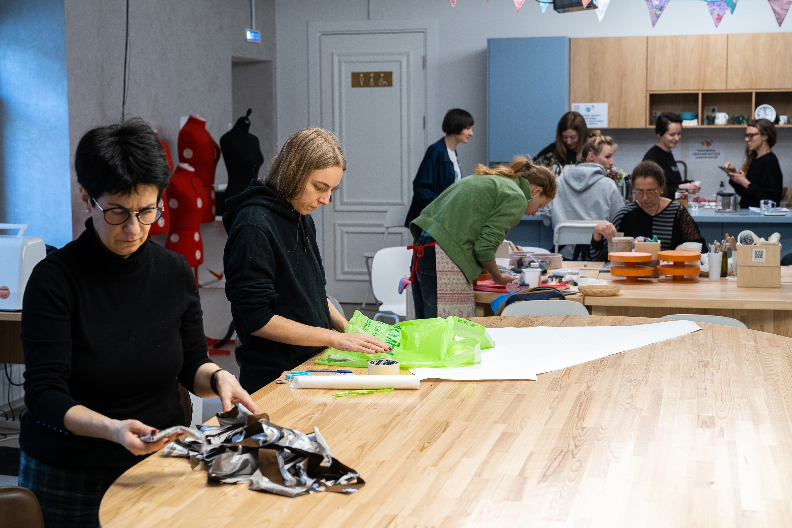
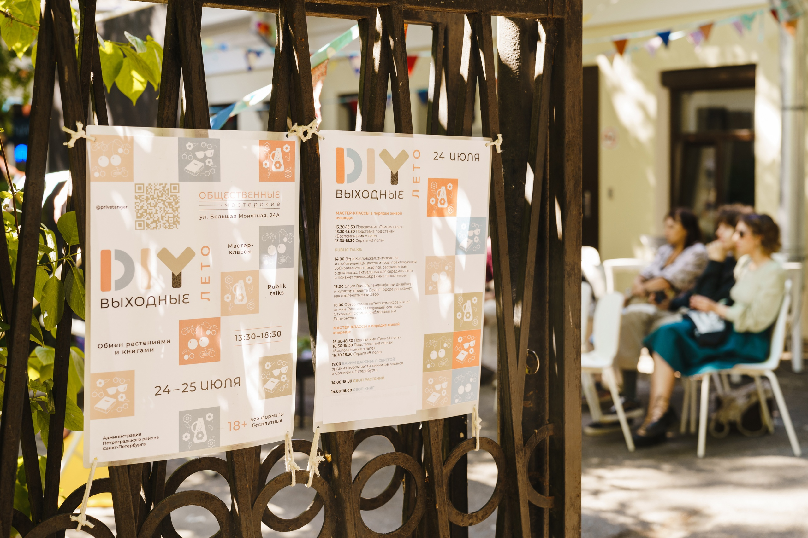
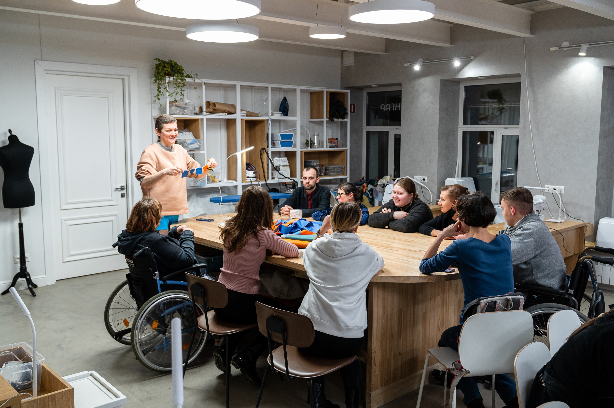

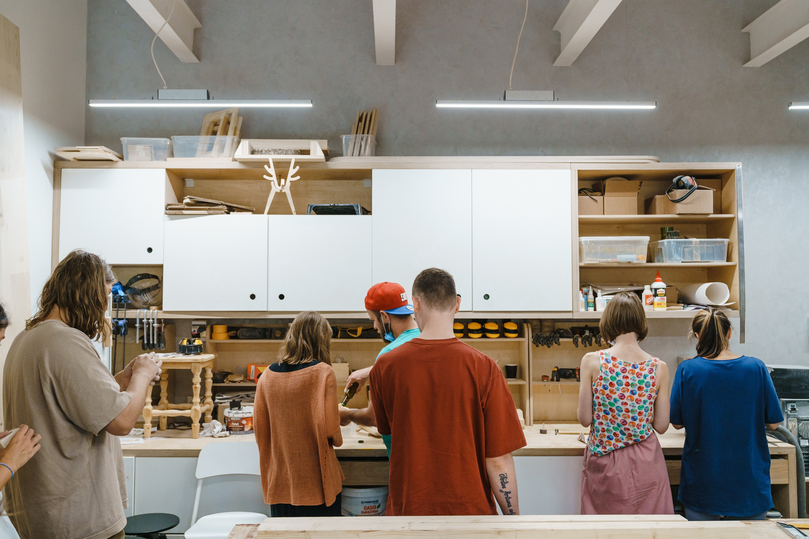
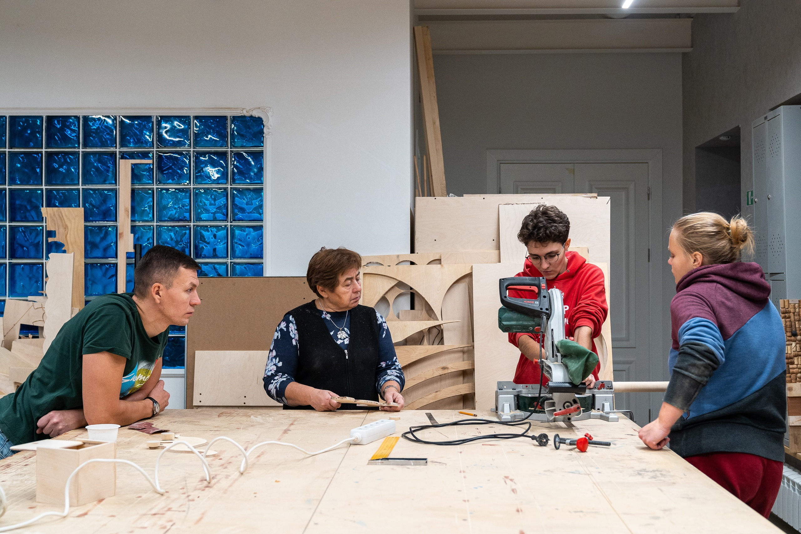

### Кто может посещать коворкинг?

Производственный коворкинг подразумевает самостоятельную работу посетителей за оборудованием, поэтому доступ получают люди с опытом и навыками по выбранному направлению.

❗Важно: если опыта работы с оборудованием еще нет, то следует дождаться набора на подходящий вашему запросу интенсив - мы будем рады вас всему научить! После этого вы сможете посещать коворкинг.

### Как попасть в коворкинг?

Если у вас есть документы, подтверждающие прохождение обучения, опыт работы за оборудованием или вы уже прошли курс у нас, то для допуска в коворкинг вам достаточно посетить установочную встречу (регистрация также по ссылке в шапке профиля). После встречи у вас появится возможность зарегистрироваться в коворкинг на свободное время.

### Установочные встречи

Наши установочные встречи, которые необходимо пройти перед посещением производственного коворкинга, продолжаются!

✨ На встречах вы сможете познакомиться с пространством, возможностями и техникой безопасности. Также сможете задать любые вопросы напрямую кураторам Мастерских.

Напоминаем, что встречи проводятся каждую неделю по выходным, ориентировочное время каждой встречи - полтора часа, количество участников - 8 человек.

❗ Установочные встречи - формат для людей с навыками по выбранному направлению. Если опыта нет совсем, то следует записаться на соответствующий интенсив при следующем наборе.

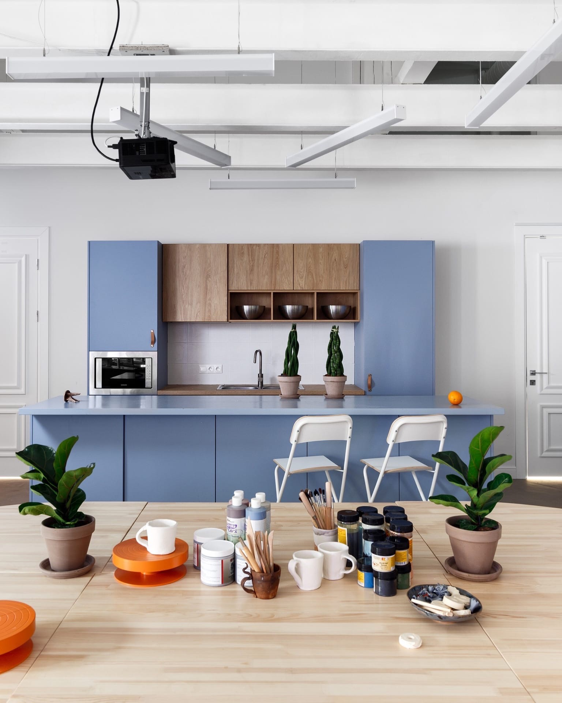
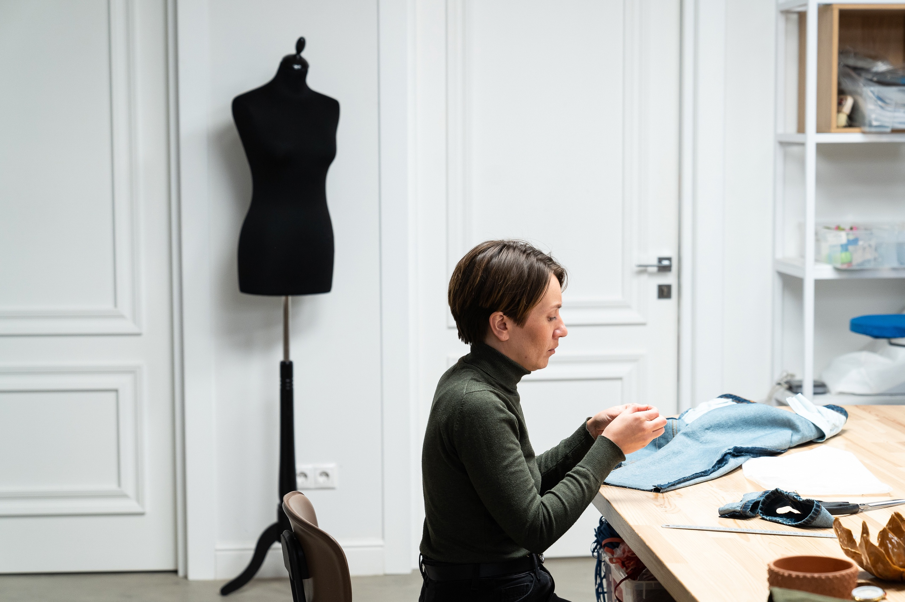
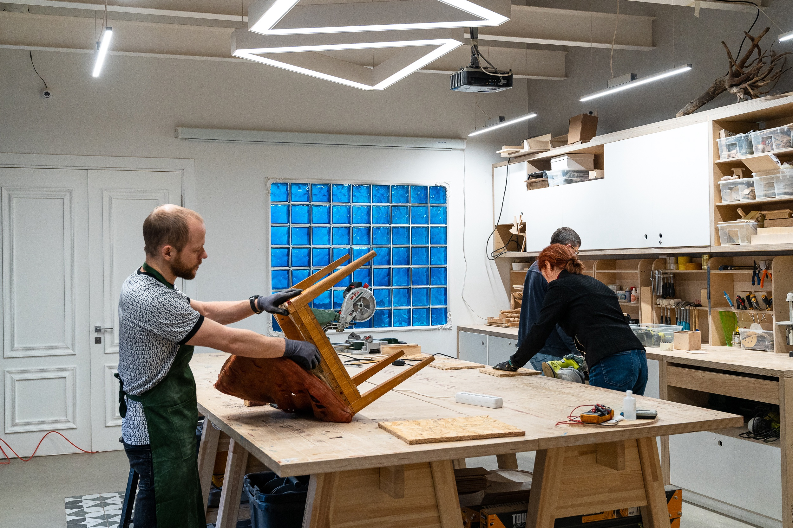

<youtube-embed link="https://www.youtube.com/watch?v=McZIcChjsRU" />

## Резиденция

### Для НКО

Общественные мастерские «Гараж» совмещают в себе учебный центр, коворкинг, творческую резиденцию, а еще мы открыты для сотрудничества с НКО города в нашем пространстве.

Мы предлагаем для НКО:

- проведение групповых занятий для подопечных
- организацию тимбилдингов для волонтёров и сотрудников
- помощь в разработке и производстве сувенирной продукции от наших кураторов и резидентов

Мы хотели бы помочь всем обратившимся НКО, но у нас есть ограничения по вместимости. Поэтому мы проводим отбор заявок от организаций для сотрудничества на ближайшие полгода.

В отборе приоритет будет отдан самым актуальным социально значимым и готовым к сотрудничеству проектам.

Напоминаем, что все наши форматы рассчитаны на людей от 18 лет.
Если аудитория организации – дети и подростки, то необходимо присутствие сопровождающих с вашей стороны.

### Для начинающих мастеров

Резиденция даст новые возможности для участников: реализацию проекта или выведение его на новый уровень, а также принесет пользу нашему городу и НКО.

Кто может стать нашим резидентом:

- Авторы своих проектов в сфере дизайна и урбанистики
- Создатели одежды, керамики, мебели, предметов интерьера
- В приоритете проекты не старше года

Что предоставляет резиденция:

- Бесплатный доступ к ресурсам мастерской: рабочему пространству, оборудованию, кухне и душевой.
- Поддержку сообщества: бесплатные консультации и интенсивы от кураторов и мастеров.

Чего мы ждем от резидентов взамен:

- Реализацию проектов для НКО и города
  Инициатором идеи можете быть вы или это будет ваш отклик на запрос города или конкретной НКО.
- Соблюдения внутреннего распорядка и правил техники безопасности

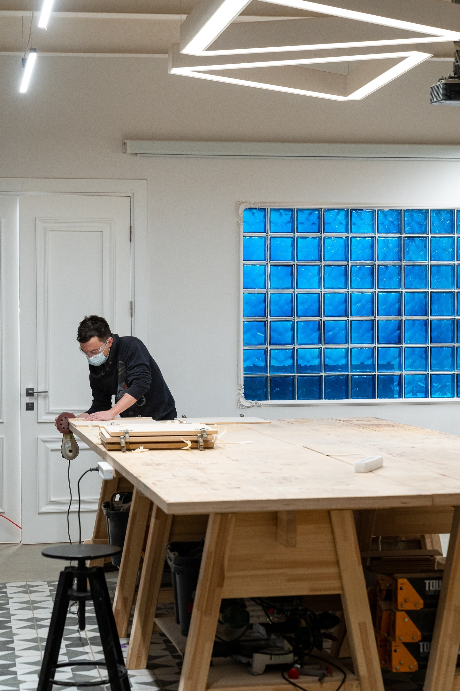

<youtube-embed link="https://youtu.be/ztFb2IKov7s" />

## Возможности

### Грязный блок

При желании и обучении в «Гараже» вы сможете спроектировать и построить: мебель, детскую площадку, дом на дереве, формы для литья, купольный дом, лодку и многое другое.

Материалы, с которыми можно работать в «грязном» блоке:

- Мягкий листовой материал
  Фанера, оргстекло, ПВХ, ДСП, МДФ, ОСБ.
- Дерево
  Массив мягких и твердых пород древесины.
- Металл
  Тонкий листовой цветной металл, алюминий, некоторые виды стали.

Мы предлагаем специальные «интенсивы» (краткосрочные курсы):

- Основы двухмерного и трехмерного моделирования
- Основы управления станками с ЧПУ
- Работа с ручным электроинструментом
- Основы мебельного производства

Насущные потребности, вроде ремонта собственной техники и гаджетов или печати деталей для своего проекта на трехмерном принтере — можно реализовывать в дни коворкинга: субботу и воскресенье.

## Оборудование

### Швейная

- Четыре бытовые электронные швейные машины с множеством настроек и режимов, а также две прямострочные машинки с прямым приводом и электронными функциями.
- Можно внести индивидуальные штрихи в свое изделие с помощью вышивальной машины. И мы имеем в виду не просто красивые стежки: вы можете загрузить свой рисунок и машинка его выполнит вышивкой.
- Для капризного в работе трикотажа есть специальная распошивальная машинка.
- Два полупрофессиональных оверлока для обработки краев и один профессиональный коверлок.
- Коверлок - уникальная машина, сочетающая функционал оверлока и распошивальной машинки, будет очень полезна при создании одежды разной сложности.
- Гладильный стол с вытяжкой, парогенератором и утюгом для отпаривания, глажки, заутюживания ткани и изделий.
- При создании одежды всегда важно видеть как она будет выглядеть на человеке, моделировать. На плоды своих трудов приятно будет смотреть на манекенах: у нас четыре портновских и два дежурных женских.
- Конечно, не только одежда может быть предметом на наших занятиях. У нас также есть инструменты для работы с кожей.

### Керамическая

В нашей керамической мастерской вы сможете создать свою чашку мечты, авторскую брошь, необычный предмет интерьера и многое другое. Что бы вы ни выбрали: вам предстоит пройти все этапы работы и для каждого из них в мастерской есть оборудование.

Ключевых позиций по одной, но они очень порадуют как новичков, так и профессиональных керамистов:

- Настольный раскатчик глины
  Для качественной раскатки глины нужно потратить время и приложить физические усилия. Этот инструмент может ускорить процесс, особенно при больших объемах материала.
- Гончарный круг
  Знаем, что многие мечтают попробовать создавать керамику именно за кругом! Это и правда удивительный процесс: и трудоемкий, и медитативный одновременно.
- Муфельная печь
  Вам откроется новое ощущение: тепло свежеиспеченной керамики и звук легкого потрескивания остывающих эмалей. Словом, зимним вечером разбирать готовые чашки особенно приятно!
- Покрасочный шкаф
  С его помощью ваши изделия будут выглядеть более профессионально за счет равномерности цвета. Авторская роспись кистями, безусловно, прекрасна и вы можете выбрать этот способ.
- Есть и наборы инструментов для работы с глиной за столом: всевозможные стеки и резаки.

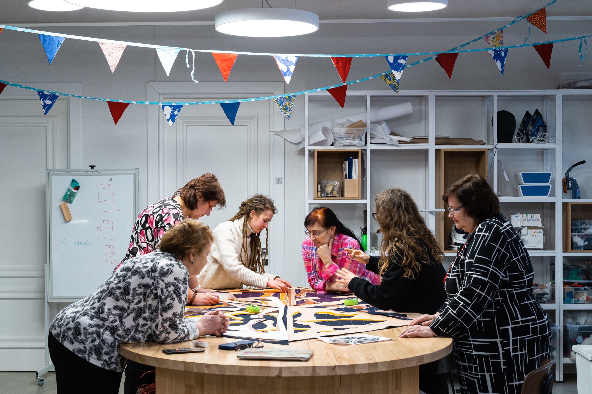
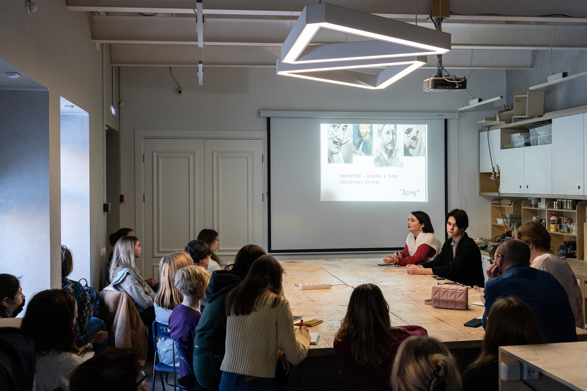
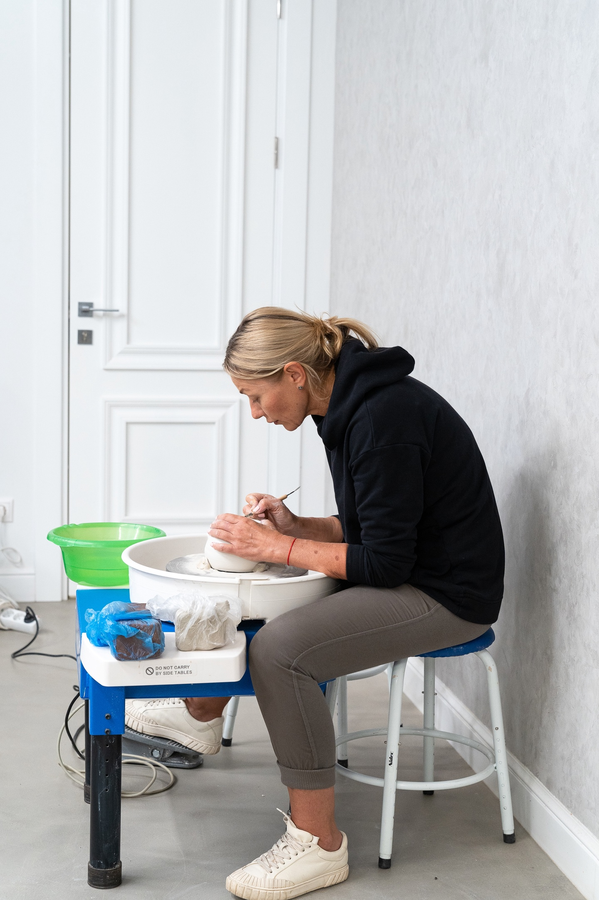

### Грязный блок

Сложно разделить «грязный» блок «Гаража» на конкретные мастерские.
Технические возможности позволяют выполнять работы разного профиля: от ремонта велосипеда до конструирования робота.

Оборудование в этом блоке требует тщательного инструктажа и соблюдения техники безопасности, поэтому мы акцентируем внимание на этом в предварительном обучении.

#### В открытом доступе:

- Трехмерный принтер
- Производительные компьютеры для моделирования
- Компрессор
- Сварочный аппарат
- Расширенный парк ручного электроинструмента
- Оборудование для ремонта электроники

#### В условно открытом доступе:

- Два горизонтальных фрезерных стола с ЧПУ (широкий и средний формат)
- Лазерный гравер с ЧПУ (средний формат)

Условно открытый доступ подразумевает контроль со стороны мастера, помимо пройденного пользователем инструктажа.

<youtube-embed link="https://www.youtube.com/watch?v=ievafBILu-s" />

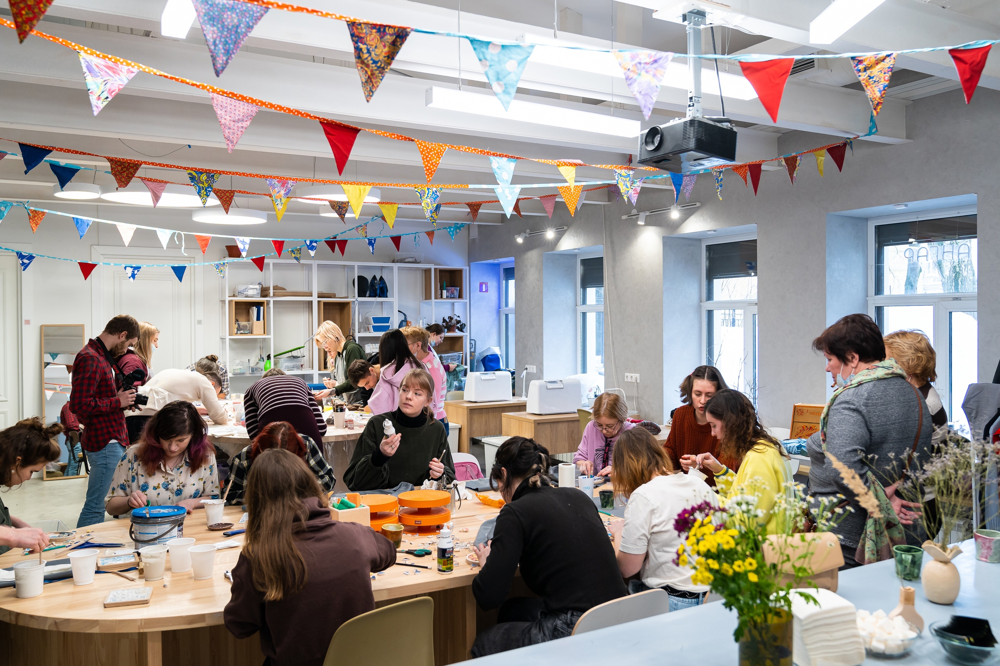
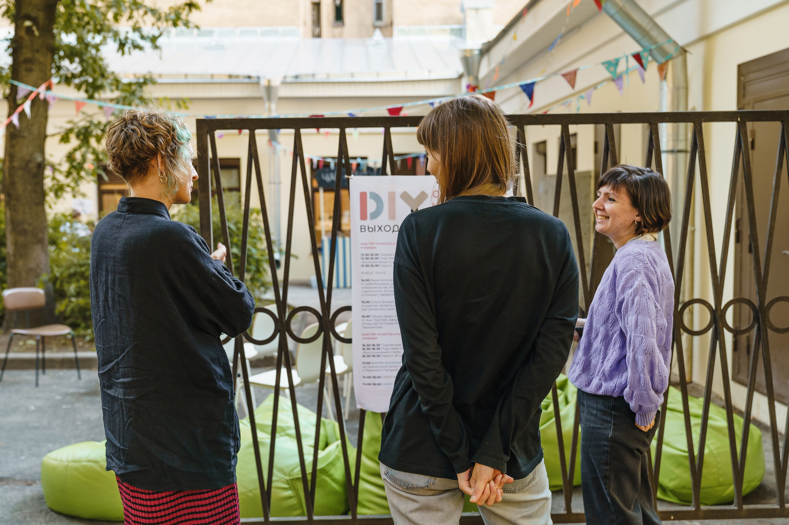
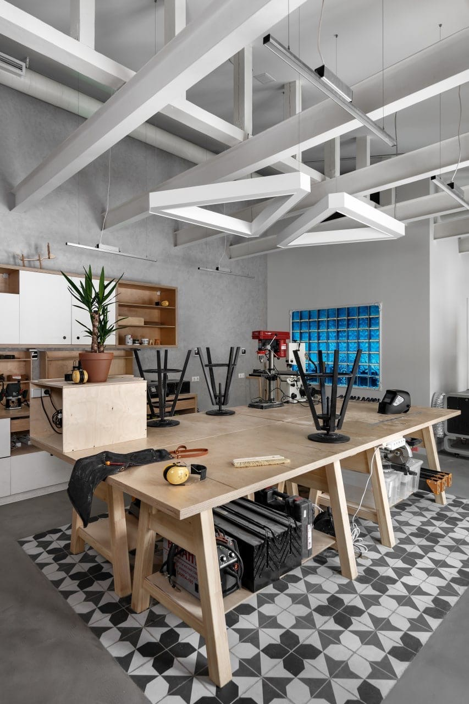

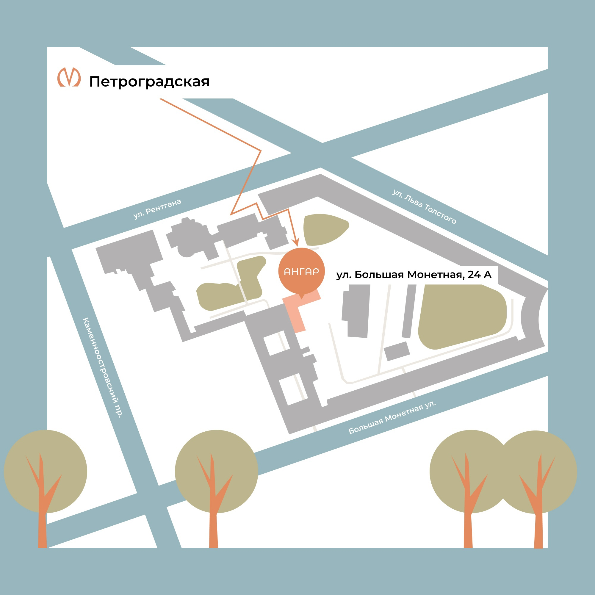
