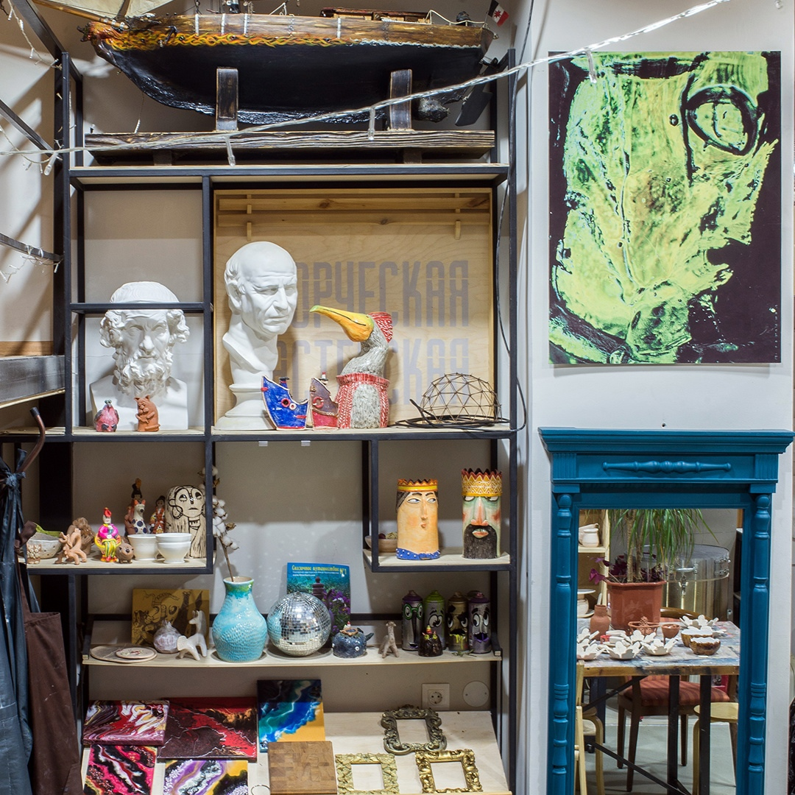
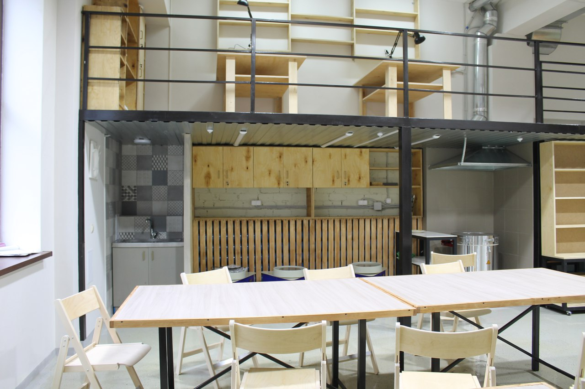
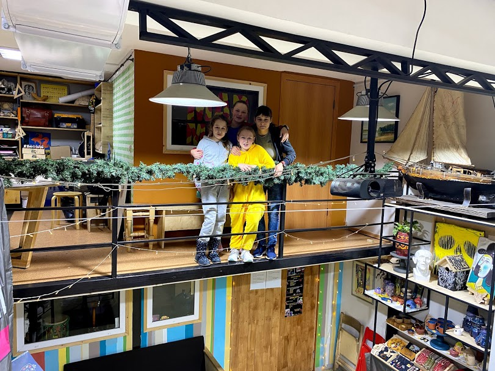

✌️ Первый творческий коворкинг в г.Ижевске предлагает мастер-классы для взрослых и детей:

- ручная лепка и гончарный круг,
- столярная мастерская,
- работа с эпоксидной смолой,
- живопись,
- декоративно-прикладное творчество

👉 Так же есть возможность взять пространство в аренду. Это касается, как частных мастеров так и дружные компании для проведения квартирников, встреч и просмотра фильмов.

Наша мастерская - это пространство для посещения мастер-классов по работе с ГЛИНОЙ, ДЕРЕВОМ, ШЕРСТЬЮ, ТКАНЬЮ, ГИПСОМ, СТЕКЛОМ, ПЛАСТИКОМ:

- основы гончарного мастерства и искусство керамики
- основы резьбы по дереву
- гипсовая скульптура
- художественная ковка
- валяние
- роспись по дереву, керамике, стеклу
- и др.

Также мы предоставляем место и все инструменты для самостоятельной работы.

Предлагаем исполнение заказов по ДЕКОРИРОВАНИЮ, ВИТРИНИСТИКЕ, изготовлению КОРПУСНОЙ МЕБЕЛИ, САДОВО-ПАРКОВОЙ СКУЛЬПТУРЕ, ХУДОЖЕСТВЕННОЙ КОВКЕ, РОСПИСИ СТЕН, изготовлению РЕКВИЗИТА для артистов, ДИЗАЙНУ, ИЛЛЮСТРАЦИИ, БУТАФОРИИ, ОФОРМЛЕНИЮ мероприятий.

