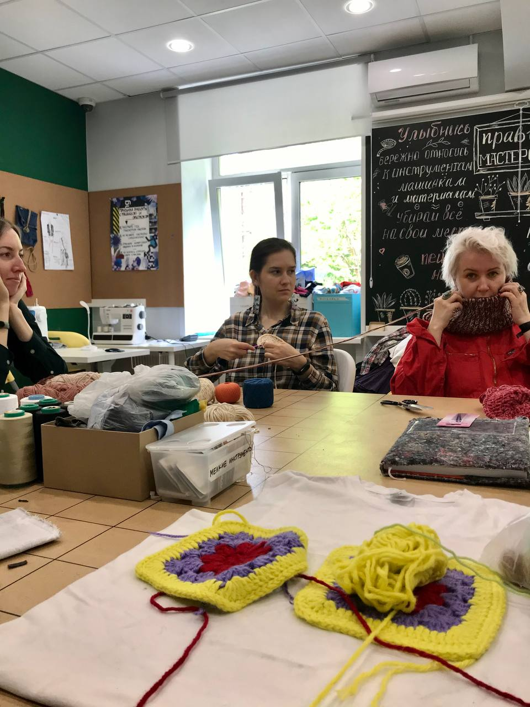
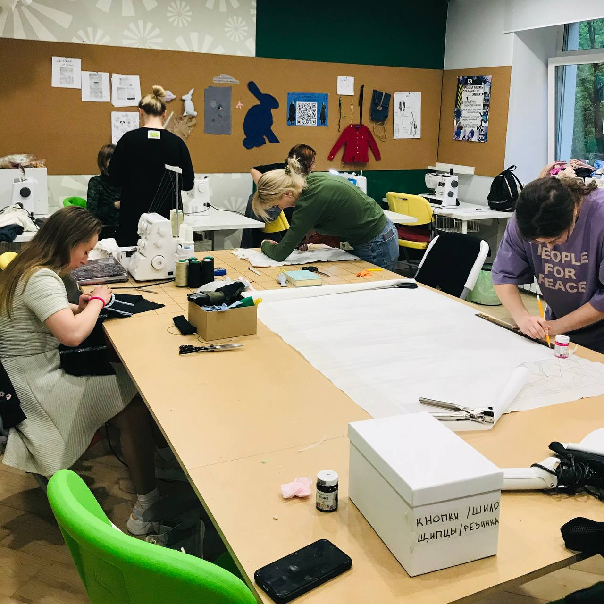

## Шей-чини-береги, мы научим тому, как дать вещам вторую жизнь!

Вещи заслуживают второго шанса, даже если они сломались, устарели или разонравились. 

**Мастерские фонда Второе дыхание** - это три общественных мастерских со всем необходимым оборудованием и бесплатным посещением (швейный коворкинг, столярная мастерская и творческая)

В Мастерских фонда ВТОРОЕ ДЫХАНИЕ вещи обретают вторую жизнь. Здесь можно починить сломавшиеся или устаревшие вещи, попробовать себя в дизайне и творчестве и узнать больше об осознанном потреблении.

## Швейная мастерская

В Мастерских можно научиться чинить или кастомизировать одежду, создавать новые предметы гардероба и интерьера из ненужных вещей, а также бесплатно пользоваться современным оборудованием для шитья и починки вещей. 

### Как появилась

Мы во ВТОРОМ ДЫХАНИИ верим, что вещи заслуживают второго шанса, даже если они сломались, устарели или просто разонравились. Нас вдохновляют российские и зарубежные дизайнеры, превращающие вторсырьё в объекты искусства, а никому не нужные вещи – в желанные и необычные, которыми мы можем пользоваться каждый день.

### Какую проблему решает?

Миссия фонда – развивать осознанное потребление в России. В стране ежегодно на мусорных полигонах оказываются 2 млн тонн одежды, при этом часть из них ещё может быть повторно использована. Мы призываем не выкидывать вещи, а по возможности ремонтировать их – и готовы научить и предоставить оборудование для этого.
ЭТО МАСТЕРСКИЕ ИНКЛЮЗИВНОСТИ

Отдельное направление проекта – создание инклюзивной среды: Мастерские открыты, а расписание адаптировано под запросы людей с ограниченными возможностями.

### Два направления

1. МЕРОПРИЯТИЯ
	Возможность научиться починке вещей у профессионалов
	Мастер-классы по шитью, починке одежды, созданию аксессуаров, игрушек, лекции от стилистов и экологов, свопы и многое другое
2. БЕСПЛАТНЫЙ ШВЕЙНЫЙ КОВОРКИНГ
	Возможность бесплатно пользоваться необходимым оборудованием
	Есть всё необходимое оборудование – от булавок и ножниц до современных швейных машин и оверлок, которым может воспользоваться любой желающий после прохождения установочной встречи

## Форматы мероприятий

### Мастер-классы

По апсайклингу и кастомайзингу: освойте технику тай-дай, научитесь подшивать брюки и накладывать заплатки, чинить мебель и создавать предметы интерьера и игрушки – и многое другое

### Лекции и обсуждения

С дизайнерами, представителями fashion-индустрии, экосообщества

### Тематические программы на целый день

Nематические программы на весь день с лекциями, мастер-классами от стилистов и специалистов по наведению порядка

### ТЕМЫ МАСТЕР-КЛАССОВ:

- ремонт одежды под руководством мастера
- кастомизация вещей с помощью различных техник
- создание новых предметов одежды из вторичных материалов
- создание украшений и аксессуаров, предметов интерьера из вторсырья

