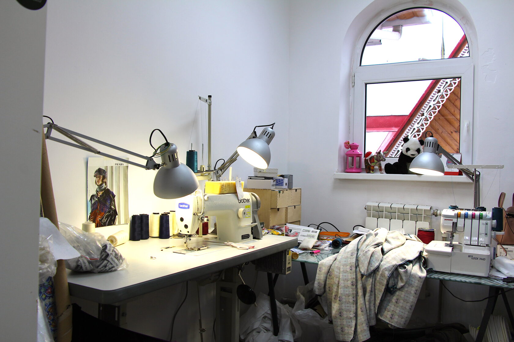
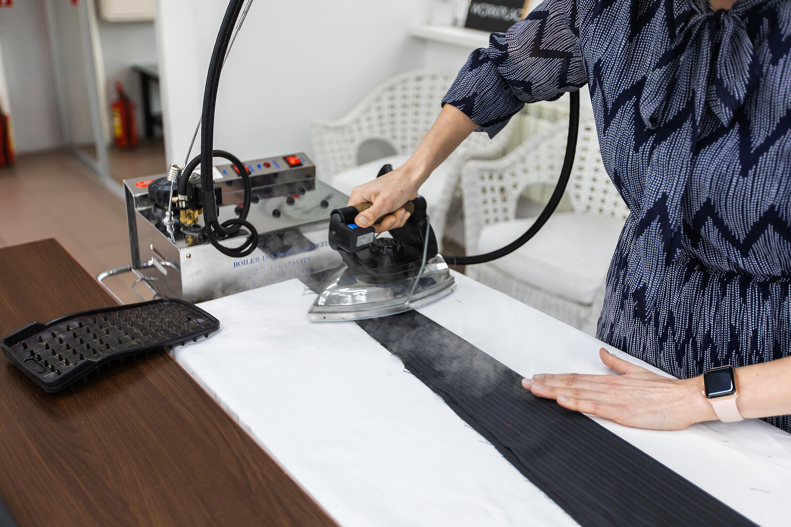

## Швейный коворкинг, аренда рабочего пространства для дизайнера одежды

#### Собственный кабинет

Уже в кабинете: яркое освещение, большой стол, система хранения, настольный свет, вешало

#### Инфраструктура

Светлый зал раскройных столов, манекены, гладильные системы, ножницы, вспарыватели, сантиметровые ленты, линейки

#### Круглосуточный доступ

Доступ в любое время суток, в том числе и в праздничные дни

#### Кухня

Отдельная комната для обеденного перерыва: чайник, микроволновка, холодильник

#### Бесплатная парковка

Для вас и ваших гостей всегда работает парковка в 10 метрах от входа

#### Чистота и порядок

Весь мусор мы выносим сами во время генеральной уборки каждое воскресенье.

## Что входит в абонемент?

Ваша мастерская состоит из нескольких частей и все это в вашем распоряжении! Собственный кабинет, зал с большими раскройными столами, кафе-кухня, примерочная. Можно перевезти свои вещи и оборудование, используя при этом ресурсы всей студии.

#### Кабинет резидента

У каждого резидента и его команды свой собственный светлый и уютный кабинет с мебелью и системой хранения. Кабинеты закрепляются за резидентами, в который можно завезти свою дополнительную мебель и оборудование.

#### Примерочная для встреч с клиентами

Абонемент — это не только рабочее место и инструменты. Это еще примерочная с безлимитным доступом. Набросать эскиз, снять мерки, пообщаться с глазу на глаз можно в просторной и светлой примерочной.

#### Зал раскройных столов

Светлый и просторный зал с большими раскройными столами. Окна во всю длину стены. А вид открывается на пруд. 

Мы не сдаем в аренду офисы, а предлагаем абонементы с доступом ко всей студии, включая закрепляемый за вами выбранный кабинет.

## Виды абонементов:

### СТАРТОВЫЙ

* Одно рабочее место в кабинете на двоих
* Вся инфраструктура пространства
* Доступ 24 часа, 7 дней в неделю, без праздников
* Швейная машина промышленная при необходимости

### МАЛЫЙ

* Закрепленный за резидентом кабинет
* Вся инфраструктура пространства
* Доступ 24 часа, 7 дней в неделю, без праздников
* Швейная машина промышленная при необходимости

### СРЕДНИЙ

* Закрепленный за резидентом средний кабинет
* Вся инфраструктура пространства
* Возможность работы дополнительно до 1 сотрудников
* Доступ 24 часа, 7 дней в неделю, без праздников
* Швейная машина промышленная при необходимости

### БОЛЬШОЙ

* Закрепленный за резидентом большой кабинет
* Возможность работы дополнительно до 2 сотрудников
* Дополнительная система хранения и стол
* Вся инфраструктура пространства
* Доступ 24 часа, 7 дней в неделю, без праздников
* Швейная машина промышленная при необходимости

Подробнее о тарифах и их различиях — [тут](https://docs.google.com/document/d/1l3oT4ZQjj3E8-Hlk-b82QwqNBvxYsqt1KDynMmBQ0Io/edit)

В стоимость абонемента входит закрепленный за дизайнером кабинет, круглосуточный доступ, а также инфраструктура всего Дома моды: раскройные столы, приемная зона для гостей, примерочная, парогенераторы, манекены. На кухне: микроволновка, чайник, холодильник, место хранение посуды. В примерочной: кресла, вешало,   зеркала, ширма. А также бесплатная парковка, мебель в кабинете, интернет, электроэнергия, вода, уборка общего зала и кабинетов, уборка санузлов, вынос мусора, расходные материалы: бумага, мыло.

Мебель. Гарантированный список предметов передающихся при подписании договора. По необходимости можно закупить собственную, включая настенные крепления, полки. Исключение предоставляемой мебели из кабинета не влияет на стоимость абонемента.

Учитываются сотрудники, регулярно использующие общие зоны и производящие продукцию на территории воркплейса. +3000 р за еще одного сотрудника в месяц к абонементу свыше указанного количества (не действует в тарифе «Стартовый»). “Сотрудником” является приходящий человек для работы на дизайнера, без завоза своего оборудования и материалов. Вход гостям в дневные часы свободный.

Каждому действующему резиденту предоставляется скидка от 5 до 25% в партнерских магазинах тканей, фурнитуры и оборудования.

### Добро пожаловать!

Мы находимся на территории нового проекта VERNISSAGE от создателей дизайн-завода Flacon. На станции «Партизанская» (в 13 минутах на метро от «Охотного ряда»).

С нами по соседству располагаются современные мастерские, шоу-румы, бары, кальянная и несколько кафе.

<youtube-embed link="https://youtu.be/0HXGRMIxe2w" />
