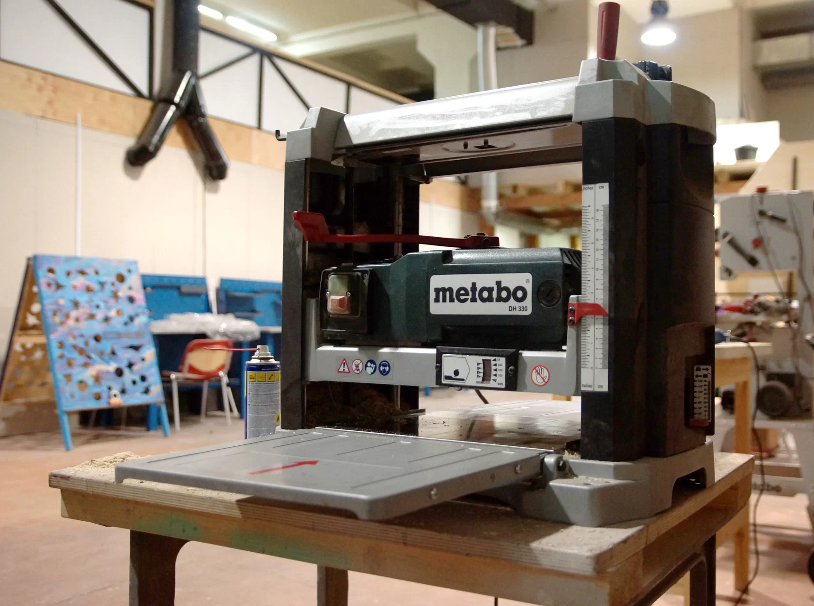

**ЦМИТ "Антарес" — это сообщество ученых, инженеров, разработчиков, педагогов-наставников.**

**Наша миссия – популяризация инженерного дела для широкой аудитории и предоставление технических возможностей для воплощения самых невероятных идей.**

Мы нацелены на создание детско-взрослой среды, обучающей решению актуальных проблем с применением научно-технологических разработок. Для этого мы создали высокотехнологичный ресурсный центр, открытый для школьников, студентов, специалистов.

Мы выстраиваем образовательную и производственную сетевую инфраструктуру совместно с партнерскими ВУЗами, предприятиями, академическими организациями России и образовательными организациями Москвы, чтобы у наших участников был доступ к необходимым для их проектов ресурсам.

### Коворкинг

Если вы точно знаете, что хотите сделать и даже знаете как, но у вас не хватает инструмента или пространства - мы можем с этим помочь! Если же у вас есть какая-то идея, но нет полного представления, как это реализовать, с этим тоже можно идти к нам!

Внимание! При использовании столярных станков, пожалуйста, пройдите сначала аттестацию в согласованное заранее время.

#### СТАНОЧНЫЙ ПАРК
- Циркулярная пила Metabo BSS611
- Фрезер Dexter Power PC1300RT
- Торцовочная пила Hyundai M1500-210
- Электроточило Томск У4.2

#### ЭЛЕКТРОИНСТРУМЕНТ
- Электролобзик BLACK+DECKER KS999E
- Электрорубанок BLACK+DECKER BD750
- Ленточная шлифмашина Интерскол ЛШМ-76/900
- Вибрационная шлифмашина Интерскол эпшм 115/135
- Эксцентриковая шлифмашина BOSCH PEX 300 AE
- Перфоратор Makita DHR241
- Сабельная пила Makita BJR182
- Шуруповерт Makita DDF453/XPH12Z
- Импульсный Шуруповерт Makita LXDT04Z
- Шуруповерт Dexter Power CDT219LD
- Гайковерт Makita BTW251
- Дрель Makita DP2011
- УШМ 125мм Makita 9558HN/DGA504
- Нивелир лазерный BOSCH 2 Basic
- Торцовочная пила BOSCH PCM 7
- Электро отвертка Ryobi premium ERGO-A2
- Гравер Dremel 3000-15

#### РУЧНОЙ ИНСТРУМЕНТ
- Молоток, киянка
- Набор отверток
- Уголок, угломер
- Линейки, рулетки
- Штангенциркуль
- Набор стамесок
- Рубанок
- Набор рашпилей
- Ручной лобзик, пила
- Шило
- Кусачки, круглогубцы, плоскогубцы
- И многое другое

---

##### Курсы для школьников и студентов

Курсы и мастер-классы по актуальным технологическим направлениям: ракетостроение, робототехника, технологии цифрового производства, VR, нейросети и многое другое

##### Учебная мастерская

Мастер-классы по изготовлению изделий из дерева, металла, литью из смолы и пластика и т.д. Разные уровни сложности, для взрослых и детей

##### Центр промышленного дизайна и прототипирования

Промышленный дизайн, поддержка технологических проектов любого уровня сложности, проектирование, макетирование, отработка технологий производства

##### Отдел производства

Лазерная резка, ЧПУ-фрезеровка, плазменная резка металла, 3D-печать. Изготавливаем заказы любого объема, от значка до мебели

### Что нужно для посещения

Чтобы принять участие в наших мастер-классах не требуются предварительные навыки, однако мы оцениваем, что некоторые мастер-классы не подходят для детей, в частности те, где предполагается работа с циркулярными станками, или, например, со сваркой. Тем не менее, вы всегда можете придти вдвоем с вашим ребенком и вместе работать над проектом. Перед началом любого мастер-класса проводится инструктаж по работе с электроинструментами и станками, кроме того, вы в любой момент можете обратиться за помощью к мастеру-преподавателю. Мы выстраиваем занятие так, чтобы даже новичок смог получить изделие высокого качества, однако для достижения наилучшего результата от вас потребуется внимательность, и главное - терпение. Мы предоставляем все необходимые инструменты, материалы и детали для мастер-класса, а в некоторых случаях вы сможете выбрать дизайн будущего изделия, например рисунок для нанесения, или цвет отделки. Рекомендуем захватить с собой смену одежды для работы, у нас есть раздевалка, где можно переодеться. Обратите внимание, что любой мастер-класс вы можете приобрести в подарок, в этом случае мы оформим красивый подарочный сертификат!
