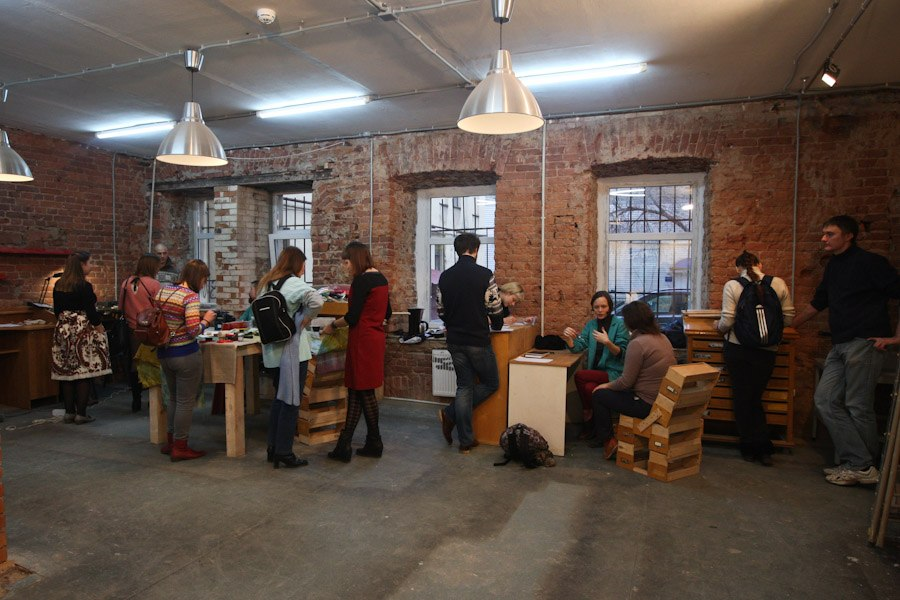

**«Открытые мастерские»** — образовательный и производственный центр в сфере прикладных искусств, с декабря 2013 года работающий на базе библиотеки «Лиговская». Проект дополняет основную деятельность библиотеки, делая акцент на развитии социально-культурного направления и просвещении в сфере искусства.

"Мастерские" предоставляют возможность творческой реализации для всех посетителей: здесь проходят мастер-классы, выставки, лекции, планируется создание собственного образовательного интернет-ресурса. Формируется уникальный книжный фонд по прикладным специальностям: дизайн одежды, фотография, художественный текстиль, переплёт и реставрация книг, станковая графика, столярное дело, резьба по дереву и флористика.

Обучение происходит в нескольких форматах: открытые лекции, мастер-классы, тренинги «одного дня», а также длительные занятия для небольших групп (участники отбираются по мотивационным письмам).

Идея создания проекта «Открытые Мастерские» появилась более двух лет назад у одного из работников библиотеки им. Лермонтова. Он был движем идеей объединить библиотечное сообщество с деятельностью молодых художников. Не приглашать художников на временные выставки, а организовать для них постоянное место, в котором они могут работать над собственными проектами и в один из вечеров на неделе преподавать свое направление для всех желающих на абсолютно безвозмездной основе.

Поддерживая достаточно гибкий подход ко всяческому изменению пространства, мы стремимся сделать его комфортным для каждого. Для нас первостепенную роль играют факторы не физического комфорта – стулья с удобными спинками, ровно отштукатуренные стены, ровный гладкий стол, мягкий свет. Все это напоминает идеальный предмет, которым очень хочется обладать, но как только он попадает в руки, то становится понятно, что полностью отсутствует элемент живого контакта. Не ясно, что делать с ним дальше. Идеальный предмет ставится на полку ради успокоения совести и там умирает. В Открытых Мастерских хочется достичь психологической расслабленности и, достучавшись до человека, увидеть в нем эмоциональную вовлеченность в процесс своего собственного развития. Выстраивая окружающее пространство, мы стремимся к мобильности и незаконченности, чтобы иметь возможность обернуть все вспять и начать сначала, но в абсолютно другом направлении, которое приведет к иным результатам.

**Если проще и внятней:** Есть библиотечная площадка (финансируемая государством), которую нам однажды удалось приспособить под нужды художников. Каждый вписавшийся в проект мастер получает бесплатное место для работы, а взамен преподает свое направление раз в неделю, в остальное время работает на себя. Библиотека, таким образом, получает большой приток посетителей, которые становятся ее читателями, насыщенную жизнь и постоянное движение. Сотрудники библиотеки стремятся сделать жизнь художников максимально комфортной и свободной. Это единое пространство в котором практически отсутствуют перегородки, а значит нужно взаимодействовать друг с другом, но если необходимо, то мы всегда найдем место для спокойного размышления. Стараемся уважать личное пространство. Настаиваем на эгоистичной позиции каждого, что проект может развиваться лишь при личной заинтересованности каждого. Все участники проекта могут работать на площадке в течении года, далее они уступают место другим художникам. Кроме постоянных курсов у нас проходят выставки, лекции, концерты, презентации, но не всякие. Критерий один – это должно быть интересно, продуманно и сделано.

Участники проекта: Наталия Максимова – станковая графика; Всеволод Коновалов – основы фотографии; Константин Поляков – живопись, техническая работа с холстом; Шейда Тахирова – дизайн одежды; Дмитрий Пряхин – художественная фотография; Максим Нисонов – столярное дело; Юлиана Моргун – каллиграфия.
