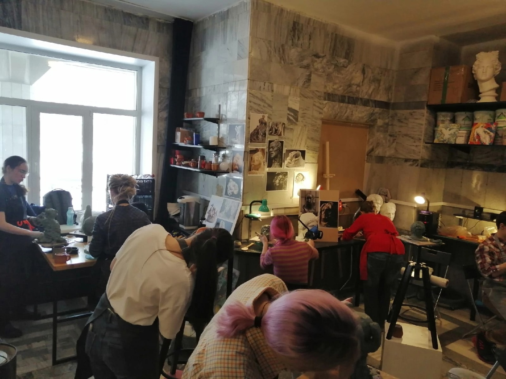
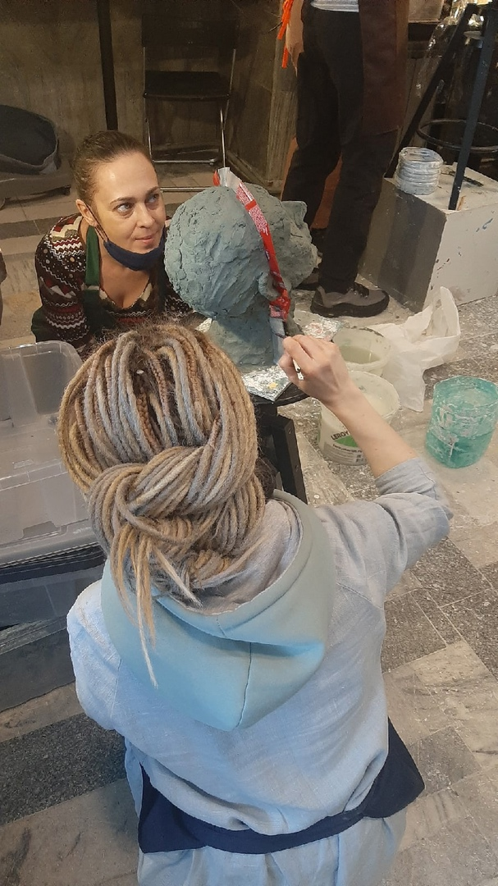
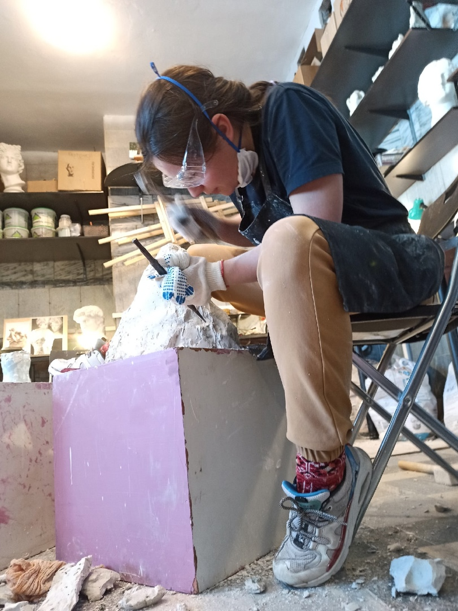
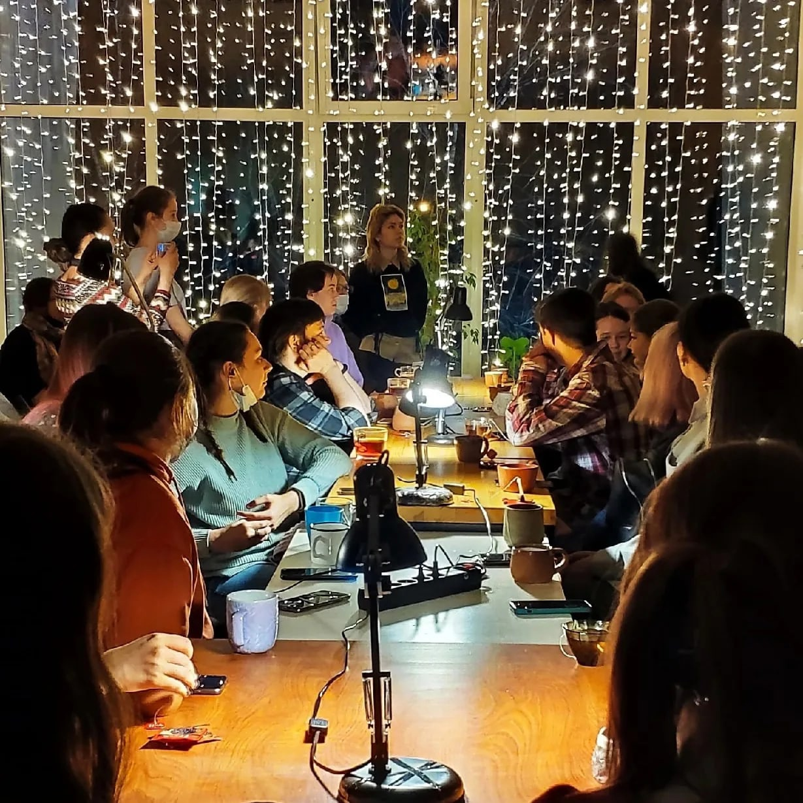
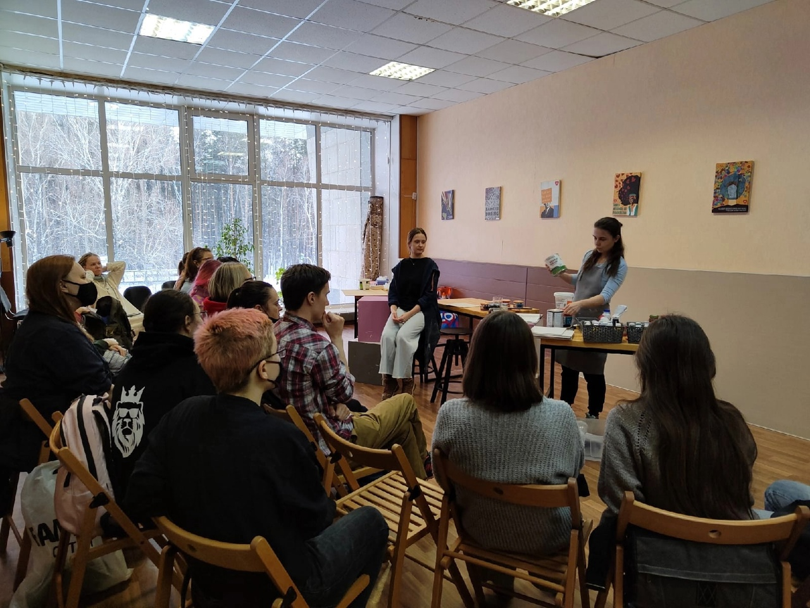

## О проекте

### Мы - маленькая творческая мастерская.

Здесь можно найти единомышленников, что-нибудь сотворить, чему-нибудь научиться или научить. В конце концов, просто раствориться в творческом потоке, без ожидания какого-то конкретного результата.

Коворкинг создан, в первую очередь, для самостоятельной работы. Согласись, не всегда есть возможность разместить дома (а тем более, в общаге) гончарный круг, печь для обжига керамики, мольберты и тд., и это не говоря о том, сколько артефактов образуется во время работы :) Творческий беспорядок заполоняет дом и причиняет массу неудобств окружающим.

Я сама сталкивалась с этой проблемой, и в какой-то момент завела свою мастерскую. А потом построила эту - для вас. Мне в этом помогло очень большое количество людей.
В первую очередь, это моя команда - Лена и Даша.
Далее - наши друзья и близкие. А потом и те, кто присоединился к коворкингу до его открытия.

Помимо самостоятельной работы, в коворкинге будут организованы бесплатные мастер-классы. Одни доступны для любого количества посетителей, другие - с ограниченным количеством мест. Для одних МК материалы закуплены по гранту, для других, идеи которых пришли нам сильно позже, придется купить материалы самостоятельно.
Если ты хочешь научиться чему-нибудь под надзором мастера вне МК - напиши нам, мы найдем тебе преподавателя по душе.

Также, перед тем, как пользоваться коворкингом, тебе придется заполнить ряд документов. Мы находимся на территории молодежного центра Юность. Здесь все серьезно и официально. Поэтому и на нас распространяются эти требования.

Рады видеть тебя, если уже знакомы. А если ещё нет - скорее присоединяйся :) очень ждем.

### Что нужно знать о коворкинге?

1. Это место предназначенное для твоей самостоятельной работы. Иногда мы проводим тут мастер-классы, но основное назначение мастерской - совместная самостоятельная работа. Повторюсь, мы НЕ студия и не школа.
   Кстати, пользоваться коворкингом можно и в классическом смысле - ты можешь приходить и садиться сюда с ноутом.
2. Для тех, кто прошел регистрацию - пользование коворкингом бесплатно. Можно брать все инструменты, которые видишь, и работать. Исключение - именные коробки. Там личные вещи посетителей
3. И да, ты можешь оставлять свои личные вещи/краски/инструменты в подписанной коробке
4. Обязательно убирай за собой рабочее место. Если это не сделали до тебя - сделай это за других
5. Мы работаем бесплатно. Проводим МК, договариваемся о МК, пишем эти посты, обрабатываем ваши запросы, отвозим обжиги на такси. Почему так вышло? Честно - мы вообще не думали о деньгах, когда писали проект. Мы хотели сделать клевое место. Мне кажется, мы его сделали. Но нам очень нужна финансовая поддержка. Банально на расходники, чай, такси до печки (разместить в Юности ее не удалось).

### Лови самые важные ссылки:

1. зарегистрироваться в коворкинге - https://litsky.ru/artchaos#form

2. табличка со временем, в которое можно воспользоваться- коворкингом самостоятельно (для зарегистрировавшихся) - - https://docs.google.com/spreadsheets/d/1CivF1Nan1EEFl..

3. форма регистрации на МК - https://docs.google.com/forms/d/e/1FAIpQLSe1sNuc5vVug..

4. форма, чтобы провести свой МК - https://docs.google.com/forms/d/e/1FAIpQLSdZHges_8lPK..

5. вступить в наш чатик - https://vk.me/join/JYj7vDed8qQRKXCqNfb3HDUGLTiOoJgWv2M=

6. поддержать проект - https://www.tinkoff.ru/cf/ksHd1xdjiL

