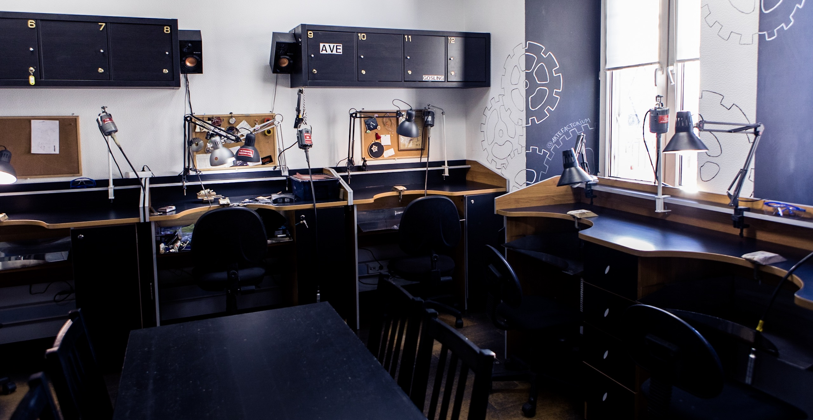
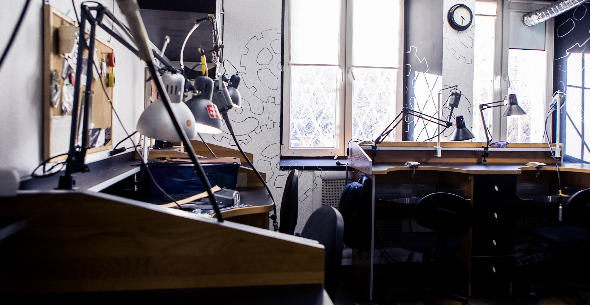
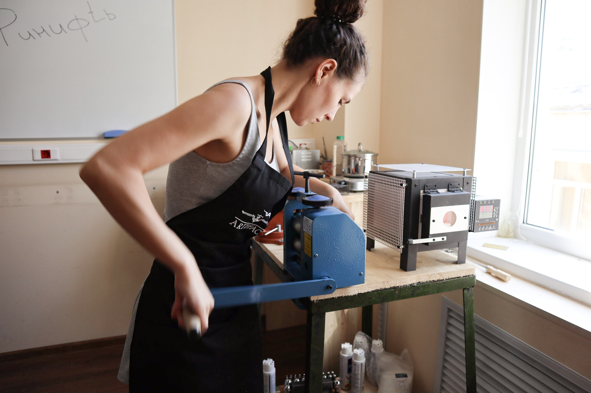
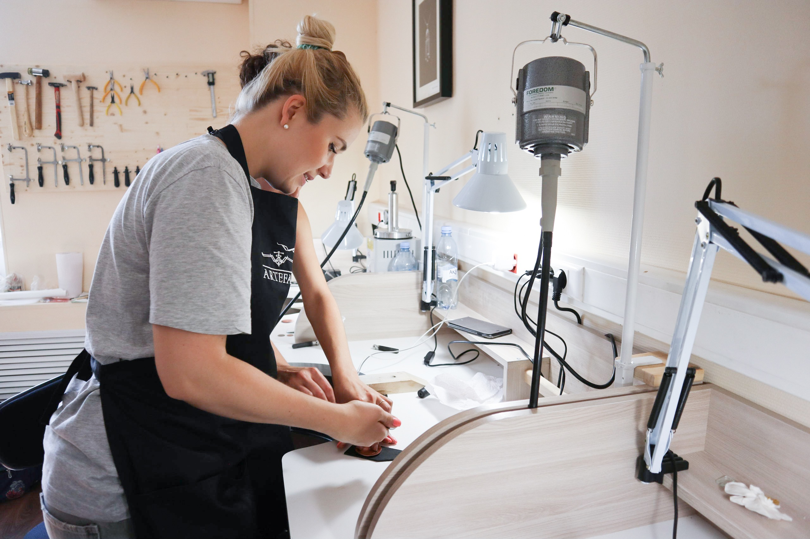

**Artefactorium** — место где обучают ювелирному делу, где работают мастера и студенты. Творческая атмосфера мастерской никого не может оставить равнодушным. Кроме обучения в Artefactorium создают неповторимые ювелирные изделия. Каждый мастер имеет свой уникальный стиль и авторские «фишки», свое творческое видение. У мастерской нет единой стилистической направленности — именно поэтому «Artefactorium» — это объединение вольных ювелиров.

### О мастерской от первого лица.

**— Александр, почему именно ювелирная мастерская?**

— Идея мастерской возникла у меня в 2010 году. Начиналось все как интересное увлечение — я работал системным администратором и в свободное время осваивал различные ремесленные навыки, и, попробовав, ювелирное дело, понял что это мое. Прошел профессиональное обучение, и начал создавать первые ювелирные изделия дома. Быстро поняв, что для ювелирной работы все-таки нужно специальное место (требуется много специального инструмента, идет работа с открытом огнем) — решил основать небольшую мастерскую. В этой мастерской я начал вести первые мастер-классы по основам ювелирного дела и созданию колец с деревом и обручальных колец для влюбленных пар. Постепенно подтянулись единомышленники и к 2012 году «Artefactorium» уже стал существовать как «мастерская вольных ювелиров» — место где обучают ювелирному делу и работают независимые ювелиры.

**— Как и когда Вы поняли что Ваша цель преподавать ювелирное искусство?**

— Изучив то, что предлагается на рынке ювелирного образования и сам столкнувшись с проблемами при обучении, я решил сделать из мастерской место для получения доступного, разнообразного и максимально практического обучения ювелирному делу для всех желающих. Таким образом появились не только мастер-классы, где любой желающий за один вечер может создать собственное ювелирное изделие, но и полноценные курсы по самым востребованным областям ювелирного дела (мастерство, дизайн, 3D моделирование, работа с воском и другие) и полугодовую программу «Хочу свой бренд!» — на который студенты не только учатся создавать ювелирные украшения, но и получают весь необходимый комплекс знаний для создания и запуска собственно марки украшений.

**— Цель Artefactorium только обучение?**

— Создавая мастерскую, мне хотелось не только дать всем желающим возможность обучиться ювелирному делу, но поддержать начинающих ювелиров. Для этого в мастерской создан ювелирный коворкинг со всем необходимым оборудованием, где любой желающий может арендовать полноценное рабочее место. Также существует группа выпускников мастерской в Facebook , где студентам предлагаются совместное участие в выставках, закупка материалов и многоe другое.

Для всех, кто хочет работать, но не имеет возможность оборудовать свою мастерскую. Для наших учеников и выпускников, а так же выпускников других ювелирных школ. Мы предлагаем творить в спокойной и дружеской атмосфере у нас в мастерской! Тут Вам точно никто не помешает и не будет жаловаться на шум и творческий беспорядок.

## Аренда рабочего места включает:

### Доступ к ювелирному оборудованию для ручного производства украшений:

- Вальцы
- Фильеры (круглая и квадратная)
- Мощные тиски
- Восковой инжектор
- Вулканизатор
- Точило
- Молотки
- Ригели для колец
- Шлифмашина
- Ленточная пила
- Горелка
- Аппарат бензиновой пайки
- Изложница
- Весы
- Муфельная печь
- Бормашинка
- Вырубка для дисков
- Дизайн куб
- Ультразвуковая ванна

### Расходные материалы:

- Бензин для горелки
- Флюсы
- Отбел
- Тигли
- Полировольные пасты

### Консультации по работе с оборудованием;
### Доступ в чистую зону для отдыха и общения с клиентами;
### Пользование библиотекой мастерской. А это более 60 (!) книг по ювелирному делу!
### Чай и печеньки;
 

**Дополнительные услуги:**

- Личный ручной инструмент (надфили, корневертки, скальпели, инструемнт для работы с воском, штихели, ударные штампы и другой инструмент) **250р за день**

- Расходники (воск, резина для вулканизации, сверла, боры, лезвия, пилки и прочее) - по прайсу мастерской

- Консультация и помощь нашего мастера - **1000р/час.** (Консультация это не обучение, предполагается что вы владете навыками)

На аренду места обязательна предварительная запись.
