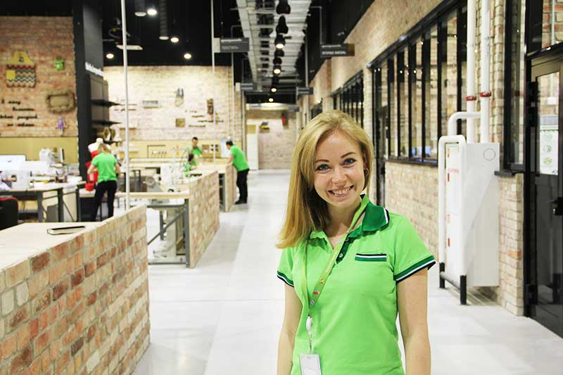

### О Фабрике

Фабрика идей Леруа Мерлен — это открытая творческая мастерская, расположенная на территории магазина Леруа Мерлен ЗИЛ.

Здесь Вы можете реализовать свой проект, получить помощь мастера, записаться на образовательные курсы и посетить разнообразные лекции и мероприятия. Наша Фабрика открыта для всех желающих: совершенно не важно, новичок Вы или уже состоявшийся профессионал. В каждом пространстве Вас ждут специалисты, готовые рассказать, научить и показать, как воплотить Ваш проект в жизнь.
Пространства

### Территория Фабрики поделена на 10 пространств:
- Дерево
- Металл
- Освещение
- Студия
- Декор стен
- 2-я жизнь
- Текстиль
- 3D и электроника
- Покрасочная
- Коворкинг
- События и мастер-классы

На территории Фабрики идей проходят захватывающие мастер-классы и звучат интересные лекции.

