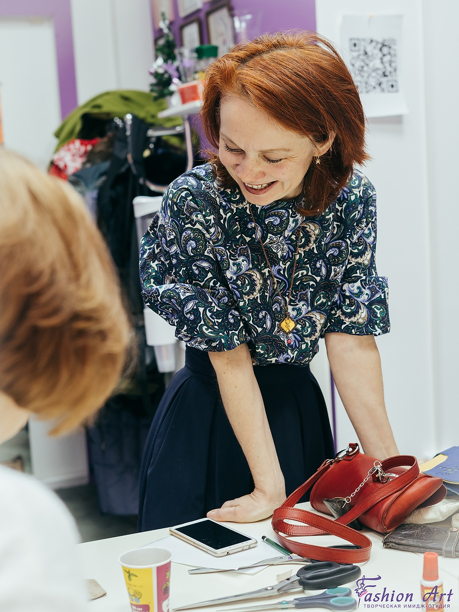

## О нас

Швейный коворкинг - это пространство для творческих людей! Здесь вы можете создавать свои шедевры легко, удобно и с комфортом! Студия полностью оснащена необходимым оборудованием, инструментами, материалом, фурнитурой. У нас также проходят мастер-классы по шитью и рукоделию. Вас ждет интересное и полезное общение с творческими и креативными людьми.

## Fashion Art - пространство для вашего творчества!

Fashion Art включает в себя 5 направлений творчества:

### FA-ателье:

- индивидуальный пошив;
- ремонт одежды;
- дизайнерские работы;
- машинная вышивка;
- швейный коворкинг;

## FA-обучение:

### Курсы

- "Кройка и шитье"
- "Моделирование одежды"
- "Корсет"
- "Пошив из трикотажа"
- "Детский трикотаж"
- "Пошив жакета"
- “Нижнее бельё”
- "Дети шьют сами" (10+)

👉🏻 Ты можешь посетить курсы, мастер-классы или пройти индивидуальное обучение

💸 Пробное занятие БЕСПЛАТНО!

### Мастер-классы

- Материаловедение
- Шлица обработанная подкладкой
- Юбка-солнце
- Туника
- Халатик
- Детская шапочка
- Рубашечный воротник
- Карман в рамку/листочка/в боку
- Застёжка поло
- Планка
- Манжеты
- Бабочка
- Брошь из фетра
- Заколка
- Скечинг
- Эбру
- Ловец снов
- Пинетки
  и многие-многие другие (смотри расписание в группе)

FA-style:

- услуги стилиста;
- шоп-сопровождение;
- разбор гардероба;
- мастер-классы по стилю, имиджу;
- курс "Я - стильная".

FA-photo:

- студийный и выездные фотосессии;
- рекламная съемка;

FA-video:

- сценарии;
- видеосъемка и монтаж;
- создание видео-проектов.
