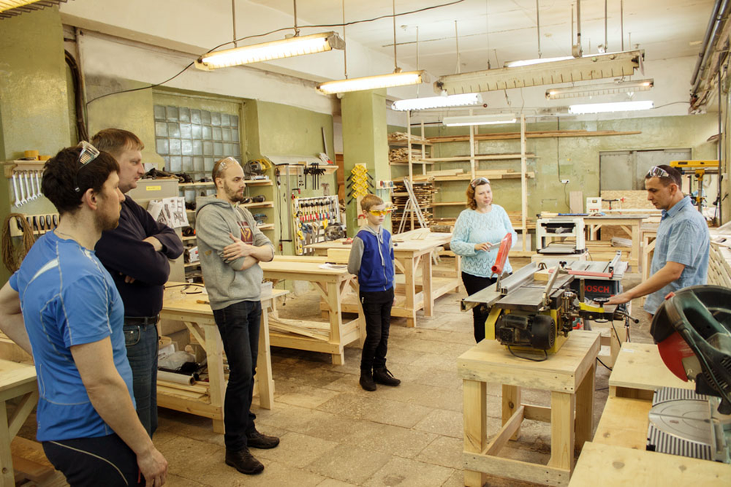

### Первая в Екатеринбурге общественная столярная мастерская!

Приглашаем всех, кому нравится создавать вещи своими руками! Даже если вы ничего не умеете, но любите дерево и хотите научиться работать с ним, приходите, мы поможем и научим. Каждому посетителю предоставляется индивидуальное рабочее место, возможность пользоваться всеми инструментами и станками мастерской, наша поддержка, чай и кофе.

Мы работаем в формате коворкинга, т.е. вы можете арендовать рабочее место в нашей мастерской на необходимый вам срок - час, день, неделю или месяц.

Обязательное условие - вы должны предварительно пройти обучение в нашей мастерской ("основы столярного дела", индивидуальное обучение). 

Кроме того, обязательно соблюдать технику безопасности и бережно относиться к оборудованию мастерской.

В стоимость аренды входят: один верстак, возможность пользоваться всеми инструментами и станками мастерской, индивидуальный шкафчик для одежды, чай, кофе, совет и помощь мастера (если возникнет такая необходимость).

Расходные материалы не входят в стоимость аренды, их можно принести с собой или купить в нашей мастерской.

### Преимущества:

1. Инструмент, который позволяет точно, качественно и быстро обрабатывать древесину и листовые материалы.
2. Удобное пространство, где можно заниматься любимым делом, не беспокоясь о том, что вы помешаете соседям или домочадцам.
3. Творческая атмосфера.
4. Возможность общаться с единомышленниками, обмениваться опытом.
5. Доступные цены.

### Несколько причин посетить нашу мастерскую:

#### Практическая польза.

- В нашей мастерской можно отреставрировать старую мебель. Не спешите выбрасывать бабушкин комод. Что может выглядеть достойнее, чем мебель из натурального дерева, сделанная старыми мастерами-мебельщиками. Немного усилий и фантазии и вы получите шикарную винтажную вещь, которая будет радовать не только вас, но и ваших детей и внуков.
- Можно отремонтировать сломанный стул или любой предмет из вашего хозяйства.
- Можно своими руками сделать новую мебель для дома или дачи. Воплотить любые идеи. И это будет не просто мебель, а авторская работа, предмет гордости. Приятный бонус - значительная экономия по сравнению с аналогичной мебелью, купленной в магазине или сделанной на заказ.
- Более того, не любую мебель из магазина, особенно доступную по цене, можно использовать без страха за свое здоровье. Делая мебель сам, ты абсолютно уверен в её экологической безопасности.

#### Удовлетворенная потребность в самореализации.

- Навыки работы с электроинструментом открывают широкие творческие возможности. Из обычной доски, листа фанеры или ветки дерева можно сделать много разных полезных и уникальных вещей. Создавая мебель, арт-объект или предмет интерьера, вы развиваете свой творческий потенциал, ощущаете радость от собственного труда, учитесь чему-то новому.

#### Трудотерапия.

- Столярный коворкинг - это аналог фитнеса. Если вы заняты интеллектуальной или малоподвижной работой, большую часть дня проводите за компьютером, то работа руками - это возможность вернуться в реальный мир, снять стресс, отвлечься от ежедневных проблем.

#### Возможность заработать.

- Занимаясь любимым делом можно получить дополнительный заработок, продавая сделанные вами вещи или выполняя заказы.

Для посещения коворкинга можно оплатить месячный абонемент. Возможна также почасовая оплата или оплата нескольких дней.

Время вашего посещения просим согласовывать по телефону.

Посетитель мастерской обязан строго соблюдать требования техники безопасности. Для исключения производственных травм каждый новый посетитель должен пройти инструктаж, получить допуск к станкам и электроинструменту, расписаться в журнале по ТБ.

### Инструменты

По мере развития мы будем расширять нашу техническую базу. На данный момент мы можем предложить вам для работы следующее оборудование:

#### Станки

- универсальный деревообрабатывающий станок (фуганок - циркулярная пила - фрезер)
- токарный станок;
- рейсмусовый станок;
- распиловочный станок;
- торцовочные пилы;
- погружная циркулярная пила с направляющей шиной;
- фрезеры;
- сверлильный станок;
- сверлильное приспособление;
- отрезное приспособление для углошлифовальной машины.

#### Электроинструмент ручной

- шлифовальные машины;
- циркулярные пилы;
- дрели;
- лобзики;
- рубанок;
- углошлифовальные машины;
- шуруповерты;
- строительный фен;
- клеевой пистолет

