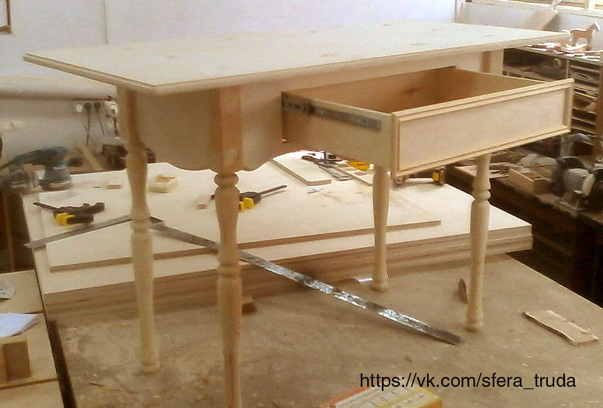

Первый в Новороссийске ремесленный клуб для детей и взрослых.

Любите созидать? Одолевают идеи? Хотите творчества?

Если у вас есть свои идеи, но нет места/инструмента/опыта, то приходите к нам. Поможем придумать, продумать, начертить и воплотить.

Мы работаем с деревом, стеклом, металлом и текстилем. Шкатулки, коробочки, рамки, подсвечники, игрушки, украшения и множество других поделок - вот то, что мы готовы делать, в том числе и вместе с Вами )))

Готовы проводить мастер-классы по витражному и столярному делу.

Мы предлагаем дружить и сотрудничать. Гарантируем внимание, позитив и сердечность. Добро пожаловать!

