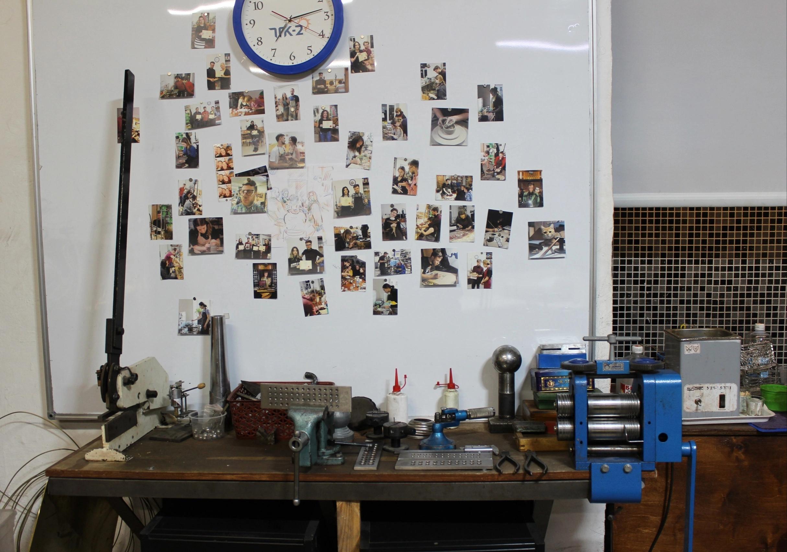

## "СВОИМИ РУКАМИ" - это:

• коворкинг-мастерская по декоративно-прикладному искусству; мы работаем с металлом, керамикой, деревом, стеклом и другими материалами; у нас свободный доступ с 12:00 до 22:00, 7 дней в неделю;

• открытый доступ к специальному оборудованию, инструментам и верстакам для реализации любого творческого замысла (ювелирный инструмент, гончарные круги, ручной электро-инструмент и многое другое);

• образовательные ювелирные курсы, курсы столярного дела, мастер-классы резьбы по дереву, мастер-классы резьбы по кости, гончарное дело;

• творческий коворкинг - сообщество творческих людей: мастеров и начинающих; Вы всегда можете поделиться новой идеей или получить нужный совет;

• удобный доступ к творческой инфраструктуре (выставочные залы, кинотеатр, магазины, хостел, кафе, круглосуточная охраняемая парковка).

Наша цель - сделать творчество доступным для каждого. Мы придерживаемся мнения, что творчество является базовой потребностью, такой же как потребность дышать.

На одной площадке мы объединяем начинающих творцов и опытных мастеров в области декоративно-прикладного искусства.

_Приглашаем к сотрудничеству мастеров по декоративно-прикладному искусству, организаторов творческих мероприятий, производителей инструментов и оборудования для ручного труда._

### Оборудование и инструменты постоянно пополняются!

**Ювелирное оборудование:** -паяльные аппараты -электромагнитная галтовка ( иголки MIX) -муфельная печь для горячих эмалей с кварцевым окошком -ювелирные вальцы -фильеры (круглые, квадратные) -ручной ювелирный инструмент -бормашинки, микромоторы -микроскоп -шлифмашина -точило -анки и пуансоны -чеканы -изложницы -матовка( электрогравер) -лобзики -восковой инжектор - раскатка для колец ( 15 роликов)

**Для резьбы по кости:** - микромоторы -ручные лобзики

**Для столярного дела:** - фрезер Bosch POF 1200 AE -циркулярная пила (ручная) -токарный станок по дереву - Станок лобзиковый (настольный) -электролобзик -шлифмашина -дрели -молотки -электрошкурка -шуруповерт -точило

**Для гончарного мастерства: ** -гончарный круг -муфельная печь 35 литров ( max. t = 1150 С) Также у нас имеются: -пирографы -швейная машинка -лайтбокс с отражающими фонами для ювелирных изделий

 
## Друзья, на площадке для творчества [СВОИМИ РУКАМИ](https://vk.com/svoymyrukamy) вы можете:

### 1. Самостоятельно работать в мастерской, приняв участие в творческом коворкинге:

**Часовой коворкинг:**

150 руб./час работы на нашем оборудовании в мастерской; для постоянных участников - 120 руб./час. Использование инструментов мастерской. Свободный доступ в мастерскую с 12:00 до 22:00

**Правила часового коворкинга:** 

Минимальное время работы – 30 минут. Начало отсчета как занято рабочее место. Stop-time только после 2 часов, не менее 30 минут.

**СЧАСТЛИВЫЕ ЧАСЫ – будни с 12:00 до 16:00 ** 130 руб./час работы, для постоянных участников - 100 руб./час.

**Дневной абонемент:** 1300 руб. за день работы, для постоянных участников - 1000 руб. Использование инструментов мастерской. Свободный доступ в мастерскую с 12:00 до 22:00

**Абонемент на неделю:** 2500р. Использование инструментов мастерской. Возможность хранения своих личных вещей. Закрепление индивидуального рабочего места. Свободный доступ в мастерскую с 12:00 до 22:00

**Абонемент на две недели:** 4000р. Использование инструментов мастерской. Возможность хранения своих личных вещей. Закрепление индивидуального рабочего места. Свободный доступ в мастерскую с 12:00 до 22:00

**Абонемент на один месяц:** 6000р. Использование инструментов мастерской. Возможность хранения своих личных вещей. Закрепление индивидуального рабочего места. Свободный доступ в мастерскую с 12:00 до 22:00 Возможность заморозки (продление абонемента)

**Правила заморозки:** максимальный срок заморозки абонемента – 7 календарных дней, единовременно.

**15 посещений в течение одного месяца: ** 5000р. Использование инструментов мастерской. Возможность хранения своих личных вещей. Закрепление индивидуального рабочего места. Свободный доступ в мастерскую с 12:00 до 22:00

**Арендовать гончарный круг** - 300 руб./час.

### 2. Пройти один из мастер-классов или записаться на курсы:

- Ювелирное мастерство - 11.000 руб./нулевой курс для начинающих/6 занятий. 
- Ювелирное мастерство - 11.000 руб./продвинутый курс/6 занятий 
- Ювелирное мастерство - филигрань - 9.000 руб./курс для начинающих/6 занятий. 
- Восковое моделирование ювелирных украшений - 9.000 руб/ 5 занятий 
- Резьба по кости - 1000 руб./мастер-класс 
- Резьба по кости - 5.000 руб./курс для начинающих/5 занятий, 1000 руб./занятие 
- Лепка из глины - 600 руб./1 человек/час 
- Резьба по дереву -1.000 руб./мастер-класс 
- Резьба по дереву - 6.000 руб./курс для начинающих/6 занятийДля участия в мастер-классах и курсах необходима предварительная запись.

Для того, чтобы мы забронировали Вам место на курсе, необходимо внести предоплату в размере 3000р. минимум за неделю до начала занятий. Оплатить можно переводом на банковскую карту или наличными в мастерской. В этом случае Вы можете быть уверены, что за Вами забронировано место. Если Вы отказываетесь от прохождения курса менее чем за три дня до его начала, а также если Вы не посещаете в дальнейшем занятия курса без уважительной причины, сумма предоплаты не возвращается, а пропущенные занятия не восстанавливаются.

### 3. Заниматься с мастером индивидуально.

### 4. Проведение своих мероприятий (мастер-класс, тренинг, корпоратив, День Рождения и т.д)

Доступно два помещения: 20 кв. м (коворкинг-мастерская) + 40 кв.м (зал-лекторий). Коворкинг-мастерская оборудована верстаками для ювелиров, а также столярным верстаком. В свободном доступе имеется оборудование и ручной электроинструмент. Малое помещение одновременно комфортно вмещает до 12-и человек. В зале-лектории есть два больших раскладных стола, более 30-и табуреток, диван, микроволновка, чай с печеньками. Большое помещение комфортно вмещает до 30-и человек.

Мы можем провести для Вас мастер-классы при участии опытных мастеров по различным направлениям декоративно-прикладного искусства: ювелирное мастерство, резьба по кости, пирография (выжигание по дереву), витражная роспись, лепка из глины, работа за гончарным кругом, деревообработка и другим направлениям по Вашему желанию.

Мы обеспечиваем информационную поддержку вашему мероприятию: делаем анонс в группе площадки для творчества СВОИМИ РУКАМИ.

Стоимость услуги: 400 руб./в час в будни до 17:00; 500 руб./в час в будни вечером, а также в выходные и праздничные дни.

Минимальная стоимость: 1000 руб.

По Вашему желанию может быть проведена профессиональная фото и видео съёмка творческого процесса. Стоимость работы фотографа или видео оператора - по договорённости.

Фотографии зала-лектория и мастерской: [vk.com/album-67538801\_193538534](http://vk.com/album-67538801_193538534)

### 5. Заказать выполнение своего авторского изделия из металла, дерева или глины у наших мастеров

Если у Вас есть интересная идея, но не хватает профессионального творческого опыта или Вы просто хотите доверить её реализацию профессионалам, то мы поможем воплотить Вашу задумку в жизнь: сделаем вместе с Вами эскиз или чертёж будущего изделия, дадим совет как добиться наилучшего результата и выполним Ваш заказ в оговоренный срок.

### 6. Приобрести подарочный сертификат.

Хотите сделать по-настоящему оригинальный и запоминающийся подарок и поделиться радостью творчества со своим близким человеком? Тогда подарите сертификат на посещение одного из мастер-классов, курсов или месячный абонемент на творческий коворкинг.

Мы проводим мастер-классы по следующим направлениям:

• резьба по кости – 1000 руб./взрослый/ребёнок 10+ • столярное дело: изготовление скворечников – 750 руб./взрослый/ребёнок 8+ • пирография (выжигание по дереву) – 500 руб./взрослый/ребёнок 7+ • лепка из глины – 1200 руб./ занятие ( длительность 2 часа) • резьба по дереву – 1000 руб./взрослый/ребёнок 10+

Вы можете приобрести сертификат на прохождение одного из курсов:

• столярное дело – 5000 руб./5 занятий/взрослый/ребёнок 10+ • резьба по кости – 5000 руб./5 занятий/взрослый/ребёнок 10+ • гончарное дело и лепка из глины – 1200руб./1 занятие длительность 2 часа • ювелирное мастерство, нулевой курс – 11000 руб./6 занятий/взрослый/ребёнок 14+ • ювелирное мастерство, продвинутый курс – 11000 руб./6 занятий/взрослый/ребёнок 14+ • восковое моделирование ювелирных украшений - 9000 руб/5 занятий/взрослый/ребенок 14+ • ювелирное мастерство, филигрань – 9000 руб./6 занятий/взрослый/ребёнок 10+ • резьба по дереву – 5000 руб./5 занятий/взрослый/ребёнок 10+

А также сертификат на:

• почасовой творческий коворкинг – 150 руб./человек/час работы в мастерской; • месячный абонемент на творческий коворкинг, безлимитное посещение мастерской, в него включена аренда индивидуального рабочего места, использование инструментов и оборудования мастерской - 6000 руб./человек/в месяц.

Сертификат можно приобрести на любую сумму. Оплата производится переводом на банковскую карту или наличными в мастерской. Срок действия сертификата - 2 месяца.

Пройти мастер-класс, начать прохождение курса или принять участие в творческом коворкинге необходимо в течение двух месяцев. После окончанию этого периода сертификат считается недействительным.
