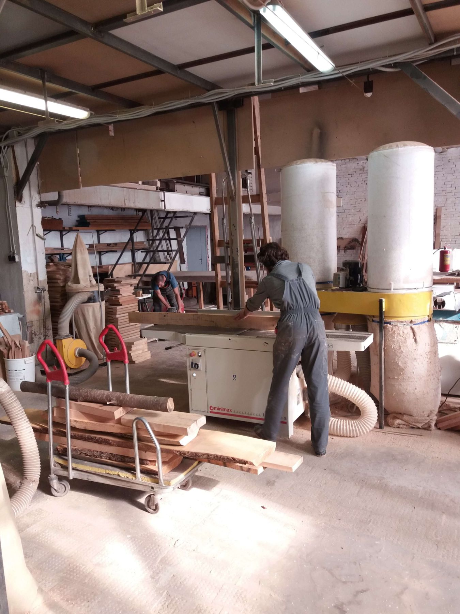

Коворкинг - это модная схема организации рабочего процесса, при которой в одном рабочем пространстве происходят разные, не всегда похожие виды деятельности. Коворкингом также называется и само помещение (офис, столярная мастерская и т. п.), где происходит подобная работа. 

Английское слово Coworking переводится именно как «совместная работа». Идея коворкинга возникла с развитием фриланса, одним из главных недостатков которого является изоляция работающего человека и отсутствие коллектива. Именно эту проблему коворкинг и призван решать. 

А ещё, поскольку коворкинг часто бывает платным, у его сотрудников возникает дополнительная мотивация вкалывать, не просиживая впустую потраченные на аренду рабочего места денежки.

### WOODSPACE - открытая столярная мастерская! 

У нас вы можете: 

- Арендовать рабочее место под профессиональные задачи (верстак, инструмент, станки) от 1го часа и до ∞. 
- Воспользоваться коворкингом для занятия своим хобби.(творчество,рукоделие,handmade)
- Провести свои мероприятия (Мастер-классы, фотосессия) 
- Пройти курсы столярного мастерства. 
- Работать над своими проектами в коворкинге с сопровождением мастера.

## Наши инструменты

1. Форматно-раскроечные станок Paoloni ( Италия) 
2. Фуганок Minimax (Италия) 
3. Рейсмус Jet 
4. Фрезерный станок Griggio с автоподатчиком 
5. Фрезерный станок малый Jet 
6. Пила циркулярная Metabo 
7. Калибровочный станок Jet 
8. Гидравлическая вайма (3 м) 
9. Пресс вакуумный 
10. Торцовочные пилы Makita (большая и малая) 
11. Сверлильный станок 
12. Пневмооборудование 
13. Ручной электроинструмент для выполнения полного цикла деревообработки 

### ЛУЧШИЙ В САНКТ-ПЕТЕРБУРГЕ СТОЛЯРНЫЙ КОВОРКИНГ

- ПЛОЩАДЬ КОВОРКИНГА БОЛЕЕ 300 КВ.М.
  Возможность работы с крупногабаритными изделиями.

- РАБОТАЕМ 7 ДНЕЙ В НЕДЕЛЮ С 10-00 ДО 19-00
  Удобный график посещения гостями коворкинга.

- ПРОФЕССИОНАЛЬНОЕ ОБОРУДОВАНИЕ
  Возможность решать задачи любой сложности.

- АБОНЕМЕНТЫ  ПОСТОЯННЫМ КЛИЕНТАМ
  Гибкая система оплаты

- ЛУЧШИЕ СПЕЦИАЛИСТЫ
  У нас работают профессионалы, опыт работы более 20 лет.

- ЗОНА ХРАНЕНИЯ
  Возможность хранить материалы, вещи, предметы на нашем складе, ячейках.

- ЗОНА ОТДЫХА
  Место, где можно устроить перерыв на чай\кофе. 

- МАГАЗИН
  Вы можете приобрести у нас необходимые расходные материалы.

