В продолжение нашего турне по мастерским города мы заглянем в ювелирный коворкинг Артефакториум, расположившийся на первом этаже дома на холме между отелем Мариотт и зданием Правительства Москвы в 10—15 минутах ходьбы от метро Смоленская или Баррикадная. Чтобы забраться на холм с Нового Арбата нужно свернуть в Новинский переулок и повернуть направо после подъема. Обойдя дом №34 и любуясь замечательными видами вокруг, находим розовую пристройку с двойной дверью — мы на месте! Внутри нас встретит **основатель и руководитель мастерской Александр Ефимов**, который подробно расскажет о творческом пространстве и покажет в нем все самое важное.

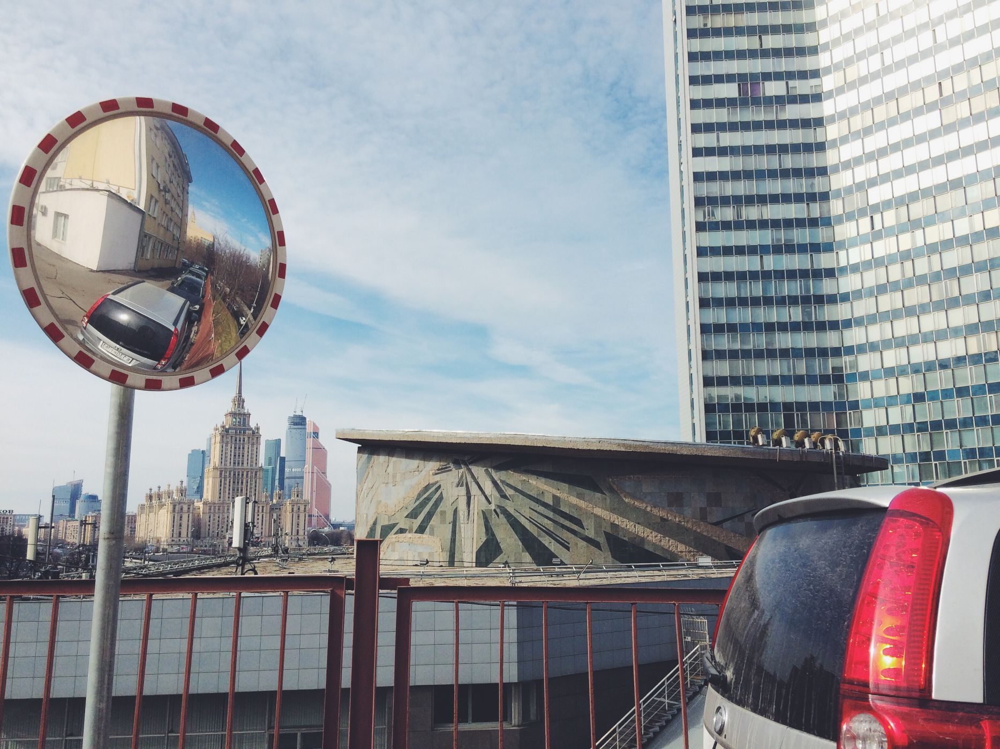
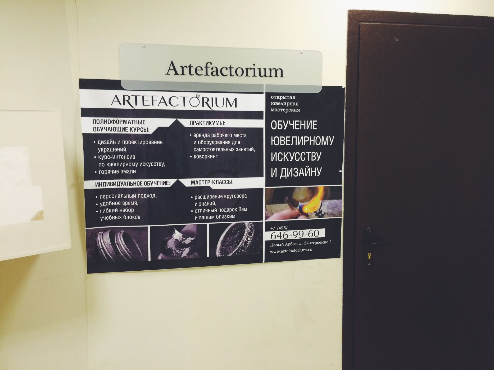

Зайдя в двери мы попадаем в большой коридор, соединяющий различные помещения мастерской. Основных помещений здесь два: это небольшие но прекрасно оборудованные комнаты, где могут одновременно комфортно разместиться 4 и 5 ювелиров соответственно. В каждой комнате у входа располагается зона, где размещается администратор и предусмотрены места для заказчиков и гостей мастерской. Кулер с водой, чайник и запас чая и кофе доступен каждому. Работает бесплатный WiFi, резиденты также могут воспользоваться принтером и сканером. Здесь в шкафах можно обнаружить множество крайне полезной для каждого увлеченного ювелирным делом литературы: **учебники, справочники, каталоги и целые энциклопедии** доступны каждому резиденту мастерской и могут стать серьезным инструментом для профессионального роста.

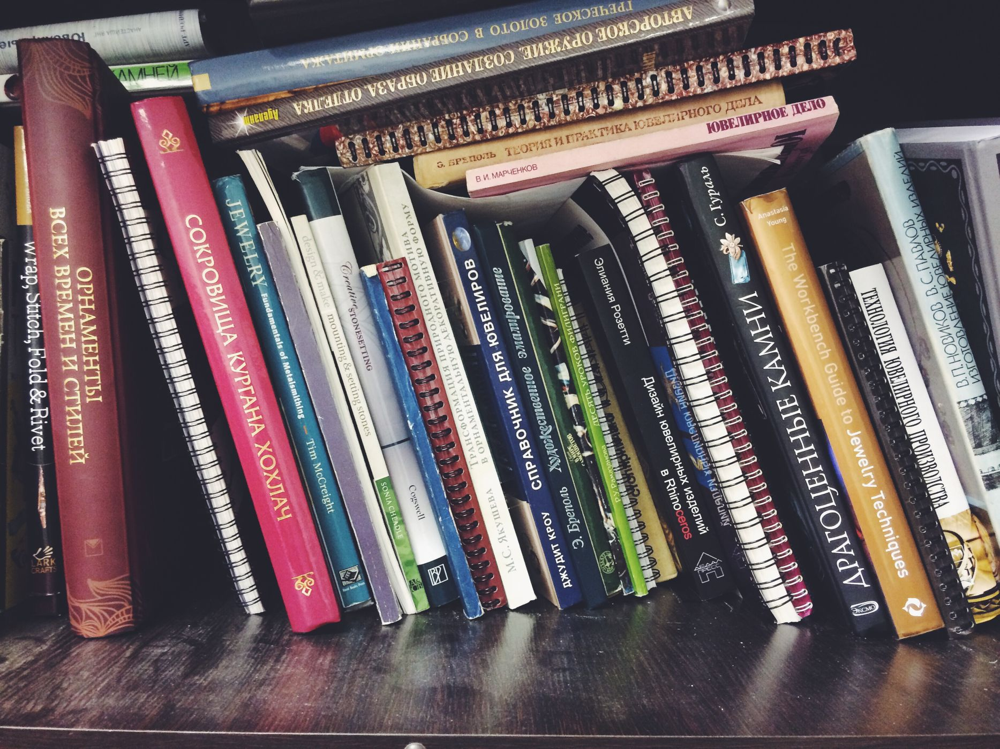
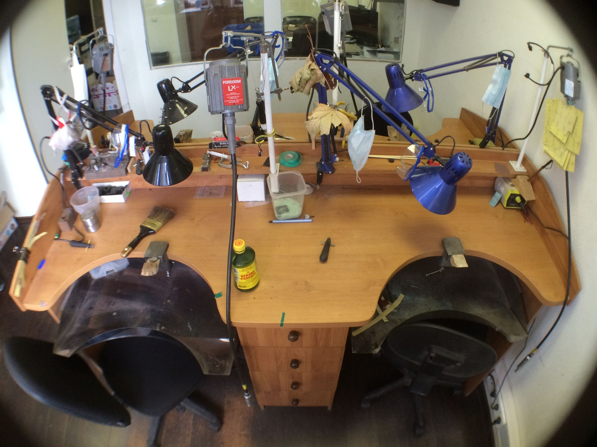
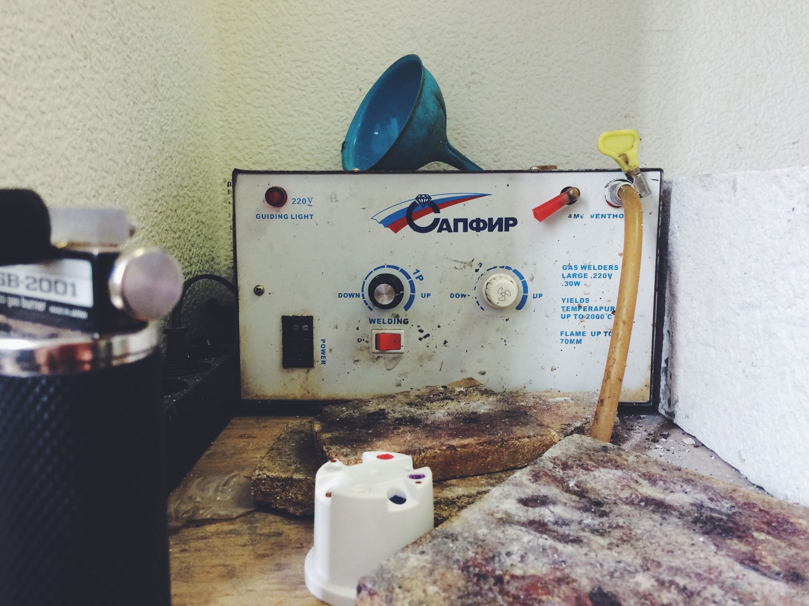
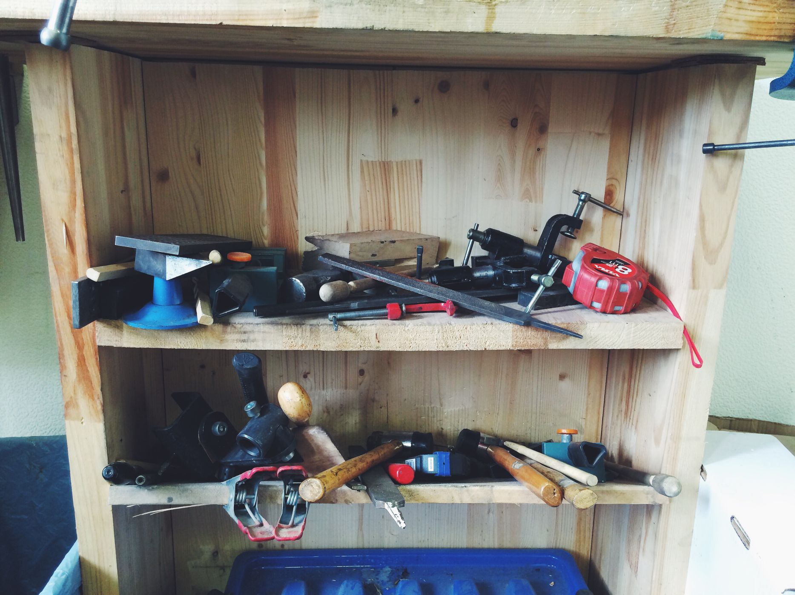

Далее, за остекленными перегородками, ближе к естественному освещению в каждой из комнат обустроено полноценное рабочее пространство. В комнате поменьше размещено 4 индивидуальных рабочих ячейки, а также общий стол для плавки, литья, и прочих громоздких инструментов и операций. Роль источника тепла, необходимого для плавления драгоценных металлов и различных эмалей выполняет экономичная **бензиновая горелка "Сапфир"**, позволяющая за счёт горения бензино-воздушной смеси достигать температур более 1500°С. На подоконнике ждут своего применения ленточная пила и многофункциональный шлифовальный станок. Вторая комната устроена практически точно так же, в ней только чуть более просторно, обустроено 5 личных верстаков и есть дополнительный общий стол в центре помещения, а стол с горелкой установлен отдельно в углу. На верстаке для крупного оборудования установлены вальцы, большие тиски, точильный и полировальные станки, а на полках можно найти различные фильеры для вытягивания проволок, ригели для работы с кольцами и многое другое.

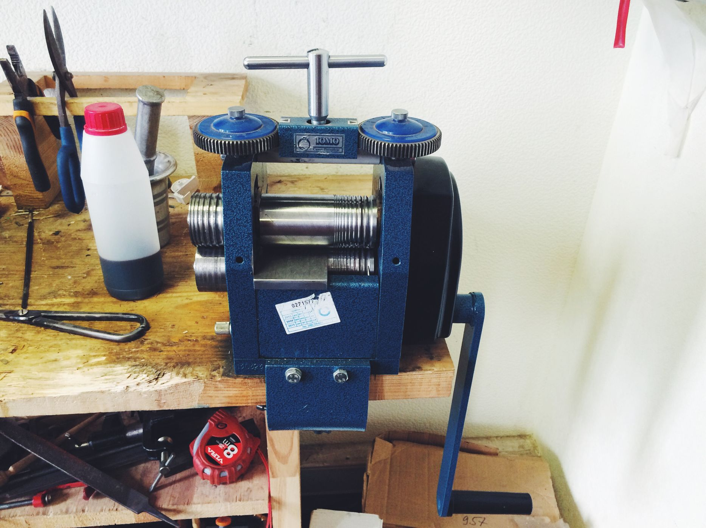

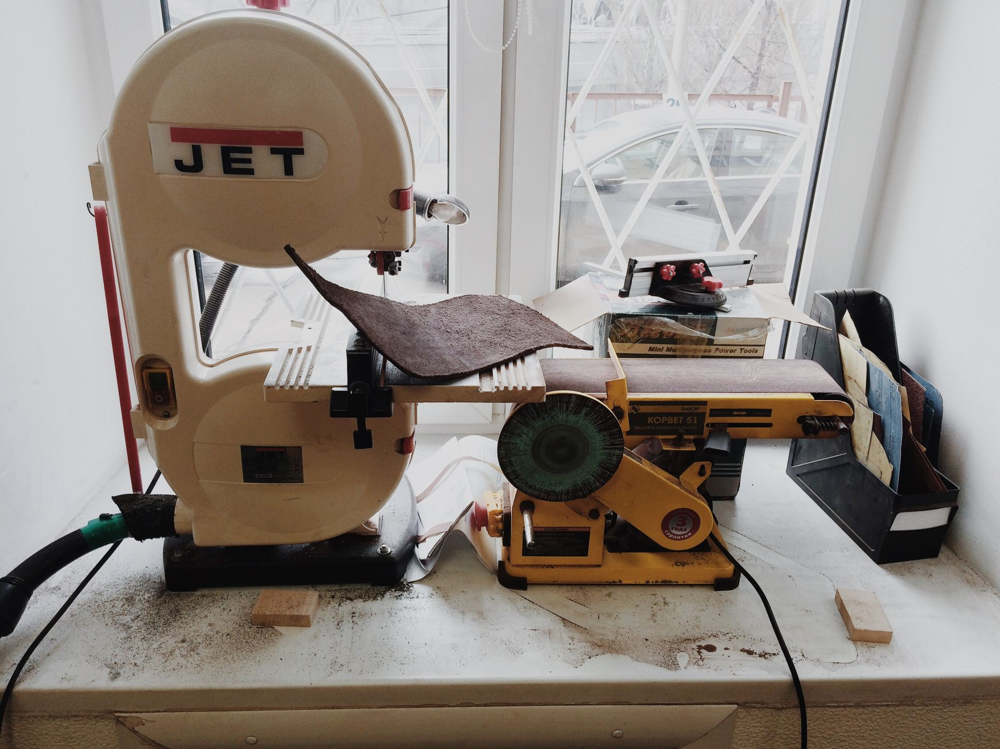
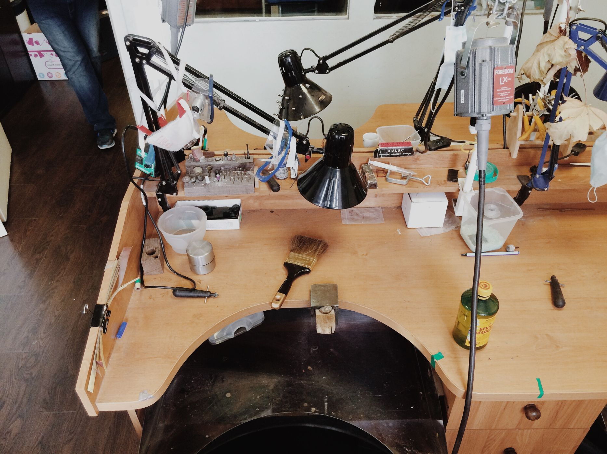

Каждое рабочее место — полноценный верстак для ювелирной работы. Устойчивая столешница с вырезом посередине, **финагель** (клинообразный выступ из дерева твёрдых пород, закрепленный на столе и служащий упором для многих ювелирных операций), короб для сбора отходов на правильной высоте. Каждое место снабжено мощной бормашиной с гибким валом, одним из основных инструментов ювелира. Резиденты мастерской имеют возможность хранить свои личные инструменты и различные приспособления в закрывающихся на ключ ящиках под верстаками. Фрезы для бормашин и прочие вспомогательные инструменты и расходники расположены на общих столах и полках.

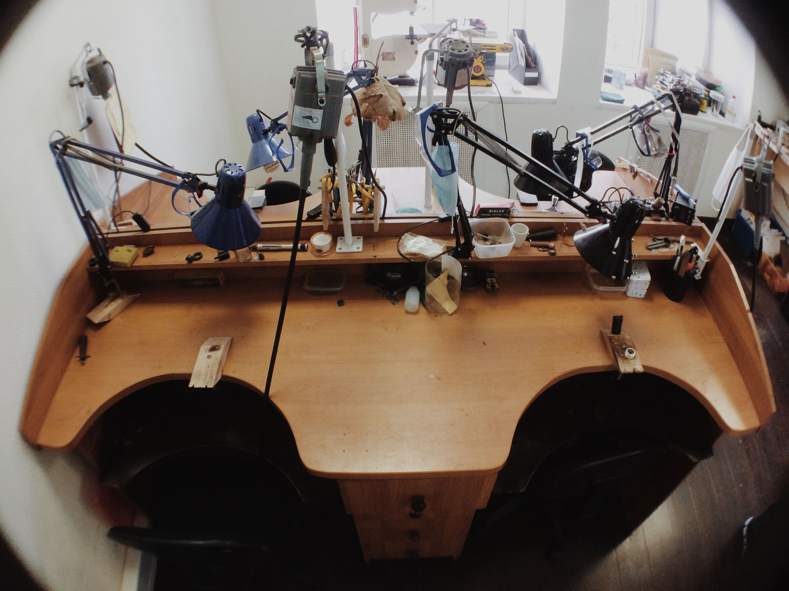
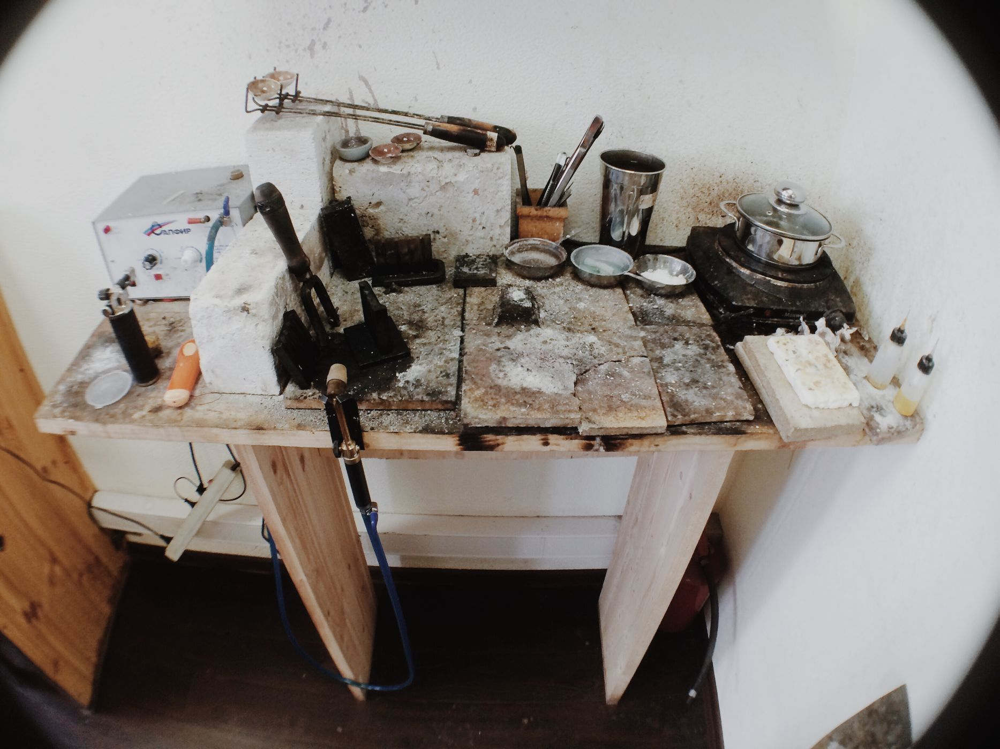
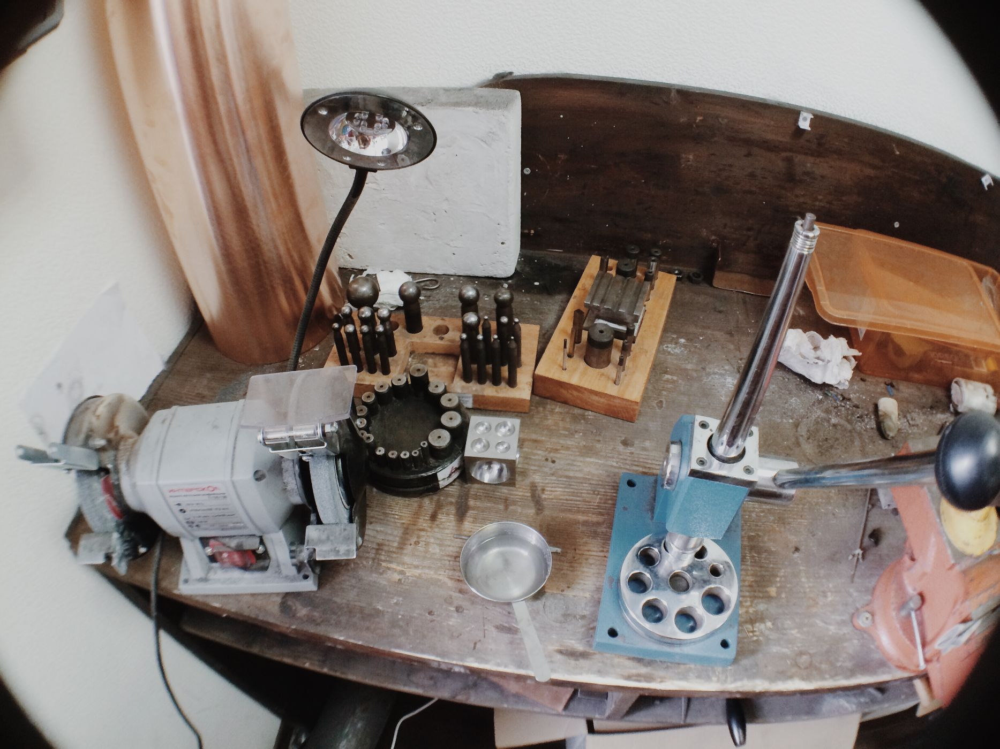
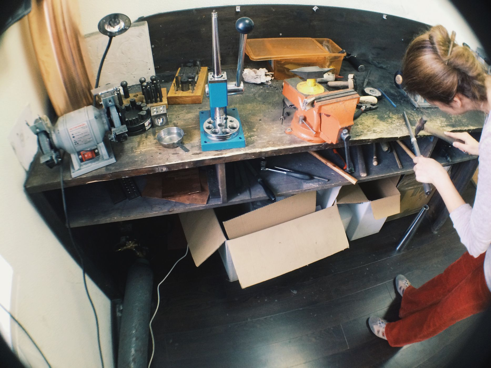

Модульное устройство мастерской даёт возможность проводить до двух мастер-классов одновременно, а также позволяет резидентам продолжать работу над своими проектами даже во время проведения групповых занятий. А такие занятия здесь проводятся часто: каждую неделю здесь проходит **2—3 плановых разовых мастер-класса**, перемежающихся занятиями более основательных курсов, состоящих, как правило, из **8—10 последовательных занятий**. Мастер-классы проводятся как сотрудниками мастерской, так и приглашенными мастерами. В ходе таких событий участники получают возможность самостоятельно создать (нередко своё самое первое) полноценное ювелирное изделие всего за одно посещение мастерской. Проводятся и индивидуальное обучение, а **мастер-классы для пар по созданию обручальных колец** пользуются большой популярностью. Занятия длятся в среднем **4—6 часов**, но, бывает, растягиваются и на два дня в случае особенно сложных техник. Так получаются отдельные полезные навыки из которых постепенно собирается настоящий практический опыт и приходит более полное понимание процесса ювелирного творчества.

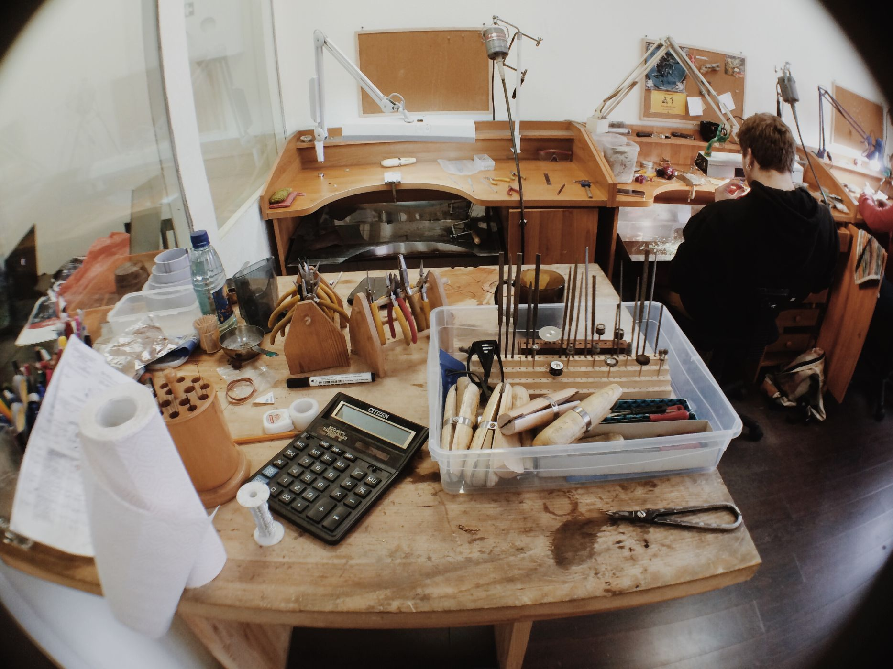

Конечно, намного более эффективным и прямым путём к овладению умениями ювелирной работы являются курсы, проводящиеся в Артефакториуме на регулярной основе. **Курсы "Основы ювелирного дела", "Филигрань", "Текстурирование металла"** — прямая дорога к полноценному погружению в эту древнюю и сложную профессию. Руководитель мастерской Александр уже давно пришёл к пониманию важности тщательной проработки программы обучения и глубокого погружения в процесс каждого участника мастер-классов и курсов. По его наблюдениям в открытой мастерской выстраивается определенная последовательность вовлеченности. Новички, впервые попробовавшие свои силы в простых задачах мастер-классов, нередко заинтересовываются более глубоким погружением в предмет и записываются на продолжительные курсы, в результате которых они получают такое количество опыта и непосредственных навыков, что могут спокойно продолжать работу в мастерской уже самостоятельно. Наличие обширной библиотеки и возможности задать вопрос профессионалу — отличное подспорье на первых порах. Кто-то учится ювелирному делу чтобы иметь в запасе еще одну профессию и увереннее чувствовать себя по жизни. Кто-то целенаправленно осваивает техники и технологии чтобы в дальнейшем устроиться на работу в крупную компанию или продолжить свой творческий путь в качестве независимого мастера. Нередко выпускники курсов решают остаться в мастерской, принимая личные заказы и создавая персональные коллекции украшений. Таким образом **основной контингент самостоятельных резидентов коворкинга составляют выпускники курсов мастерской.**

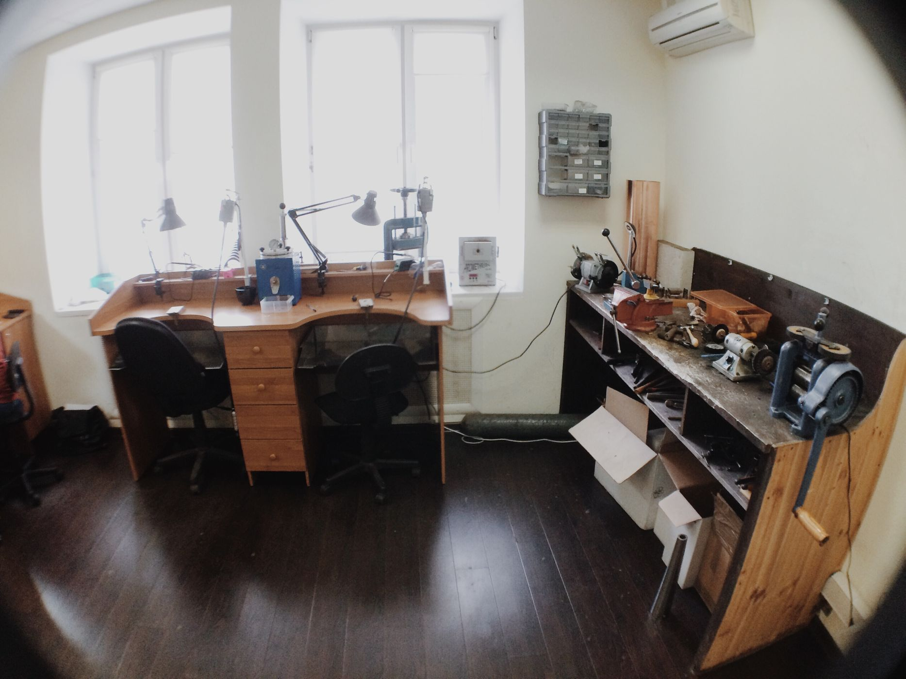
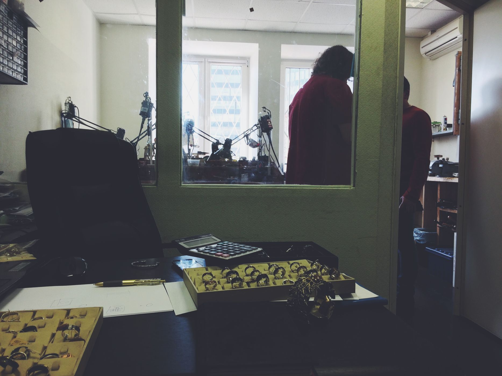

В Артефакториуме есть всё необходимое оборудование, а также большой запас материалов: **золото, серебро, медь, латунь можно приобрести в нужном количестве прямо на площадке**. Руководствуясь подробными таблицами "рецептов", можно получить ювелирный сплав с заданными характеристиками. В дополнение здесь можно приобрести и некоторые виды камней и даже возможность использовать в своих украшениях ценные породы дерева со всего мира. Разработанная здесь же авторская **техника создания колец с деревом** — не тайна за семью печатями. Этой техникой охотно делятся и, овладев ею всего за один мастер-класс, вы можете серьезно расширить спектр своих творческих возможностей.

Открытая ювелирная мастерская "Артефакториум" существует **с 2012 года** и до сих пор является единственной в своём роде. Такое открытое творческое пространство привносит струю свежего воздуха в древнюю и немного таинственную профессию, разрушая корпоративные стены и открывая двери в профессию каждому заинтересованному. Подумать только: каких-то 2—3 месяца увлекательных лекций и практических занятий и вы смело можете резко изменить направление развития вашей жизни. Может быть вы не захотите становиться профессиональным ювелиром, но точно получите важную точку опоры в жизни, благодаря которой сможете смелее и увереннее смотреть в непредсказуемое будущее. А тонкий ручной труд позволит раскрыть ваш творческий потенциал и поверить в свои силы в других сферах жизни.

Мы будем внимательно следить за событиями мастерской и продолжим это знакомство в последующих обзорах и репортажах.

[Адрес и прочие контакты "Артефакториума"](/workshop/catalog/artefaktorium/ "Артефакториум").

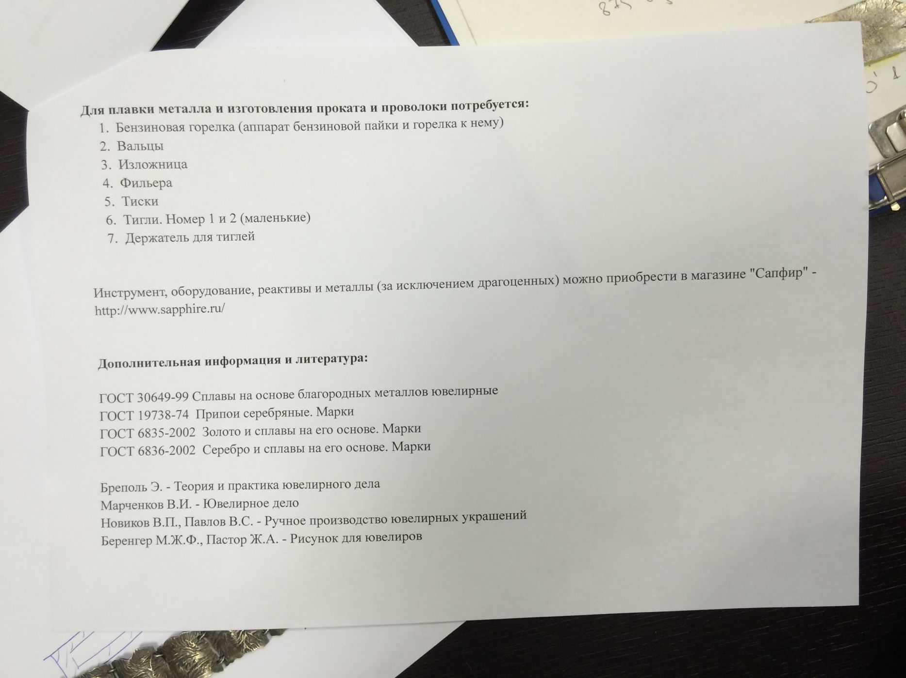
