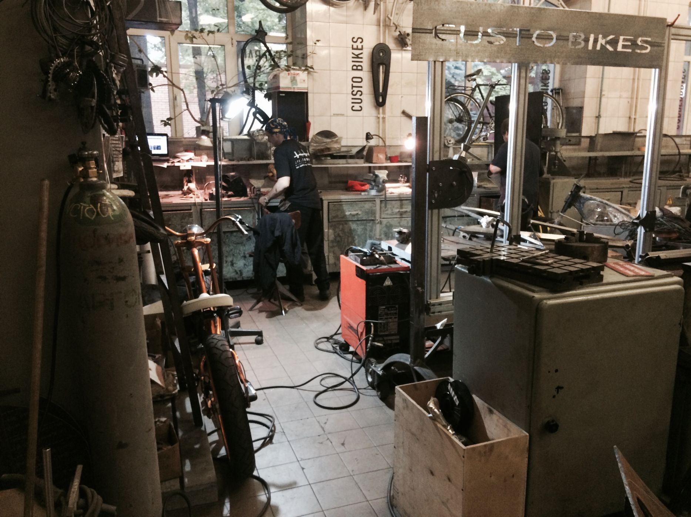
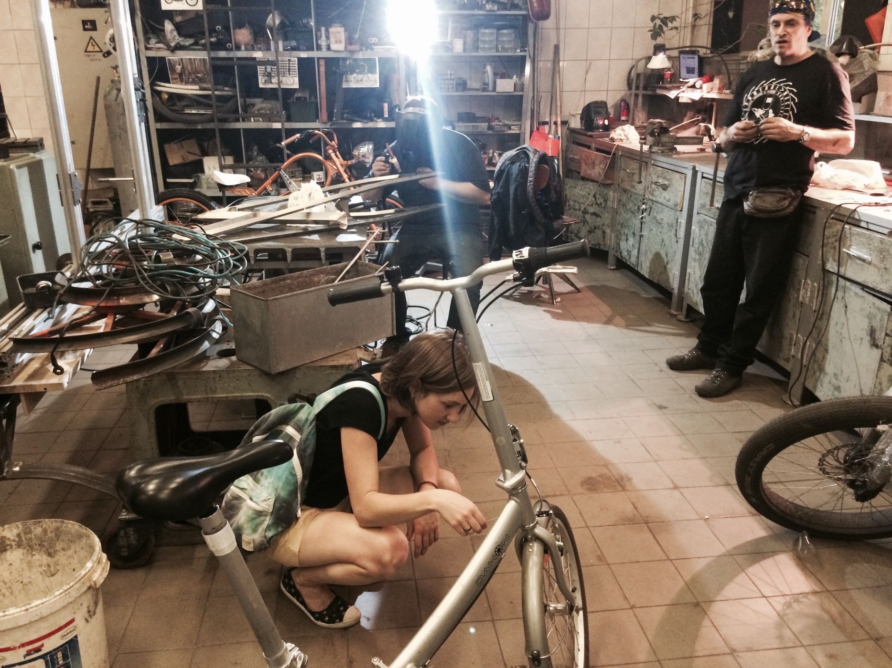
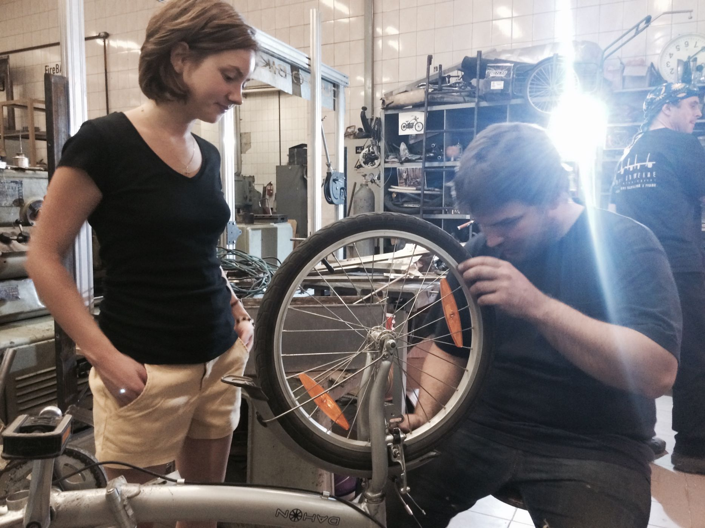
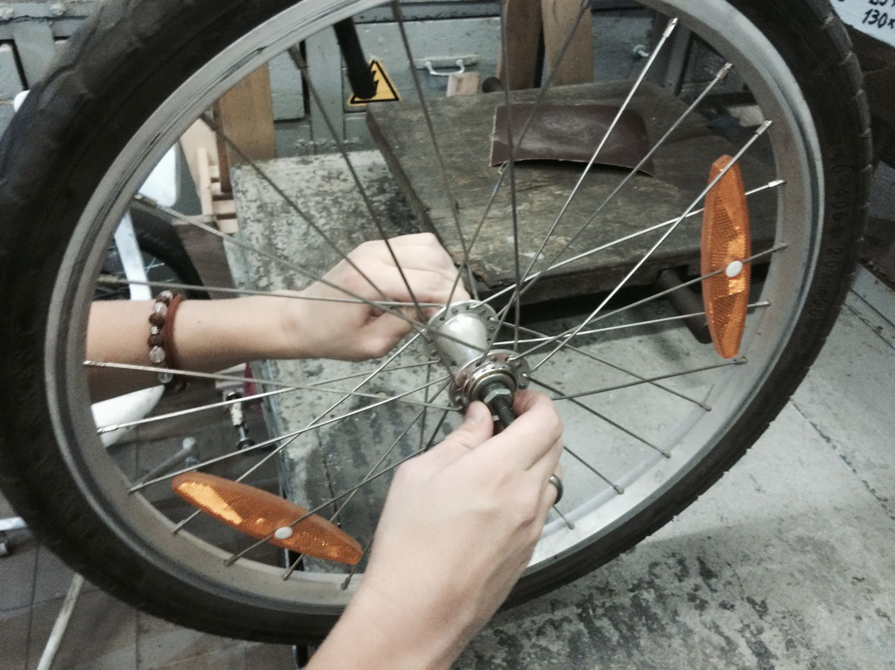
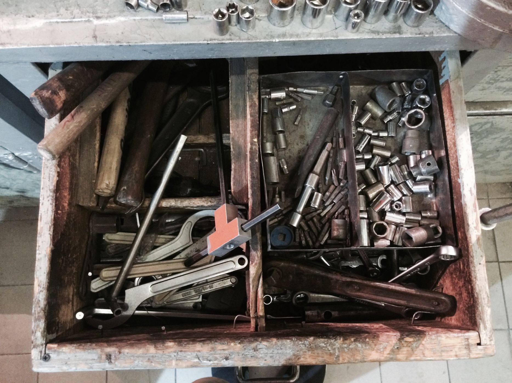
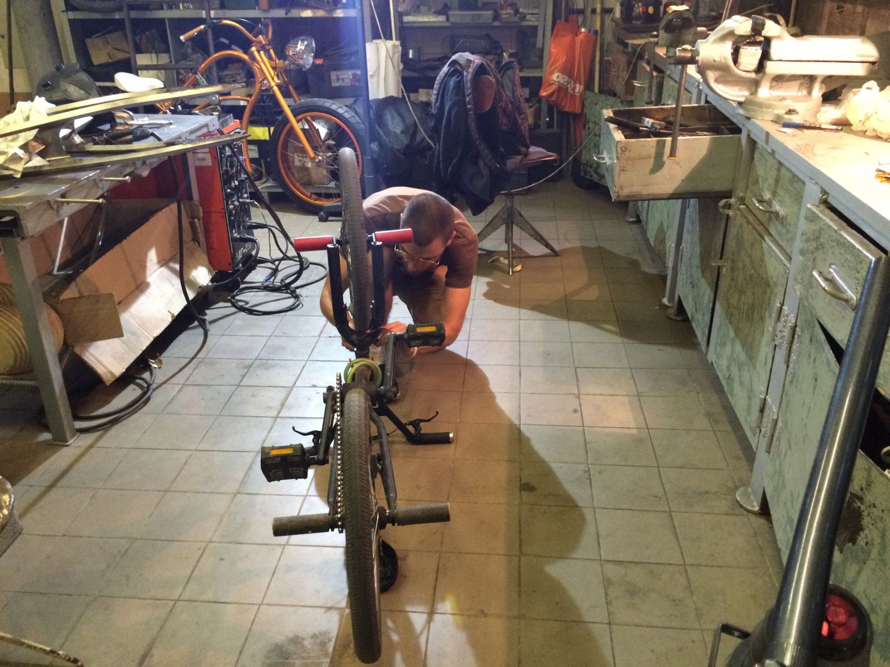

В Москве наконец-то открылась первая [Велокухня](/theory/repost/bikekitchen-by/) на базе мастерской известного кастом-веломастера [Никиты Сергеева](https://vk.com/id383417) на Кристалле. Проект делает свои первые шаги и пока [Велокухня](https://vk.com/bikekitchenmoscow) открыта только по понедельникам с 18 до 21, но по мере набора и обучения волонтёров открытых часов будет становиться больше. OOLEY побывал на дебютной открытой сессии мастерской и принял в ней активное участие.

Мастерская, в которой создаются велошедевры позволяет обслуживать, ремонтировать, восстанавливать и собирать практически любой велосипед. Помимо всего самого необходимого вроде смазки для подшипников и конусных ключей, здесь есть возможности аргонной сварки металла, токарный и точильный станок, и множество других способов работы с металлом. Есть стойка для уверенного спицевания и выравнивания колеса.

Московская велокухня открыта в экспериментальном режиме, но уже приносит настоящие результаты: за эти первые открытые часы гости мастерской при поддержке веломастера успели найти и устранить восьмерку на переднем колесе небольшого складного велосипеда, смазать подшипники и подтянуть люфты в его передней оси, подтянуть каретку BMXа и наметить задачи для следующих сессий. На данный момент мастерская работает полностью бесплатно и рассчитывает на добровольную поддержку участников велосообщества. Предполагается возможность организации классов и курсов по гнутью труб, сварке рам, работе на токарном станке и многое другое, особенно в виду участия велокухни в [конфедерации Про.Движение](/workshop/tour/pro-dvizhenie/), объединяющей несколько созидательных проектов с возможностями дерево- и металлообработки.

Велокухня — исключительно волонтёрский проект, который существует только за счёт добровольных усилий его участников. Мы очень ценим такие инициативы и готовы поддерживать их всеми возможными способами. Не так трудно найти способы помочь: открытой веломастерской всегда есть куда расти. Велокухне не помешали бы стойки для ремонта велосипедов, дополнительные комплекты шестигранников и прочих велоключей для одновременной работы нескольких посетителей и прочие инструменты и расходники, подойдёт помощь в оформлении пространства, информационная поддержка инициативы и многое другое. Также сюда можно и нужно приносить любые свои ненужные велодетали от подшипников до убитых рам, которые, вполне возможно, станут ресурсом, полезным для других участников велокухни. Такое раздолье чтобы проявить свои таланты и приобщиться к начинающему свой путь сообществу велолюбителей. Мы начали с того, что помогли немного разобраться с горой гаечных ключей и головок и предложили несколько идей для развития проекта и не собираемся на этом останавливаться.

Если у вас есть идеи поддержки и развития данной инициативы — можете, не стесняясь, [писать нам](mailto:o@ooley.ru) или непосредственно инициатору московской Велокухни [Никите Сергееву](https://vk.com/id383417).

Чтобы следить за новостями и анонсами первой московской велокухни, вступайте в сообщество Вконтакте: [vk.com/bikekitchenmoscow](https://vk.com/bikekitchenmoscow)
