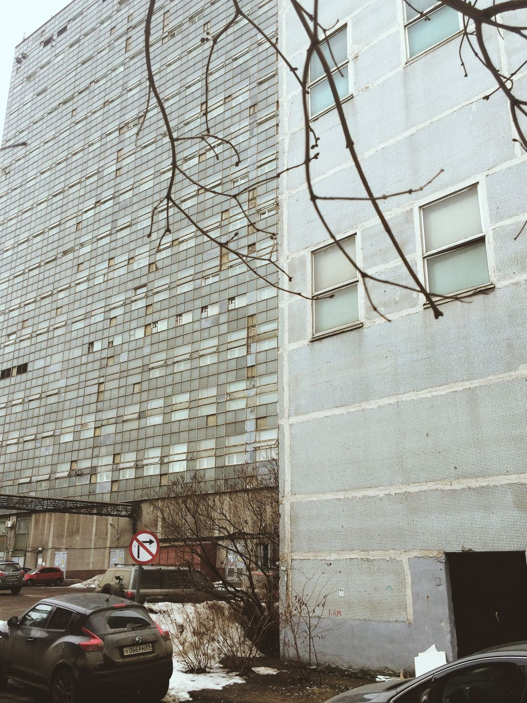
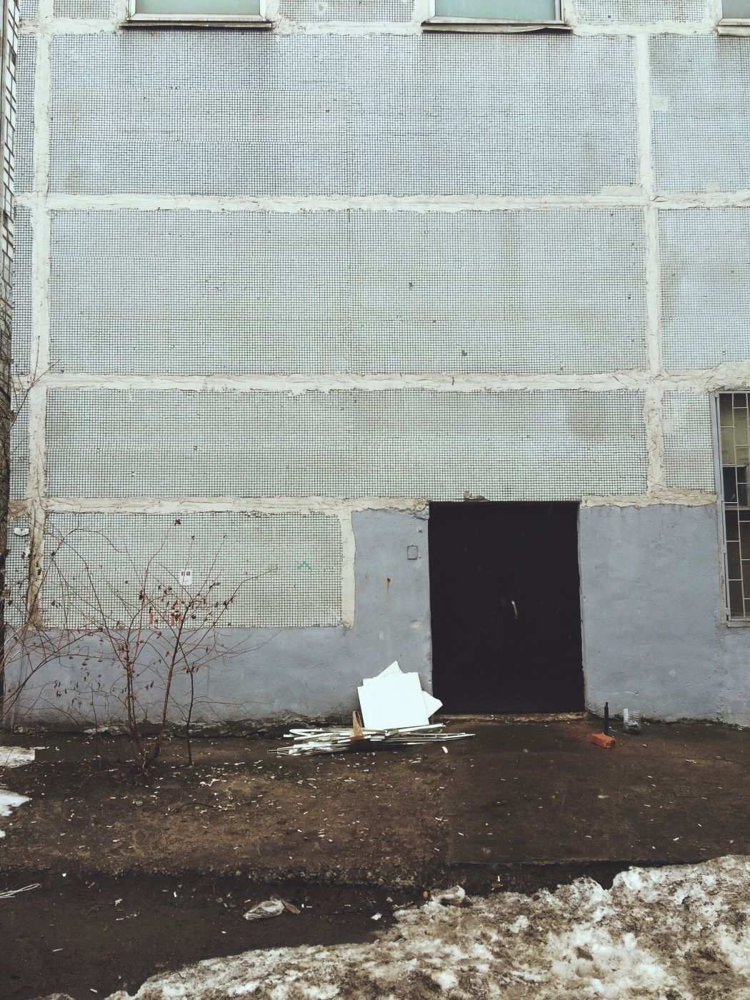
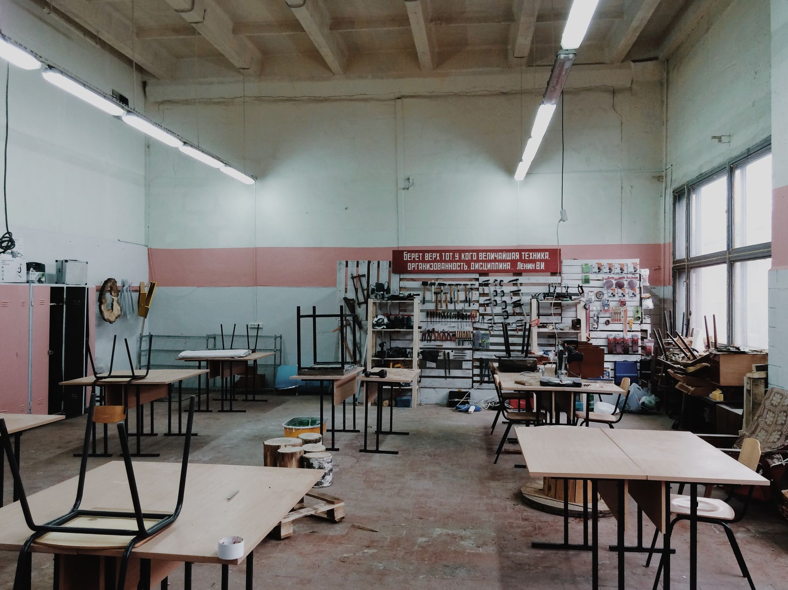
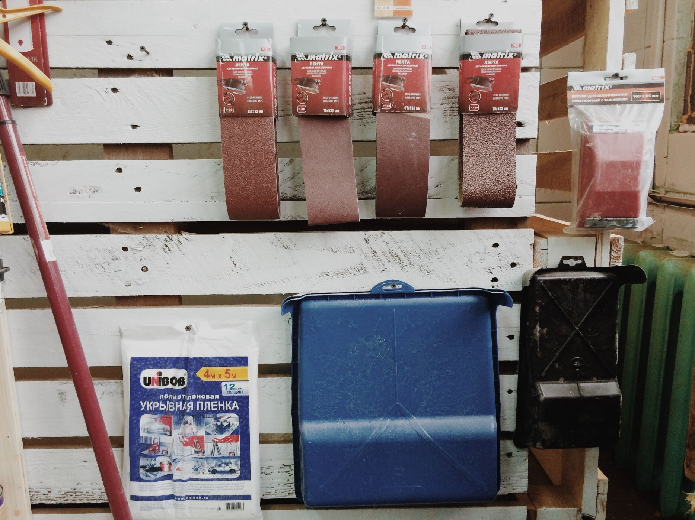
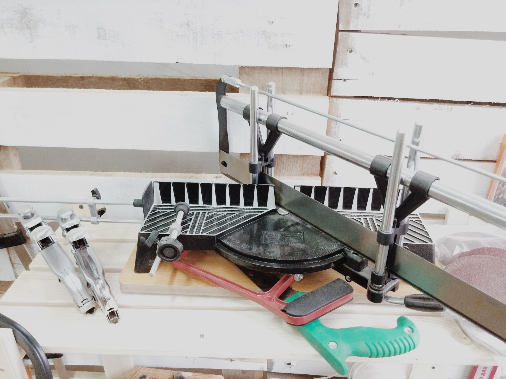
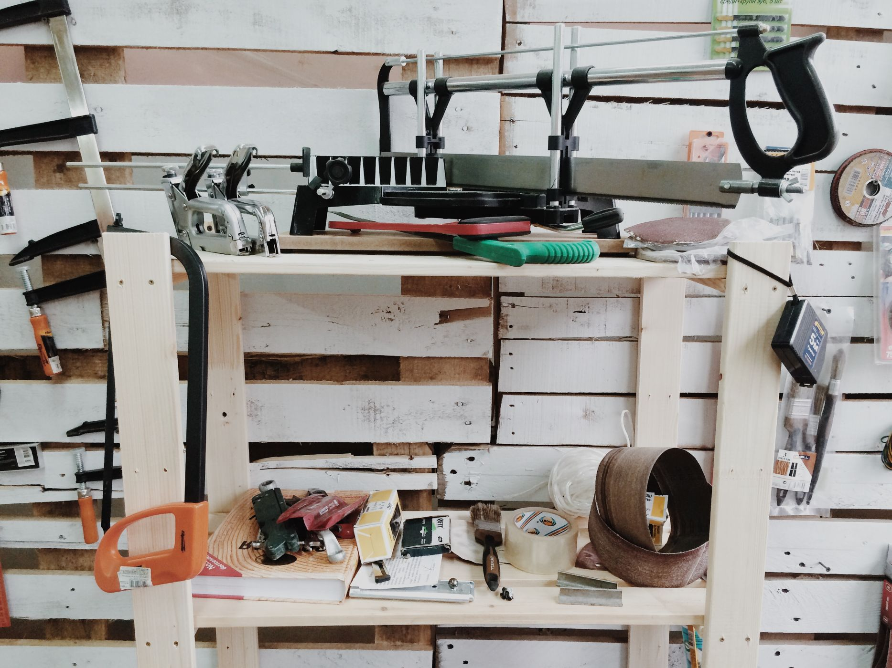
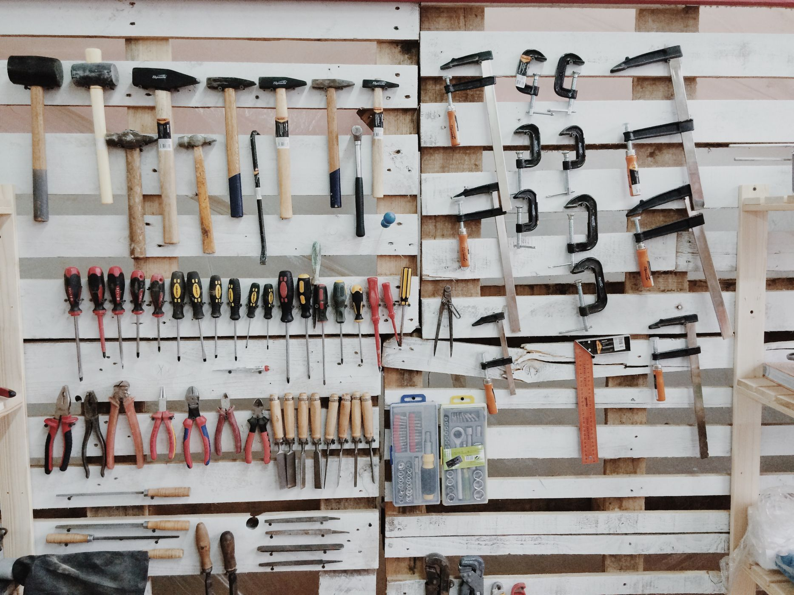
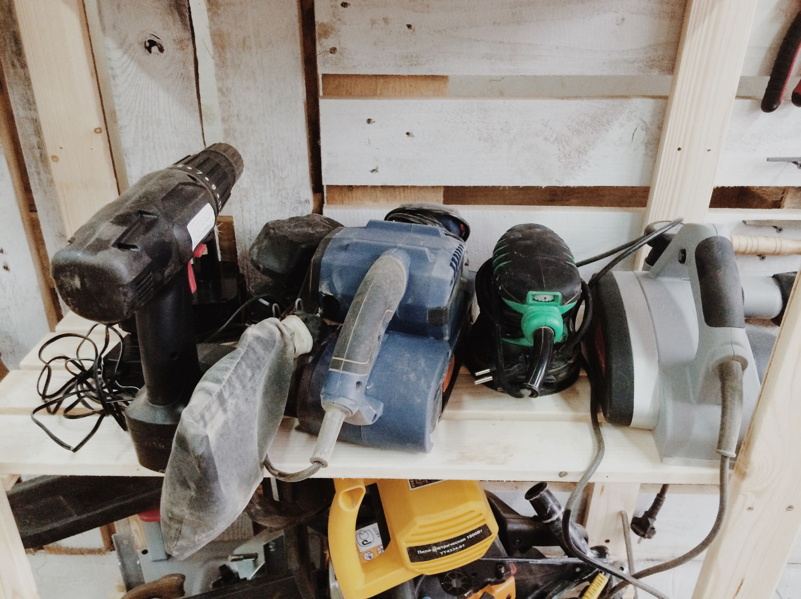
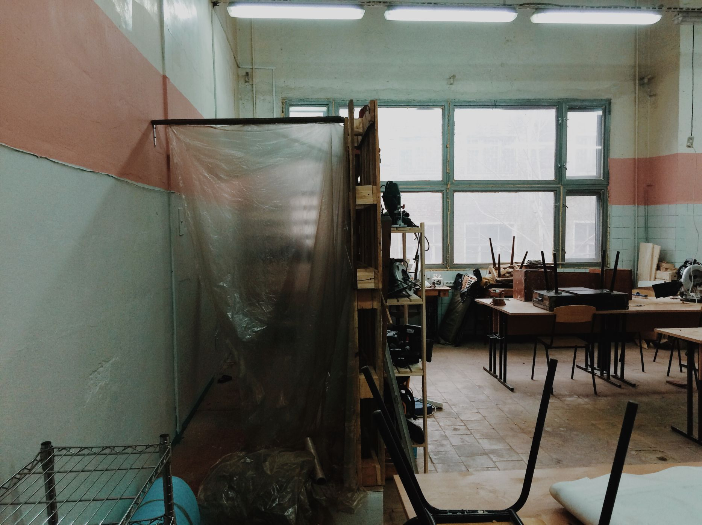

Освободившиеся площади **НИИ Дальней Радиосвязи на Преображенке** стали благодатной почвой для бурного развития всевозможных мастерских. В просторных помещениях со всеми необходимыми коммуникациями разместились ювелирные реставрационные мастерские, нашли своё место и производители флейт и скейтбордов. И даже общественных мастерских здесь уже целых две! [Про большой и серьезный Дар Труда мы уже рассказали](/workshop/catalog/dar-truda/ "Производственный коворкинг “Дар труда”"), а теперь в соседнем корпусе открылся и ждёт своих резидентов новый [**коворкинг для мастеров Crafts Station**](/workshop/tour/crafts-station/ "Crafts Station").

Несмотря на то, что серьезный закрытый НИИ уже давно съехал, доступ на его территорию всё еще строго контролируется и чтобы попасть в мастерскую нужно заранее предупредить администратора по телефону: он встретит вас на проходной. Коворкинг расположился на втором этаже 15-го корпуса, вход в который скрывается за неприметной черной дверью в дальнем углу здания. Заходим, поднимаемся по лестнице и, чуть пройдя по гулкому коридору, открываем двери столярного коворкинга. Пока здесь работает всего несколько человек, а ремонт еще далёк от завершения, но помещение мастерской уже начало приобретать понятные очертания.

Это довольно большой светлый зал с шестиметровым потолком, огромными окнами и промышленной системой вентиляции. Прямоугольное помещение довольно четко разделено на зоны, выглядит вполне просторно и дружелюбно. Сразу у входной двери расположился стол администратора, где каждому новичку предлагается ознакомиться с основными правилами безопасной работы, подробнее узнать о возможностях мастерской. Справа от входа вдоль стены скоро будут размещены различные крупные деревообрабатывающие станки, а пока эта зона свободна для масштабных проектов и хранения материалов резидентов. В центре зала парами расставлены парты-верстаки для резидентов: **абонемент на посещение мастерской включает свободное использование одного такого "поста", а также окружающего его пространства**. В ближайшем будущем здесь планируют обвести такие личные зоны прямо на полу яркой прочной краской. Стоит отметить хорошую освещенность рабочей зоны как днём из больших панорамных окон, так и в темное время суток за счёт висящих над столами ярких ламп. С них сверху к каждому рабочему месту организовывается отдельный источник электропитания. Для резидентов установлены шкафчики для хранения одежды. В дальней части зала за инструментальным стендом с яркой надписью скрывается импровизированная покрасочная камера, собранная из палет и пластиковой плёнки. Тут же в углу установлены стеллажи и крюки для сушки окрашенных изделий.

Конечно, самое главное в любой мастерской — инструменты. Мы побывали в мастерской еще во время запуска, когда крупные станки еще не привезли, но для большинства операций здесь уже есть всевозможный ручной и электроинструмент. **Ручной фрезер с небольшим набором фрез, УШМ ("болгарка"), угловая полировальная машина, цикрулярная пила, три разных электролобзика, шуруповёрт, ленточная и орбитальная шлифовальные машинки, электрорубанок, дрель, две большие цепные пилы: электрическая и бензиновая**. Плюс некоторый запас расходных материалов к ним: ленты и круги для шлифмашинок, пилки для лобзиков и прочее. Несколько струбцин и некоторый ручной инструмент. Комплект, можно сказать, минимальный, но уже достаточный для того, чтобы справляться с различными столярными проектами и даже работать с другими материалами: при необходимости можно воспользоваться сварочным аппаратом, а рабочие верстаки использовать хоть для литья бетона.

Crafts Station** предоставляет несколько вариантов взаимодействия: разовые и многодневные абонементы, а также несколько видов членства. Один час работы в мастерской обойдётся всего в **200 рублей**. Четыре часа разом обойдутся дешевле, а если понадобится больше времени — выгодно оплатить уже целый рабочий день. Абонементы на **10, 20 и 30 часов** — удобный способ арендовать пространство для реализации конкретных проектов, причём без особенной спешки — такие абонементы действительны **в течение 3 месяцев**. Можно приобрести и **месячный абонемент без закрепленного рабочего места**, но только полноценный **абонемент резидента** позволит вам не только работать в мастерской каждый день кроме понедельника **с 11 до 21 часа**, но и получить личный закрывающийся шкафчик и возможность хранить свои инструменты, заготовки и некоторый запас материалов прямо в пространстве коворкинга. Такой абонемент обойдётся уже в **15 000 рублей\*\*, но учитывая, что он позволяет работать за одним столом одновременно двум людям (мастеру и подмастерью), это кажется вполне подходящим вариантом для тех, кто уже реализует различные производственные проекты, но еще не готов обзавестись своей личной мастерской.

Эта общественная мастерская еще только делает свои первые шаги, еще многое предстоит сделать. Покрасочная камера будет увеличена и оборудована полноценной вытяжной вентиляцией, будут закупаться новые инструменты и станки, причём приоритеты в этом будут определяться уже самими резидентами. Впоследствии в помещении планируется надстроить второй этаж, где разместится офис, чистая зона, а также место для отдыха резидентов. **Crafts Station** активно привлекает заказчиков в сфере производства штучной мебели и прочих элементов интерьера, а резиденты мастерской могут свои творческие результаты на продажу прямо на [официальном сайте коворкинга](http://www.craftsstation.com/). Помимо резидентов, коворкинг активно ищет мастеров, готовых проводить на этой площадке мастер-классы и курсы.  Мы будем внимательно следить за развитием этой новой творческой площадки!
