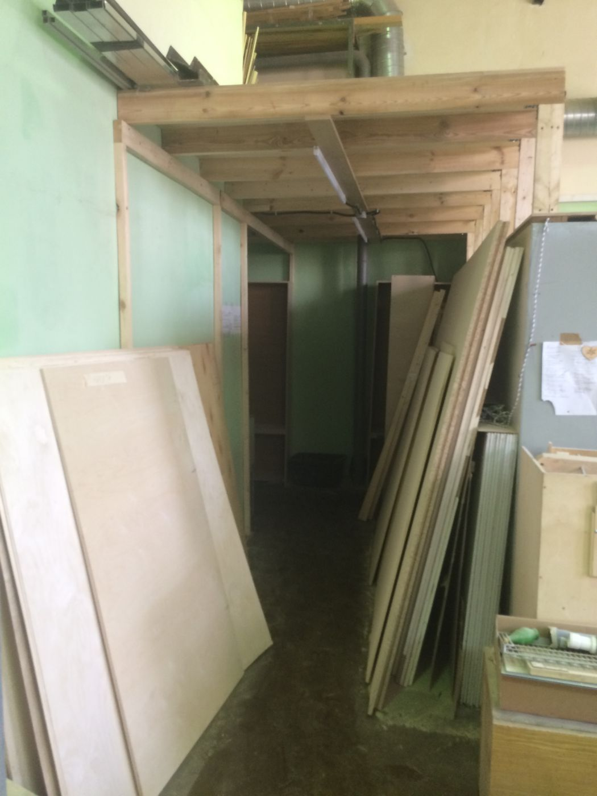
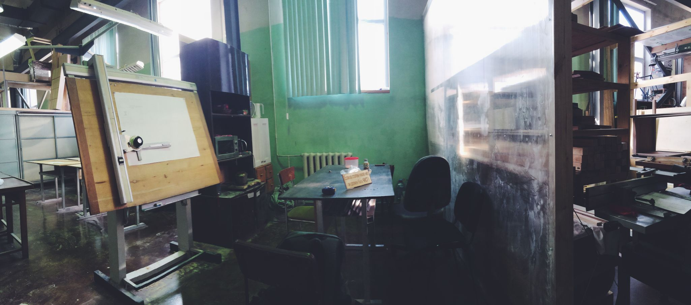
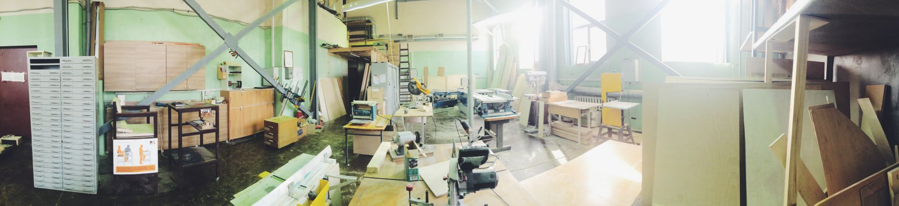
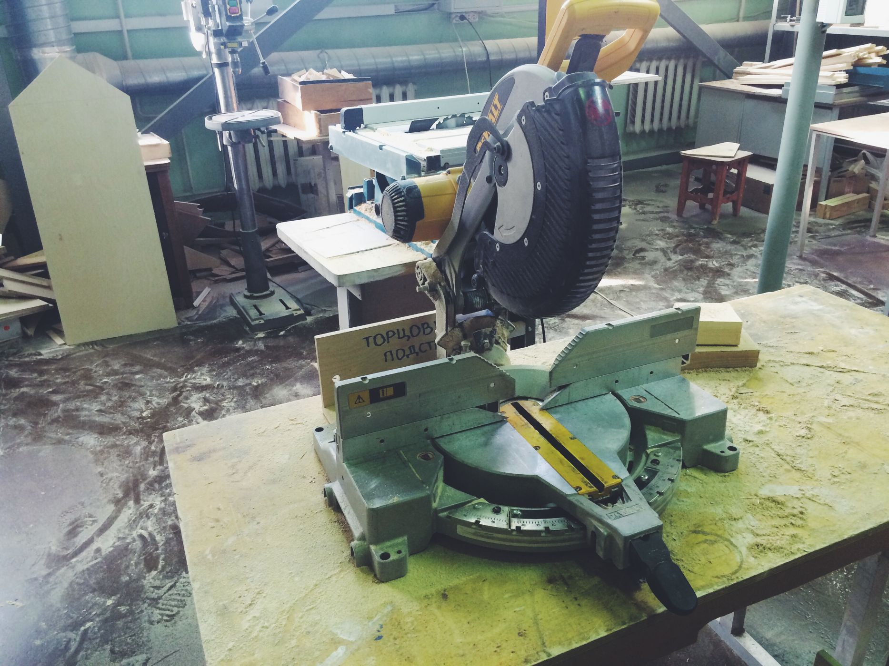
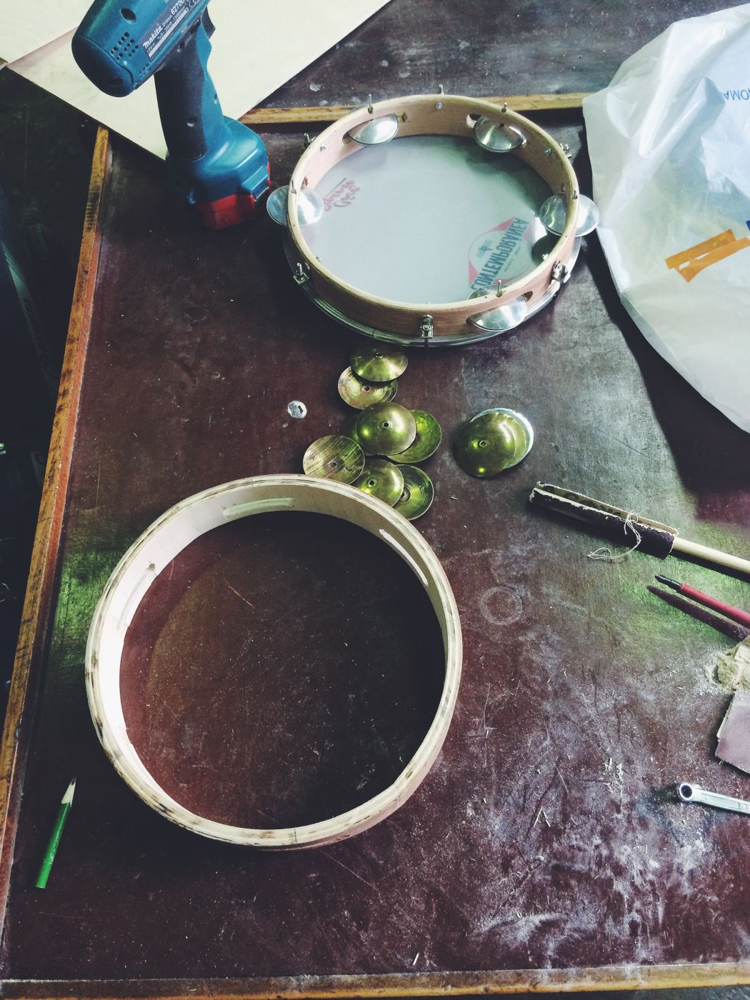
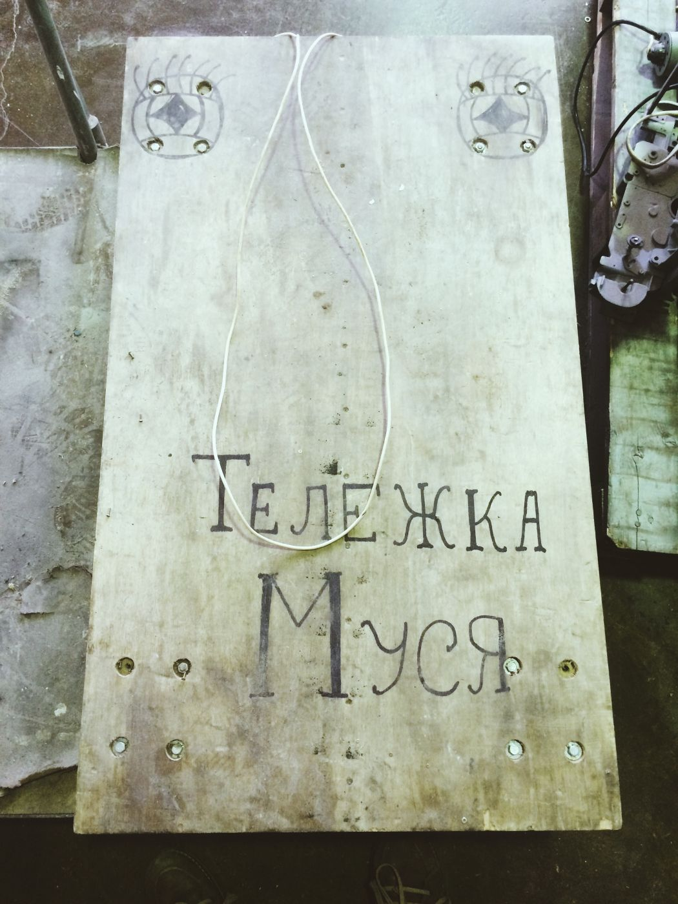

Обзоры мастерских — хороший способ познакомиться с их внутренним устройством, возможностями и особенностями. Вы уже знаете, что [ремесленный коворкинг "Двор Сотрудней" переехал](/practice/process/dvor-sotrudnej-pereehal/ "Двор Сотрудней переезжает") на Преображенскую площадь и, сменив название, стал большим и мощным производственным коворкингом на первом этаже 16-ого корпуса на территории съехавшего в Подмосковье НИИ дальней радиосвязи (НИИДАР). Мы уже показывали фотографии нового просторного цеха, а с основным оборудованием познакомились еще в старой мастерской на Чистых прудах. Теперь настало время познакомиться поближе с новым цехом и лучше понять устройство общественной мастерской.

Вход в мастерскую скрывается за неприметной металлической дверью, которая ведёт в небольшой коридор, образованный обратной стороной шкафа с крупными инструментами. Чуть пройдя вперед мы попадаем в светлый просторный цех. Справа вдоль стены располагается стойка администратора и шкафы с инструментами. Резиденты и посетители мастерской могут получить здесь все необходимое от линейки и карандаша до шуруповерта и шлифмашинки. Здесь же поддерживается стабильный запас основных крепежей и можно не беспокоиться в случае, если в процессе работы не хватило нескольких саморезов.

Основное рабочее пространство состоит из двух зон: площадки со станками и зоны общих верстаков, за которыми происходит основная работа, а также проводятся мастер-классы. Воспользоваться верстаком и простым ручным и электрическим инструментом может каждый, а для доступа к серьезным станкам необходимо пройти краткий вводный курс, стоимость и продолжительность которого варьируется в зависимости от сложности оборудования. В качестве разделителя этих двух рабочих зон выступает большой шкаф для личного хранения, место в котором выделяется для каждого резидента, а также стеллаж с запасами материалов: фанеры, досок, брусков и прочего.

Дальше вглубь цеха находится гардероб с импровизированной раздевалкой и общий стол, за которым можно попить чая или даже чего-нибудь перекусить. В самом конце строятся из легких материалов отдельные комнаты для мастеров. Мастерская въехала в это помещение совсем недавно, но может показаться, что она здесь была всегда — так удачно вписались в интерьер оставленные в наследство переехавшим НИИ большие шкафы, столы и стеллажи. Удачно и мастерская вписалась в большой просторный цех с 6-метровыми потолками, краном-балкой и промышленным энергоснабжением и вытяжной системой. Конечно, это только самое начало, мастерская на глазах отстраивает сама себя, несмотря на периодическую загруженность заказами и ежедневный рабочий график.

Для посетителей и резидентов здесь предоставляется доступ к внушительному парку оборудования. В зале станков можно найти любимый многими большой и мощный форматно-раскроечный станок, ленточную пилу, сверлильный и точильные станки, циркулярную и торцовочную пилы, а также рейсмус, УШМ на подставке. В шкафах у стойки администратора и в углу зала можно обнаружить всевозможные электроинструменты: несколько шуруповёртов, различные шлифмашинки, электрорубанки, ручные фрезеры, дрели и другое оборудование, а также расходники к ним. В целом, для простых столярных работ здесь уже есть всё, включая некоторый запас базовых материалов на стойке в центре зала и на надстройке над входом. Вам остаётся только надеть одежду, которую не жалко и которая не будет мешаться при работе, также желательно захватить с собой защитные очки и перчатки, и можно приступать к творчеству. Не стесняйтесь задавать вопросы администратору и вы сможете открыть для себя всю широту возможностей работы в настоящей большой столярной мастерской.
