После изучения всей доступной информации о новой московской открытой столярной мастерской "Делай вещь", мы всё ещё не получили представления о её внутреннем устройстве. А ведь наполнение пространства и внутренняя механика работы открытой мастерской — наш главный интерес. Значит настало время отправляться в гости.

Мы связались с одним из основателей мастерской, креативным директором проекта Сергеем Царёвым, и он любезно согласился показать нам мастерскую и рассказать о ней поподробнее. Едем!

Буквально в трёх минутах ходьбы от метро ул. 1905 года прямо напротив парка Декабрьского восстания стоит длинное серое здание Московской газетной типографии. Звоним по телефону мастерской, получаем пятизначный пин-код, введя который на проходной, получаем карточку для прохода на территорию предприятия. Неожиданно удобная система, наверное, расположенная в этом же здании Студия Артемия Лебедева повлияла. Дойдя по территории до разгрузочного пандуса, находим там дверь с жёлтым треугольником, открывающуюся по той же карточке. Поднимаемся по крутой лестнице на третий этаж и мы почти у цели. Снова желтый треугольник на двери у грузового лифта, за которой узкий коридор, ведущий в общее помещение, соединяющее сразу три мастерских. За приоткрытыми раздвижными дверьми слева расположилось небольшое производство мягкой мебели, а также их соседи — бородатые мебельщики со своей [мастерской Вуд Дид](http://wooddeed.ru/).

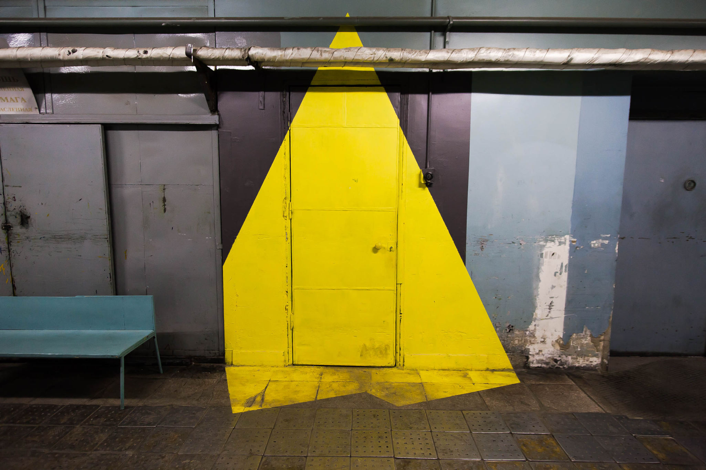
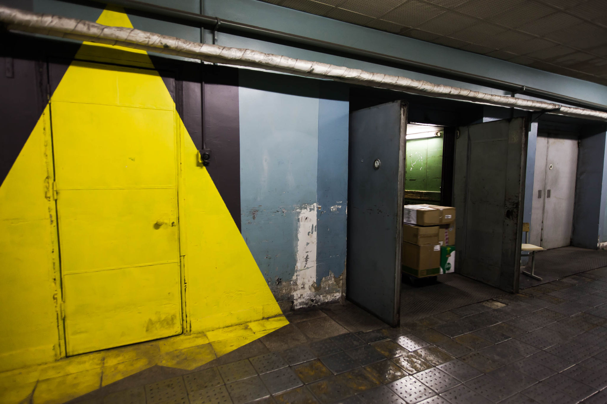

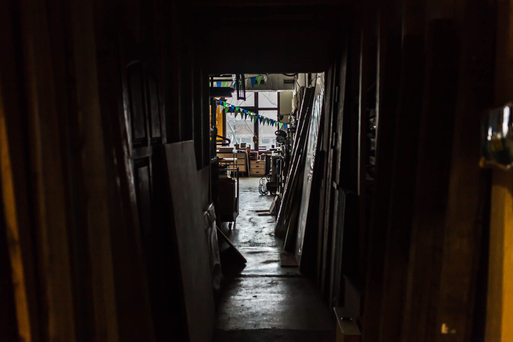

Отличное соседство для проекта "Делай вещь", скрывающегося за белой дверью с иллюминатором. Уже здесь в общем вестибюле у лифтов начинаются владения открытой мастерской — запас большеформатной фанеры, разобранных поддонов, а также различных досок и брусков, сложенных на стеллажах и подвешенных на консолях к стенам. Аккуратная система хранения не мешает проходам к грузовым лифтам, разгружая при этом пространство мастерской.

Войдя, сразу оказываемся в просторном холле, сочетающем сразу несколько функций. Вдоль стены вешалки для верхней одежды, справа рядом с красной телефонной будкой — стол дежурного мастера Виктора Крутелёва. Чуть дальше — стойка регистрации гостей и сотрудников мастерской. Слева от входа расположилась общая кухня, место встреч и непринуждённого общения за чашечкой чая с печеньками. Рядом стоит большой белый стол для переговоров, за которым смогут легко разместиться человек 10-15.  В дальнем углу — флипчарт и большой экран для презентаций, а также старый кабинетный стол — рабочее место Сергея Царёва, все время ведущего какие-то важные переговоры.

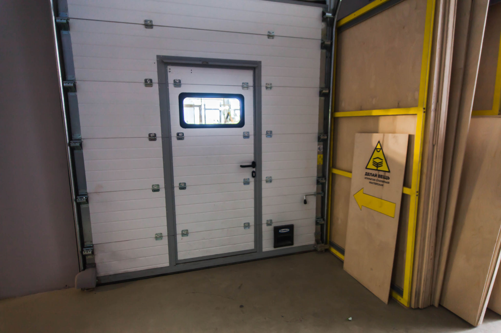
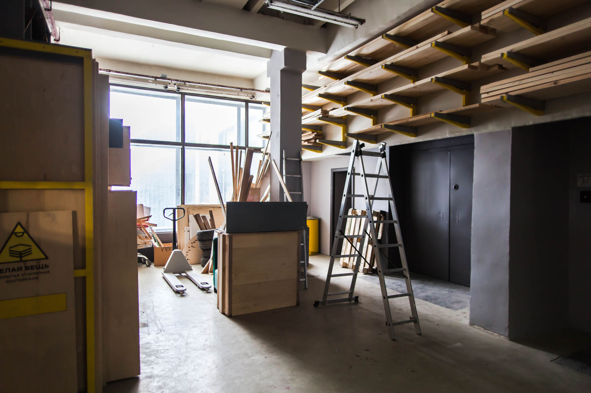

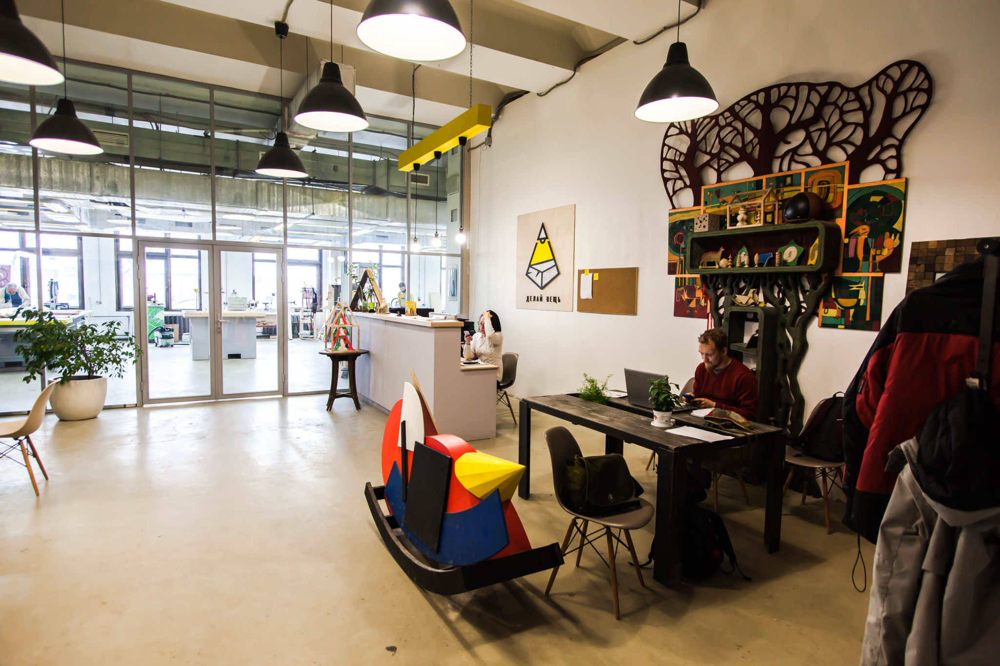

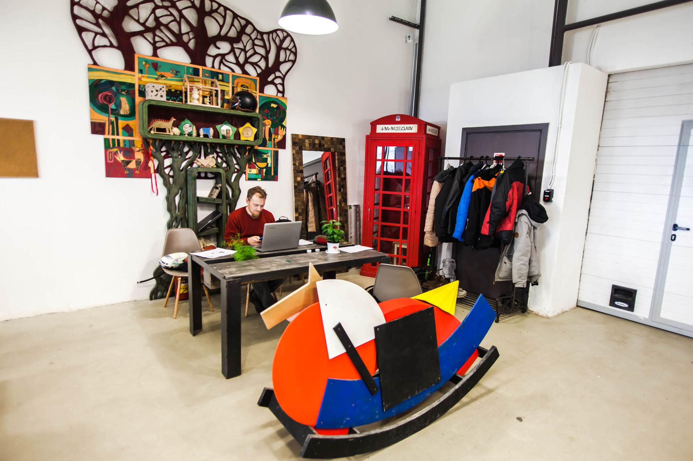

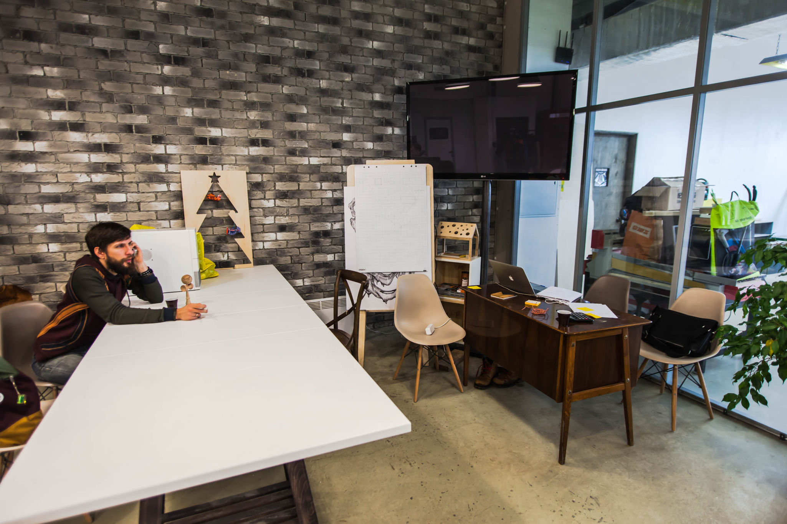

В этом светлом холле сразу создаётся ощущение открытости и прозрачности, ведь весь коллектив мастерской готов приветствовать каждого гостя или сотрудника мастерской. Стеклянная стена, открывающая обзор на общественное пространство мастерской только усиливает это ощущение. За стойкой гостей встречает приветливая девушка-администратор Анна. Она подробно рассказала нам о расписании и режиме работы мастерской, а также о разнообразных форматах взаимодействия с ней.

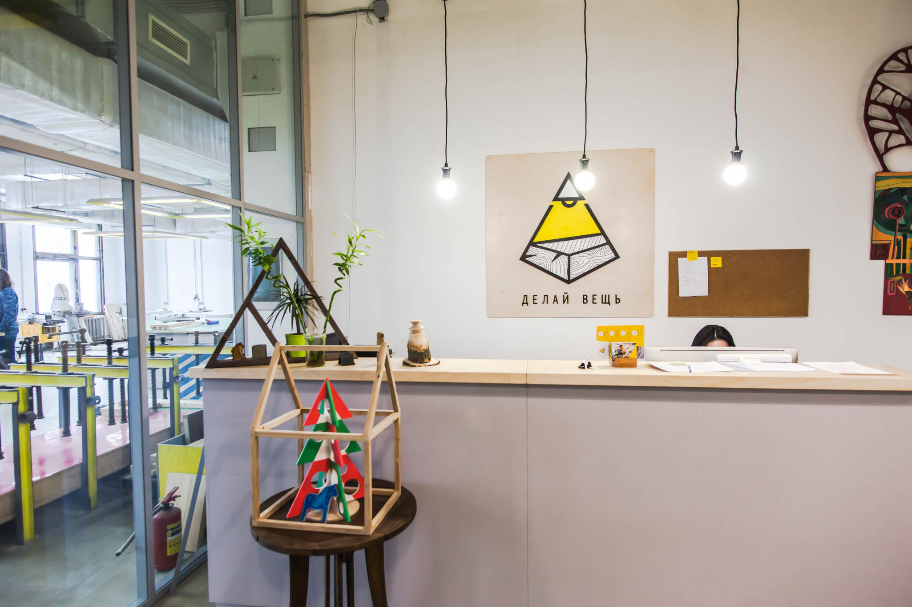
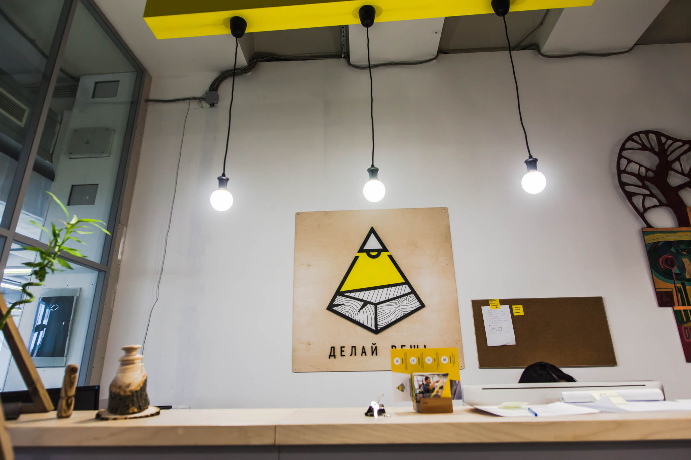

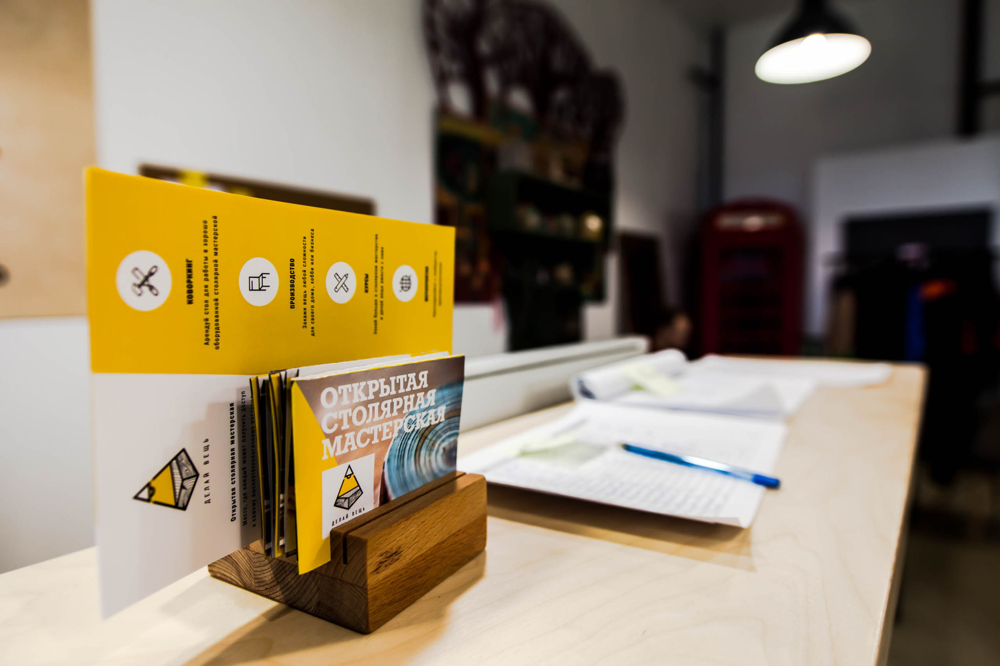

На данный момент открытая мастерская работает в режиме "по запросу", т.е. желающие поработать над своими проектами, сообщают о своём приезде заранее.  Как правило коворкеры собираются в мастерской вечерами будних дней, занимаясь творческой самореализацией в свободное от основной работы время. По субботам в мастерской регулярно проходят различные однодневные воркшопы "Простые вещи", позволяющие на целый день погрузиться в творчество даже тем, кто от этого еще очень далёк. Для таких клубных встреч задаётся тема, готовятся все необходимые для творчества материалы и в свободном формате гости мастерской воплощают свои самые смелые тематические проекты под руководством ведущего событие мастера.  По понедельникам в мастерской нередко устраиваются [мастер-классы для ребят из колледжа №21 для молодых людей с особенностями развития](https://www.facebook.com/delaivesch/posts/730291727104835).

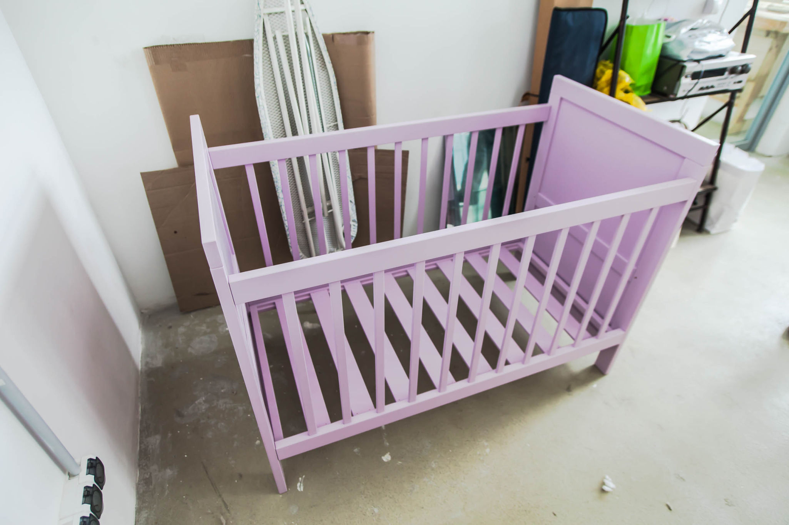

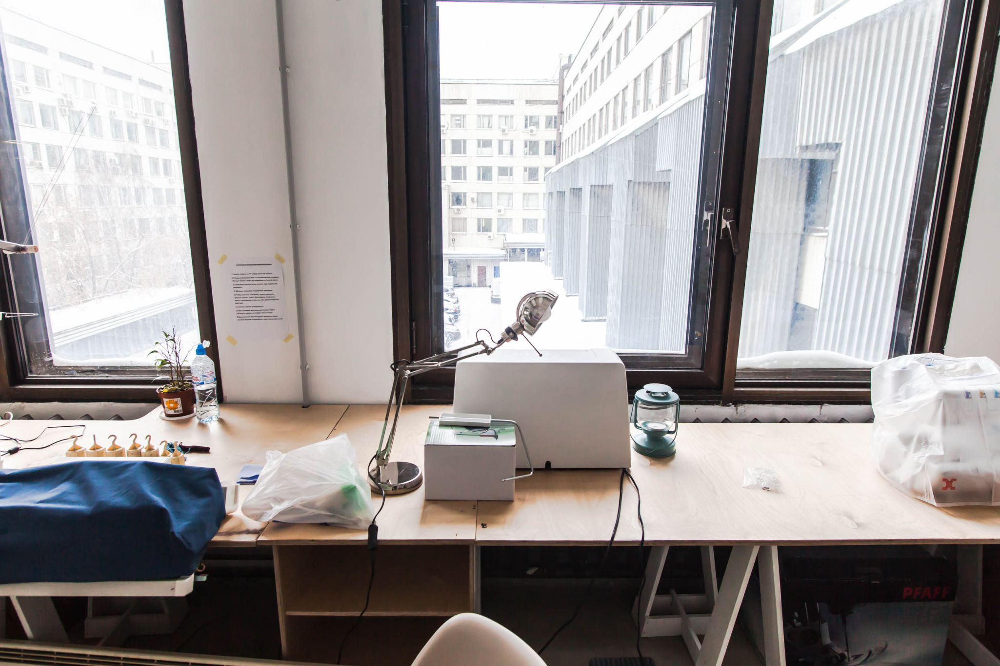
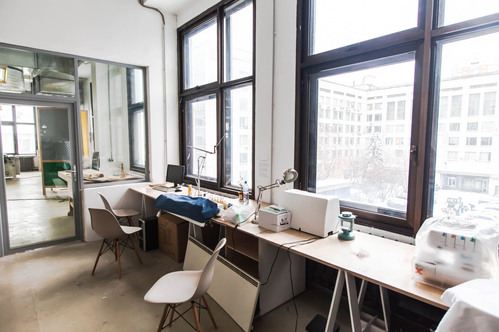
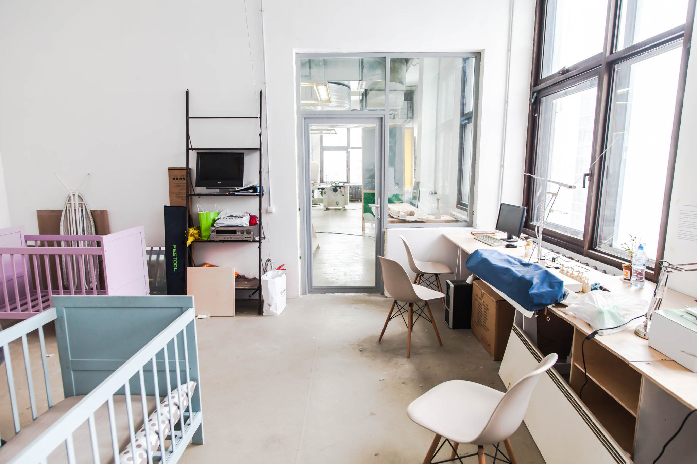

Открытая мастерская — невероятно гибкий формат взаимодействия с заказчиками, гостями и всеми желающими поработать руками. Для каждого конкретного проекта здесь готовы подобрать наиболее оптимальный сценарий его реализации от исполнения его мастерской на заказ до полностью самостоятельного воплощения посетителями собственных идей. Для заинтересованных в базовых навыках столярного мастерства здесь регулярно проводится курс "Основы мастерства", где за 5 занятий главный мастер проекта Вячеслав Швайков передаёт не только базовые столярные техники, но и дизайн-подход в реализации творческих проектов. Новички могут поработать в мастерской и вне курса, но только с персональной поддержкой мастером-ангелом, оплачивая время работы по часам или по дням. Для прошедших вводный курс или доказавших свою квалификацию любителей мастер-ангел уже не требуется, за исключением случаев использования форматно-раскроечного станка или другого серьезного оборудования. Самостоятельную работу в мастерской можно оплачивать по часам, по дням, а можно приобрести абонемент резидента сразу на 5, 10 или 20 рабочих дней (с ограничением в 8 часов работы в день).

Здесь же на стойке администратора мы увидели списки учёта, где сотрудники мастерской записывают время своего присутствия, а посетители расписываются в получении инструктажа по технике безопасности. Мы оказались в мастерской в первой половине буднего дня и через стеклянную стену мастерской можно было наблюдать несколько человек, увлечённо работающих над мебельными проектами. Как оказалось, это не коворкеры, а полноценные сотрудники и стажёры мастерской, постигающие новые профессии под руководством её основателей. Подробнее о том, как "Делай вещь" помогает бывшим офисным сотрудникам начать новую жизнь в столярном деле, нам рассказал Сергей Царёв.

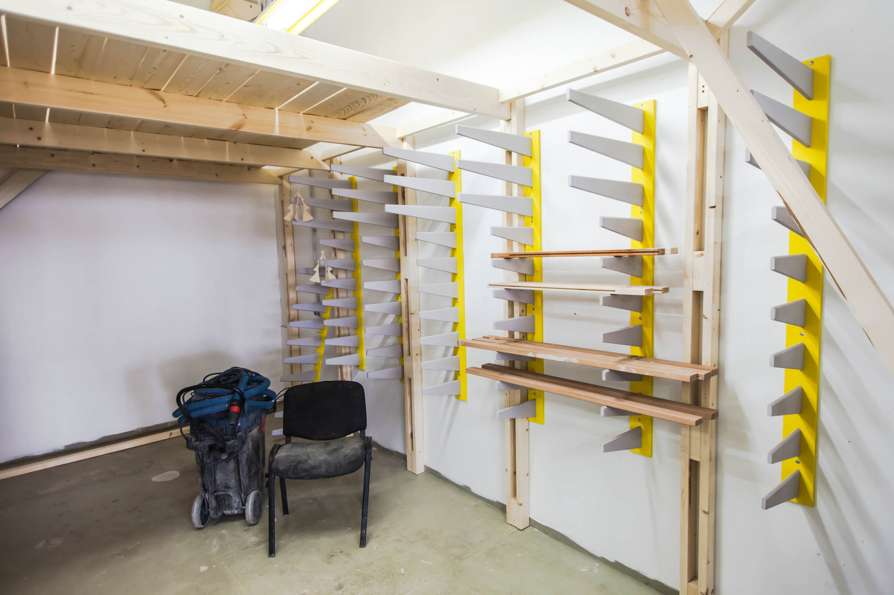
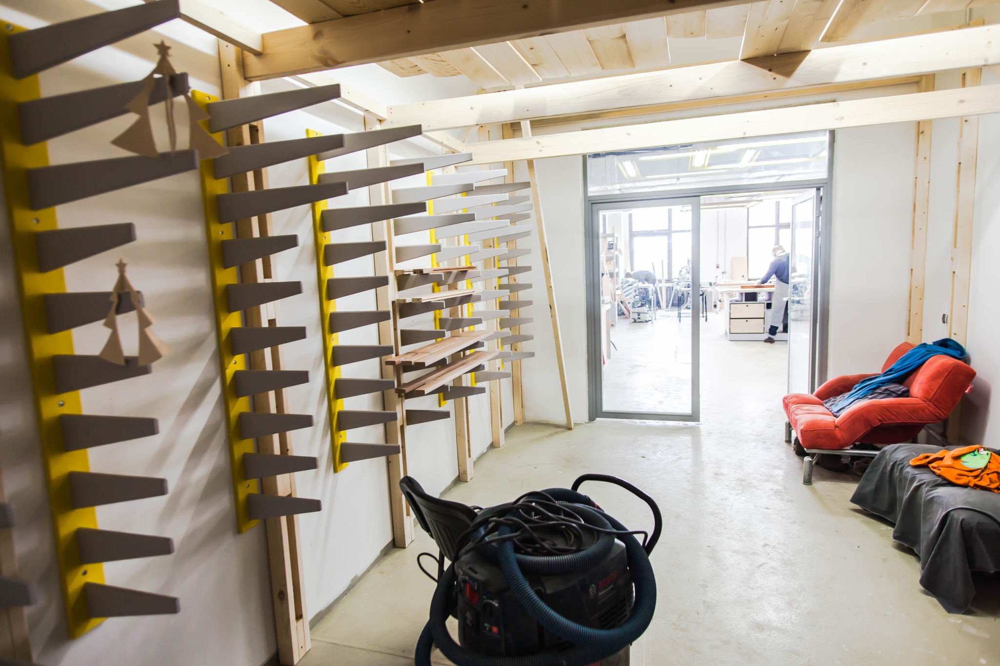

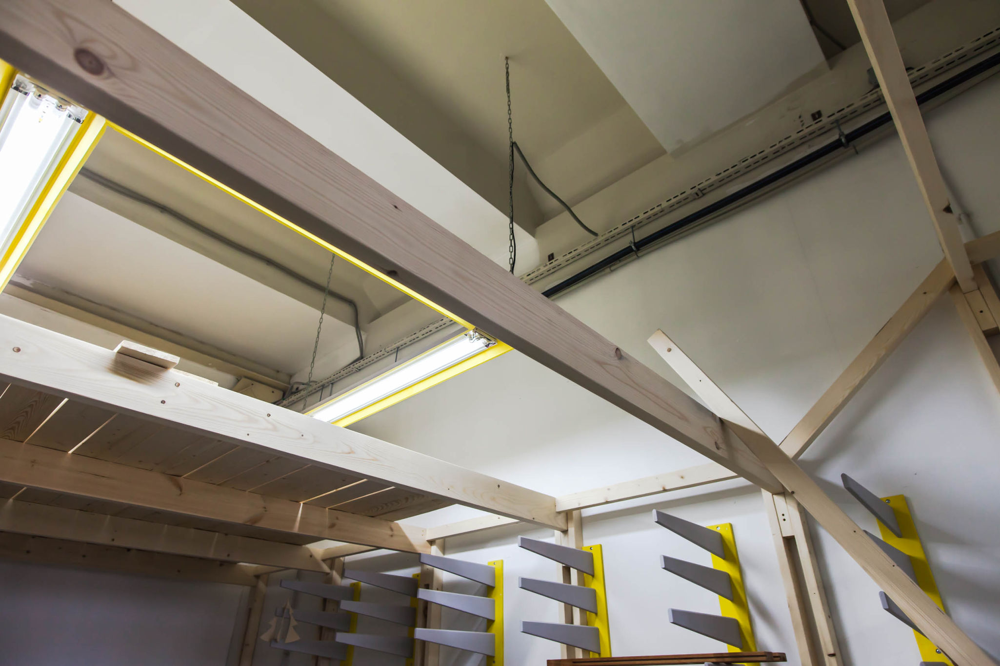

В мастерской активно функционирует сразу несколько программ стажировки. Действительно, многие обращаются в "Делай вещь" не просто чтобы заказать или даже сделать самостоятельно какую-то вещь, но с целью попробовать себя в новых сферах деятельности. Курсы и поддержка мастеров — отличное подспорье в обучении, но для того, чтобы начать профессионально работать в столярке этого явно недостаточно. Программа стажировки позволяет плавно погрузиться в бурный рабочий процесс мастерской, достаточно лишь написать мотивационное письмо и пройти собеседование с мастерами проекта. После одного испытательного месяца работы без оплаты, но с возможностью свободно посещать все события мастерской, человек получает возможность стать настоящим подмастерьем с зарплатой и возможностью работать над собственными проектами в свободное время. Стажёры и подмастерья работают над заказами и проектами мастерской командами, гибко координируя свои усилия под руководством мастеров. Основатели проекта уделяют особое внимание возможностям такой "моментальной коммутации", когда в пространстве мастерской можно в один миг обнаружить не только всё необходимое оборудование и материалы, но и людей, готовых взяться за любые, даже самые смелые проекты. Открытая мастерская в чём-то похожа на биржу, собирающую всевозможные заказы и перераспределяющую их среди независимых творческих команд. В то же время  "Делай Вещь" чем-то напоминает средневековый цех, где ключевую роль всегда имел мастер, принимающий заказы и перераспределяющий работу среди подмастерьев, обучая и воспитывая учеников в совместном труде. В сегодняшней открытой мастерской мастер продолжает играть важную роль.

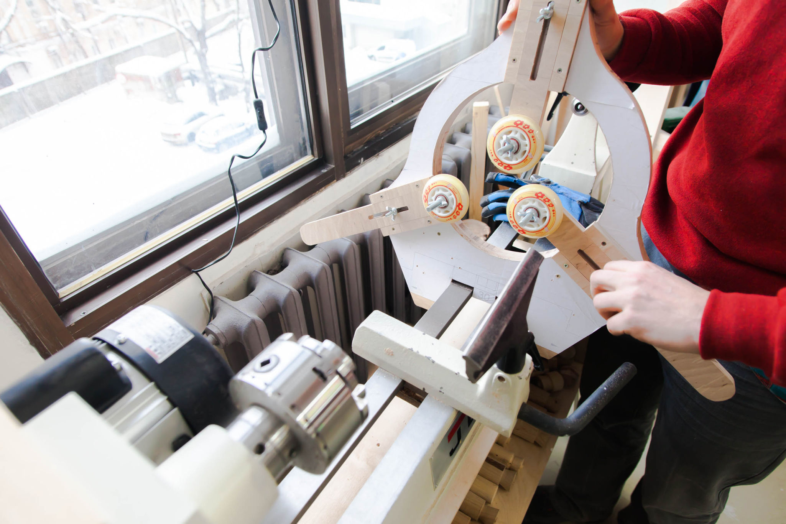

Нам удалось побеседовать с мастером Виктором Крутелёвым, одним из основателей проекта, который провёл нам экскурсию по пространству мастерской и рассказал о её становлении от самой идеи до полноценной реализации. Несколько лет назад Виктор понял, что работа в рекламе - это не то, чем ему хотелось бы заниматься  и решил радикально изменить свою жизнь, выбрав для себя профессию столяра. Он пробовал свои силы и нарабатывал столярный опыт в различных проектах под руководством опытного мастера Вячеслава Швайкова в его мастерской "Механические Деревянные Шестерёнки". Через несколько лет обучения и практики, работы в рамках МДШ и над своими собственными проектами и заказами, пришла уверенность в собственных силах, а также понимание того, что трансформация из офисного сотрудника,  в человека владеющего востребованной профессией - не так уж страшна, как казалось вначале. Такая трансформация подарила ему вдохновение делиться этим опытом, причём на практике. Он уверен, что во многих из тех, кто сегодня задумывается над тем, своим ли делом занимается, просиживая в офисе неделю за неделей, и год за годом, где-то в глубине скрываются перспективные столяры и умелые дизайнеры, которым нужно лишь дать пространство и возможности для того, чтобы, наконец, раскрыться и заняться тем, чем действительно хочется заниматься. В современном столярном деле с предсказуемыми материалами и высокоэффективными электроинструментами все процессы интенсифицируются и вместе с тем ускоряется развитие самого человека. Виктор считает, что за несколько лет человек любого возраста и уровня квалификации вполне может пройти весь путь от ученичества через практику подмастерья и помощника к мастерству, открывающему безграничные возможности в жизни. Дать людям возможность такой трансформации — вот движущая идея создания открытой столярной мастерской "Делай вещь".

Для того, чтобы овладеть и уверенно пользоваться всеми базовыми инструментами и приёмами работы в столярной мастерской достаточно и пары лет. Стажёры сначала получают знания по базовым операциям, затем уже в качестве подмастерьев осваивают работу со станками и сложными формами и соединениями. Затем на первый план выходит развитие дизайн-подхода, начинающегося с продумывания проекта и чертежа и заканчивающегося упаковкой готового изделия. Освоив и научившись сочетать различные виды отделки и выработав собственный стиль, в скором времени человек способен преобразиться в мастера, самостоятельно реализующего полный цикл работы над проектом. Основные материалы, используемые при работе над проектами в мастерской — фанера и массив дерева, которые обрабатывают ручным электроинструментом и на различных станках. "Делай вещь" развивает идеи и практики, опробованные её командой в их предыдущем проекте — общественной мастерской DIY Академия. Аккуратные стеллажи с крупными листами фанеры, полки с ручным электроинструментом, небольшие, но эффективные станки. Давайте взглянем на мастерскую повнимательнее.

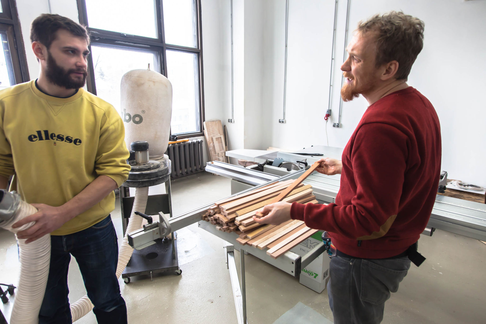

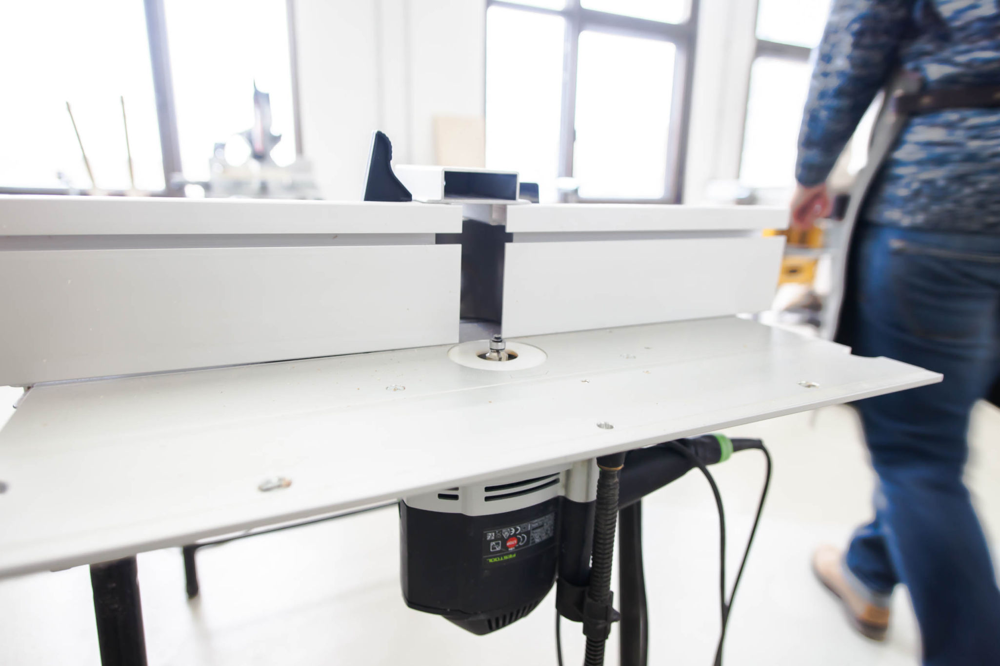
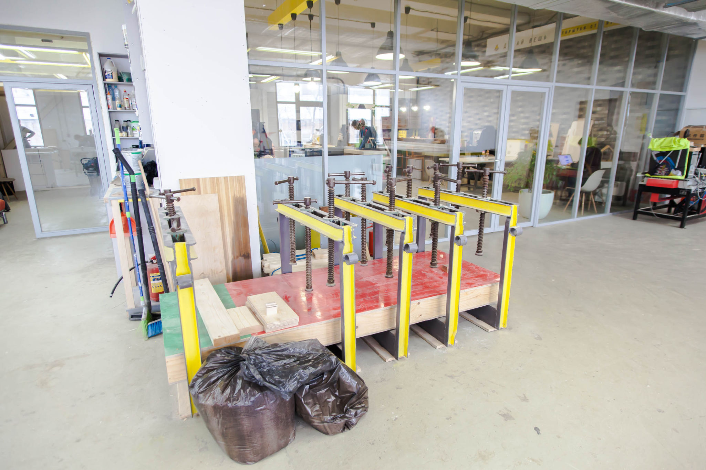

Светлое пространство мастерской поделено на две основных зоны: обозреваемую через стеклянную стену общественную и производственную. Общественная зона предназначена для работы коворкеров, стажёров и подмастерьев, проведения образовательных и иных событий. Здесь стоят два больших верстака с множеством встроенных ящиков и полочек, с достаточной поверхностью чтобы уверенно работать с крупногабаритными изделиями или разместить множество небольших субботних проектов. Есть компрессор, запас фанеры, ленточная пила, заточной станок, небольшой сверлильный станок, базовый электроинструмент и расходники. Здесь же у окна разместился токарный станок, стамески и заготовки еще одного мастера — француза Лионеля Роя, творящего на нём свои скульптуры и игрушки и с удовольствием обучающего этому искусству участников своих воркшопов. Участие в таких событиях — возможность не только прикоснуться к этому завораживающему ремеслу, но и заодно попрактиковаться в английском языке.

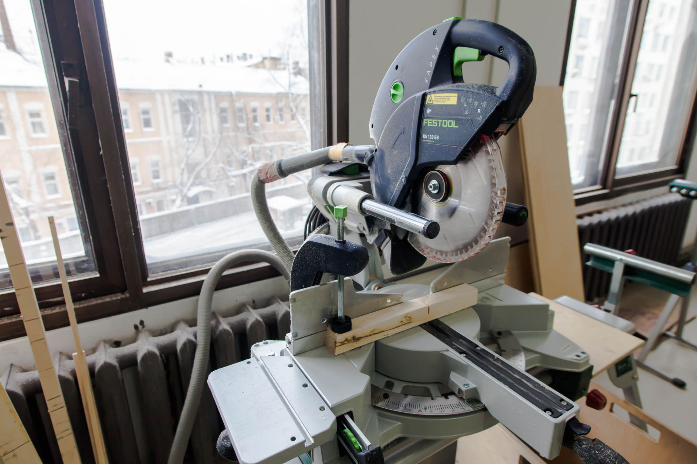
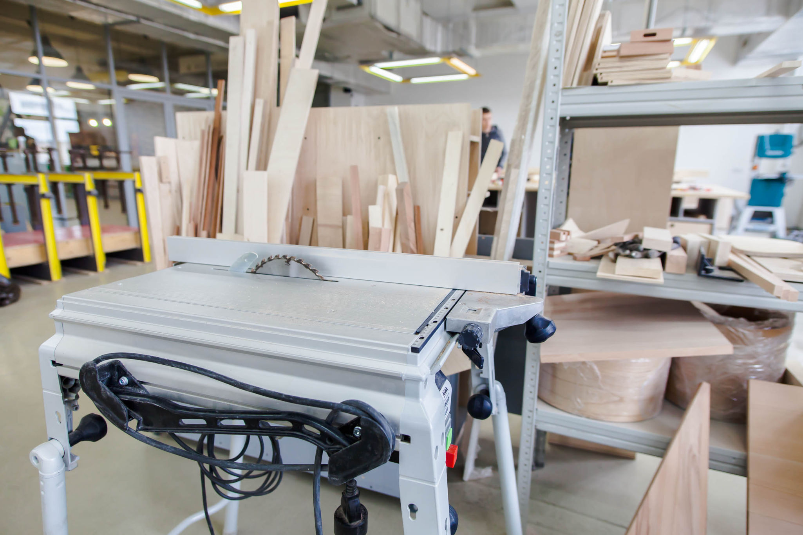

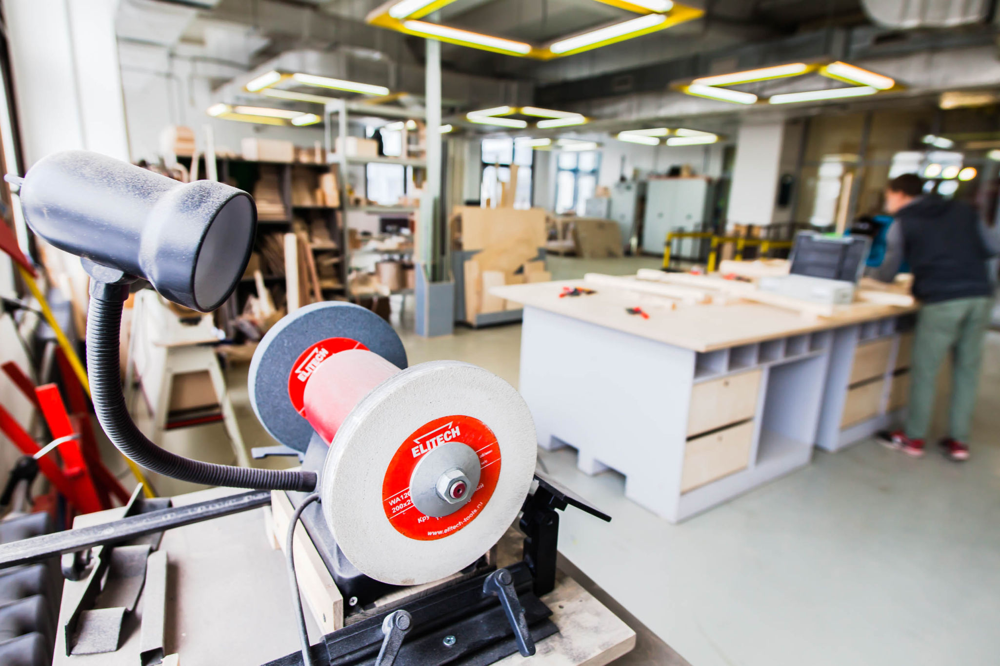

Производственная часть мастерской вмещает более сложное оборудование, включая форматно-раскроечный станок с системой сбора стружки, а также фрезерный стол, фуганок, рейсмус, отрезную пилу, циркулярный стол. Установлен довольно большой пресс для фанеровки и изготовления гнутых деталей из дерева. Остаётся масса свободного пространства, где сейчас удобно работать с крупногабаритными заказами, а в будущем появятся еще несколько профессиональных станков.

Еще в мастерской есть два помещения, одно из которых сейчас используется как временное хранилище проектов, а второе играет одновременно роль покрасочной комнаты и хранилища материалов [на надстроенном втором этаже](/practice/process/second-floor/).  "Делай вещь" использует в отделке преимущественно водные краски и лаки, а также масла и воски, для которых не требуются особые условия нанесения, однако отдельная комната необходима даже хотя бы для сушки окрашенных изделий в помещении без пыли и стружки.

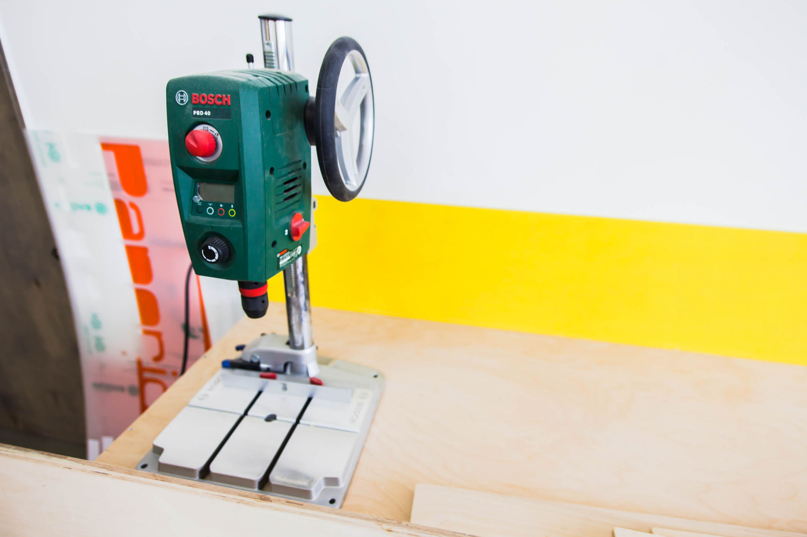
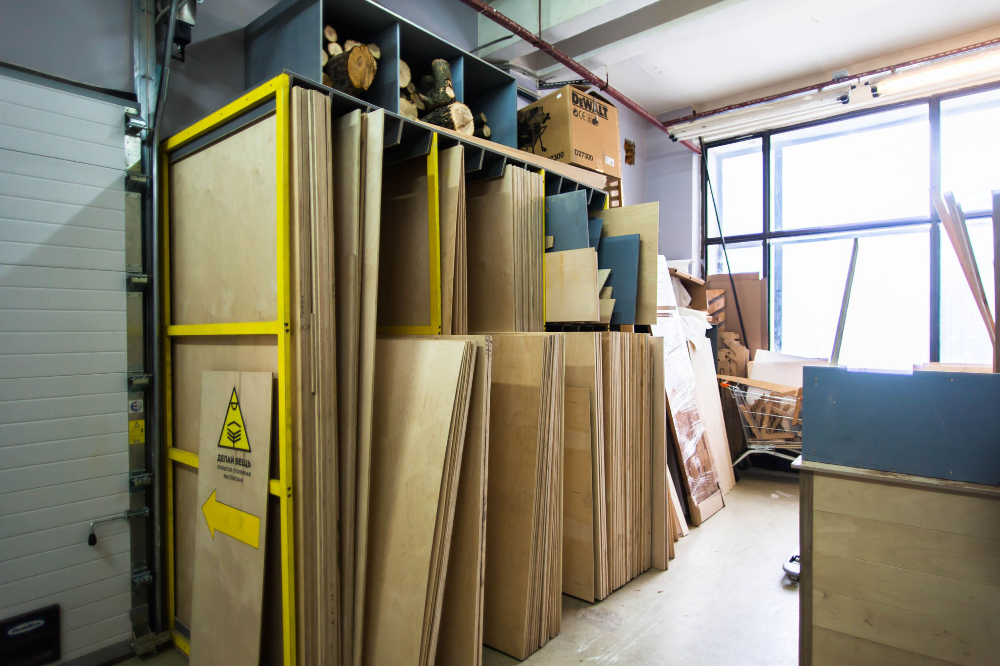
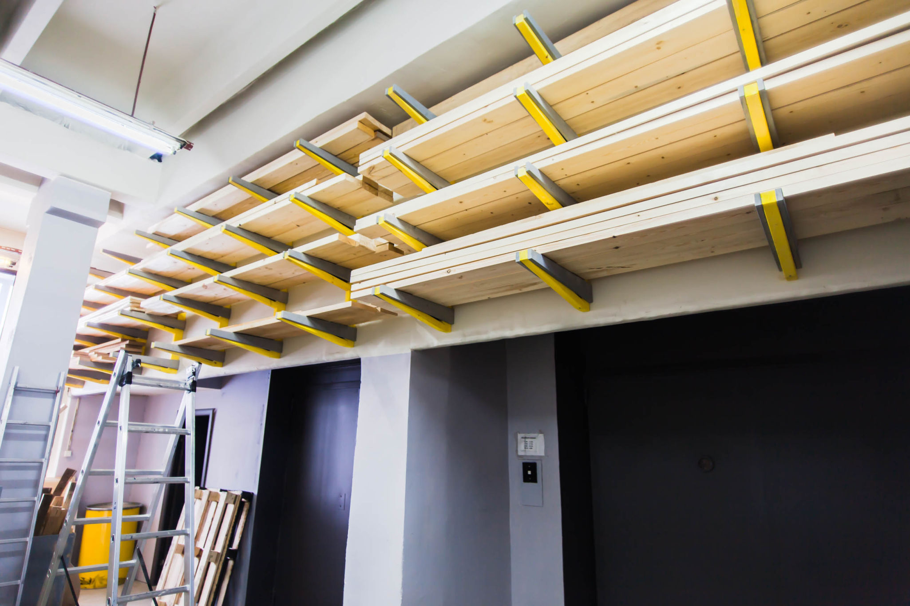

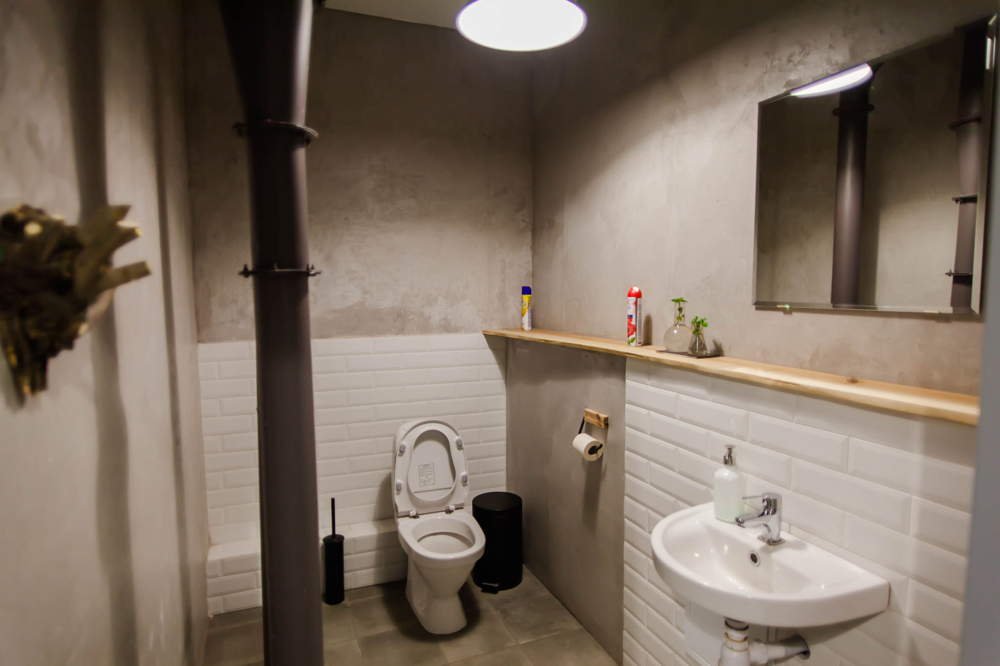

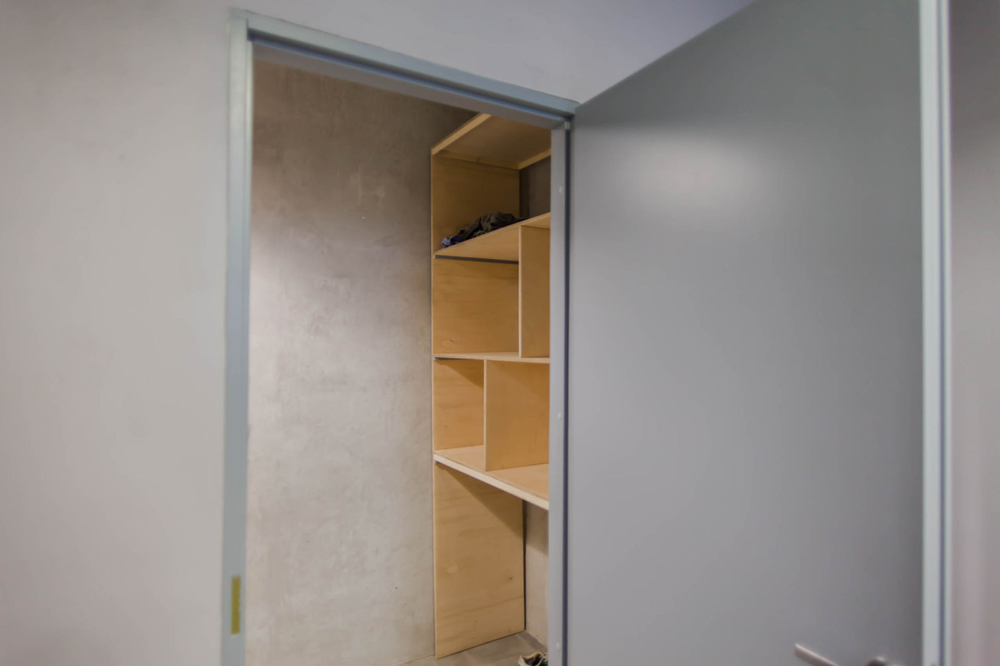
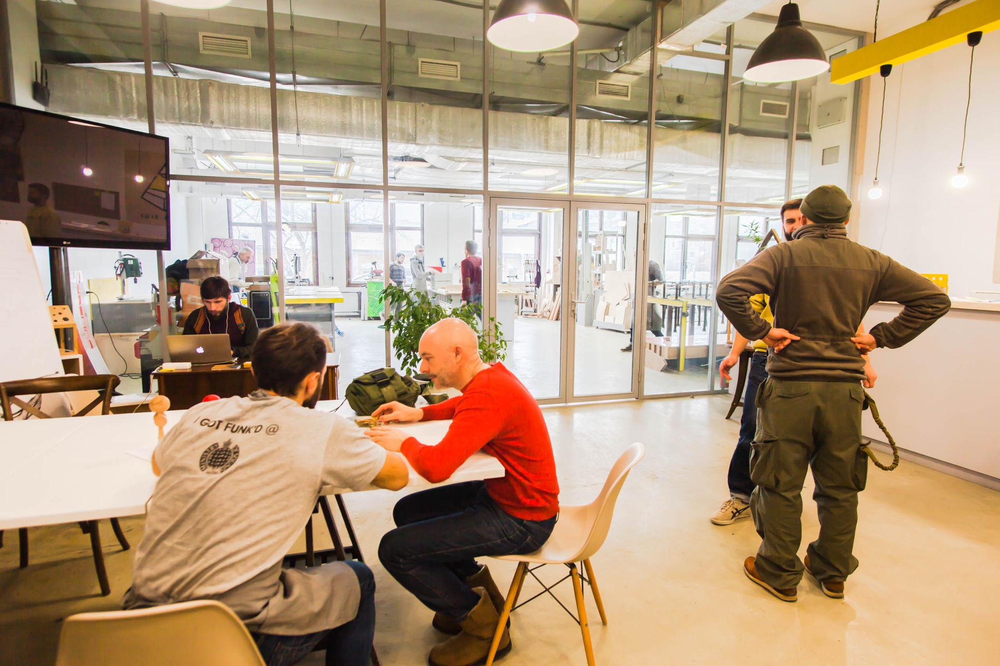

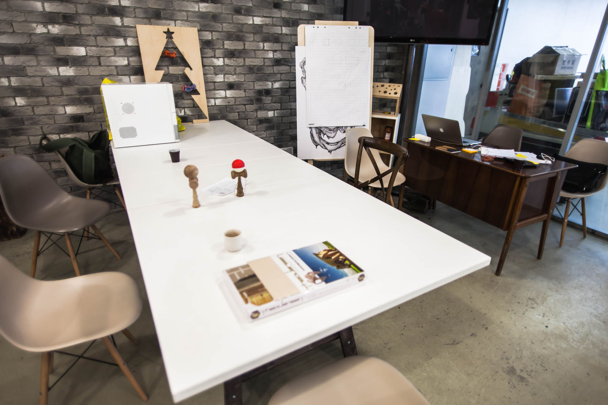
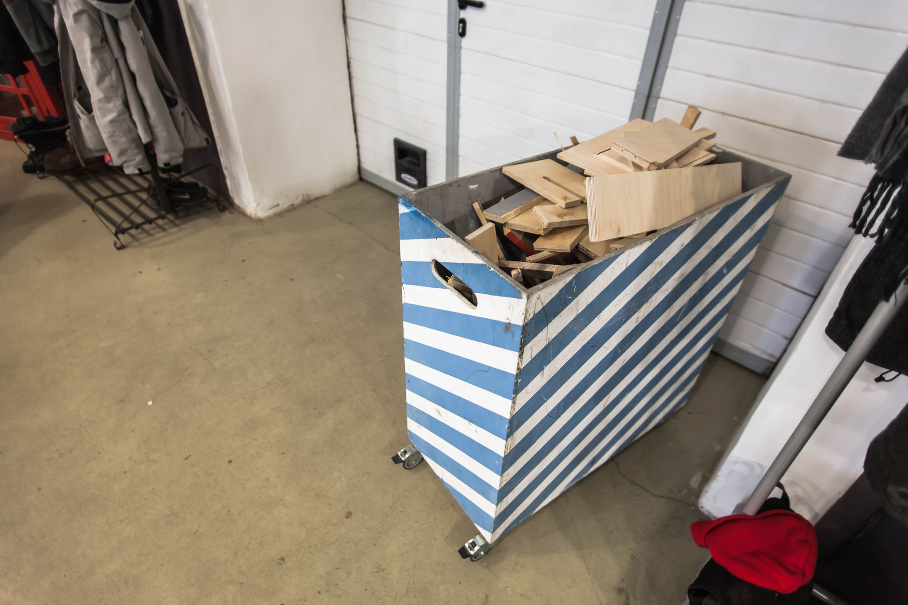

Мастерская "Делай вещь" существует всего несколько месяцев, но уже активно развивает множество различных направлений. Команда проекта уверена, что такое пространство может стать прибыльным только если будет предоставлять максимально широкие возможности и сочетать разнообразные формы деятельности. Значительную часть средств, конечно, продолжают приносить заказы производству, абонементы коворкинга дают ещё часть. Мастер-классы и разнообразные воркшопы и прочие события в пространстве — тоже немаловажный "ручеёк", из которых собирается весь необходимый поток средств. Мастерская создавалась полностью на собственные средства её основателей, наполняется тоже во многом своими силами, команда активно продвигает и развивает проект, привлекая производителей оборудования к спонсорству и сотрудничеству. Такой цех современного дизайна и интенсивного профессионального образования способен раскрыть множество действительно перспективных столяров и дизайнеров. Мы всецело поддерживаем благородное стремление помочь людям вырваться из офисного и компьютерного заточения, предоставляя им возможности заняться по-настоящему плодотворной творческой деятельностью. Пожелаем им успехов в этом замечательном начинании!

---

P.S. Кстати, в мастерской открыта вакансия: ищут опытного столяра на позицию директора производства. Задача — управление производственной группой. Требования — выполнять заказы в срок, вписываться в бюджет, иметь представление о дизайне и современных технологиях.

По всем вопросам [связывайтесь непосредственно с мастерской.](/workshop/catalog/delaivesch/)
