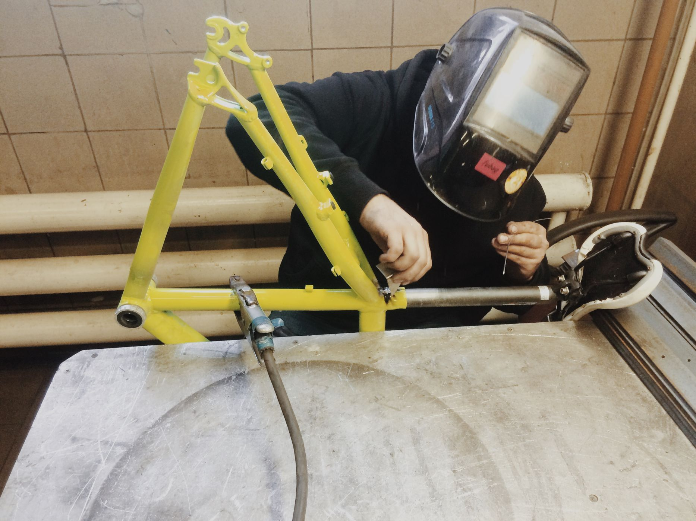
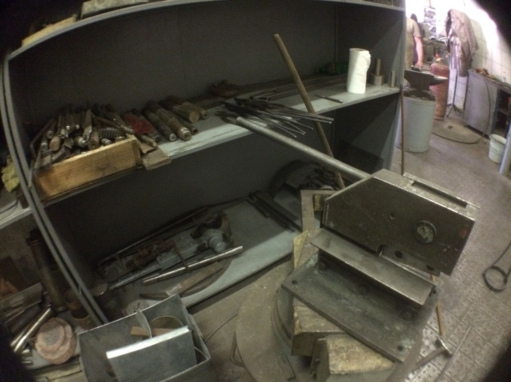
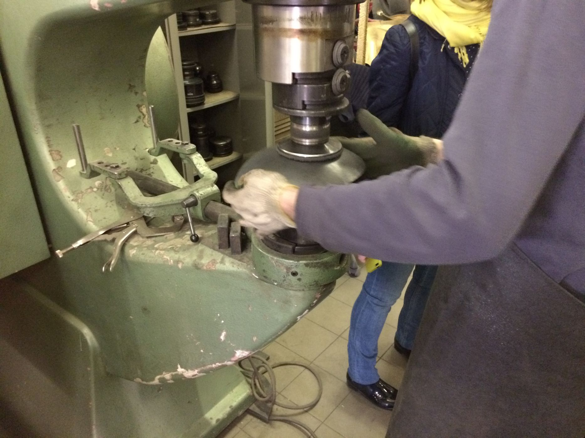
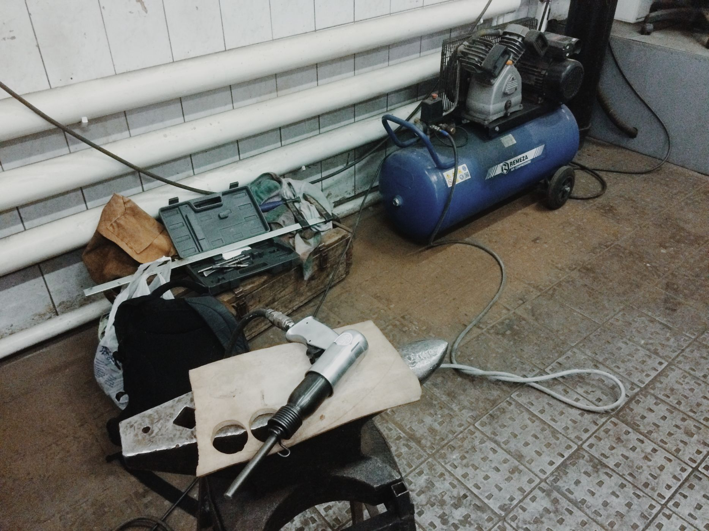
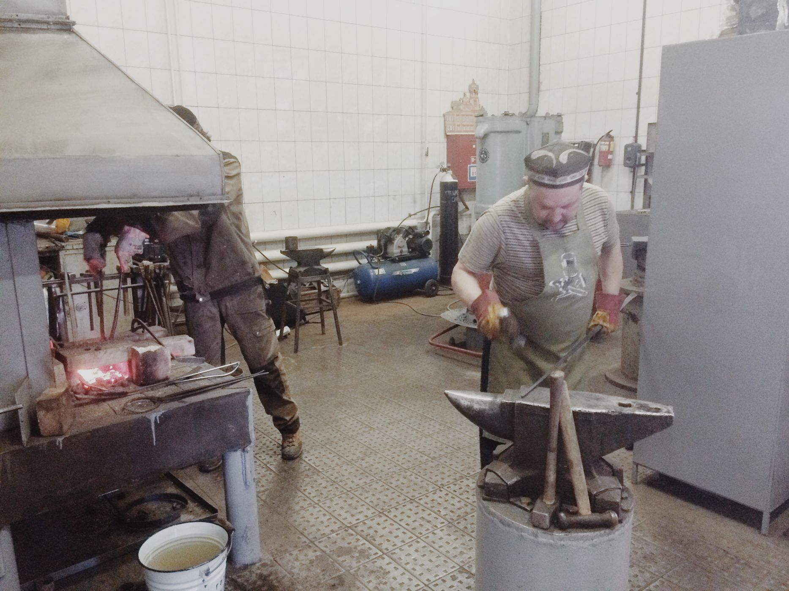
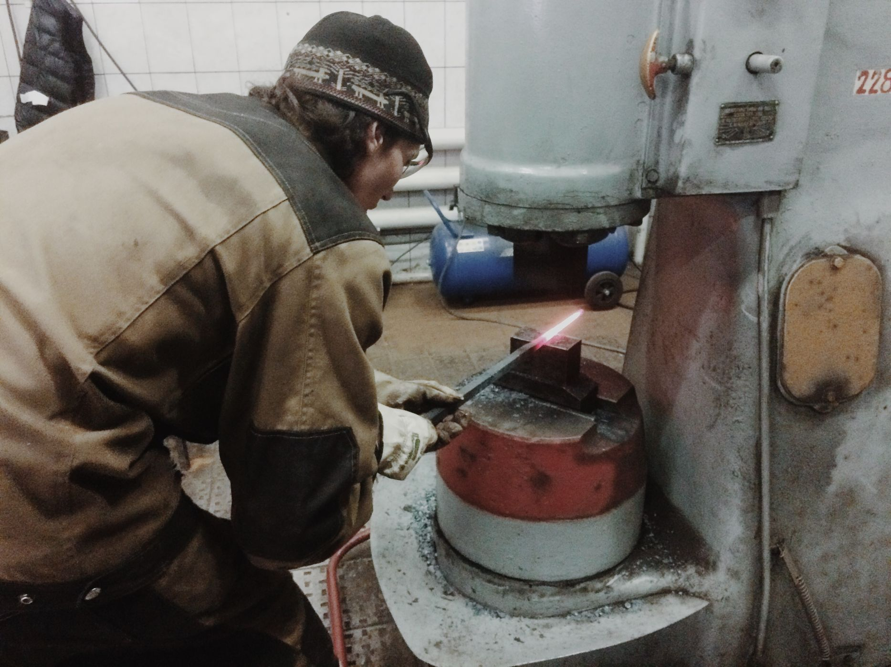
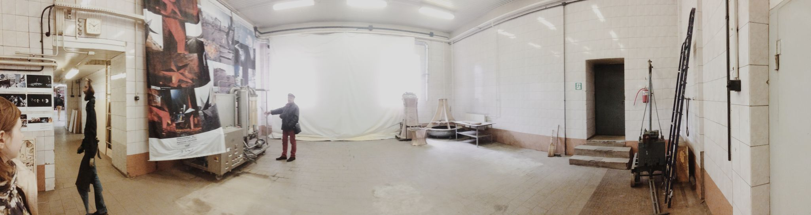
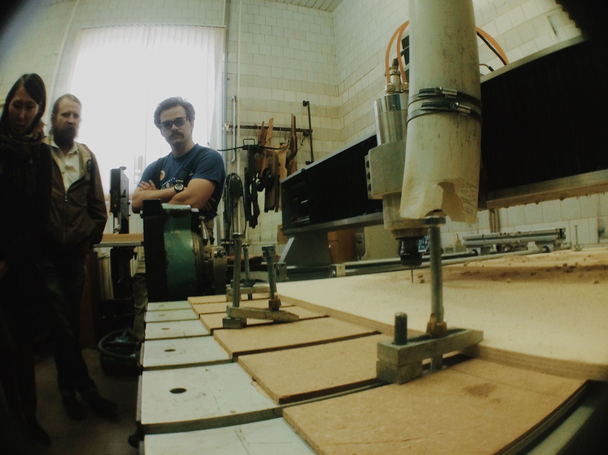
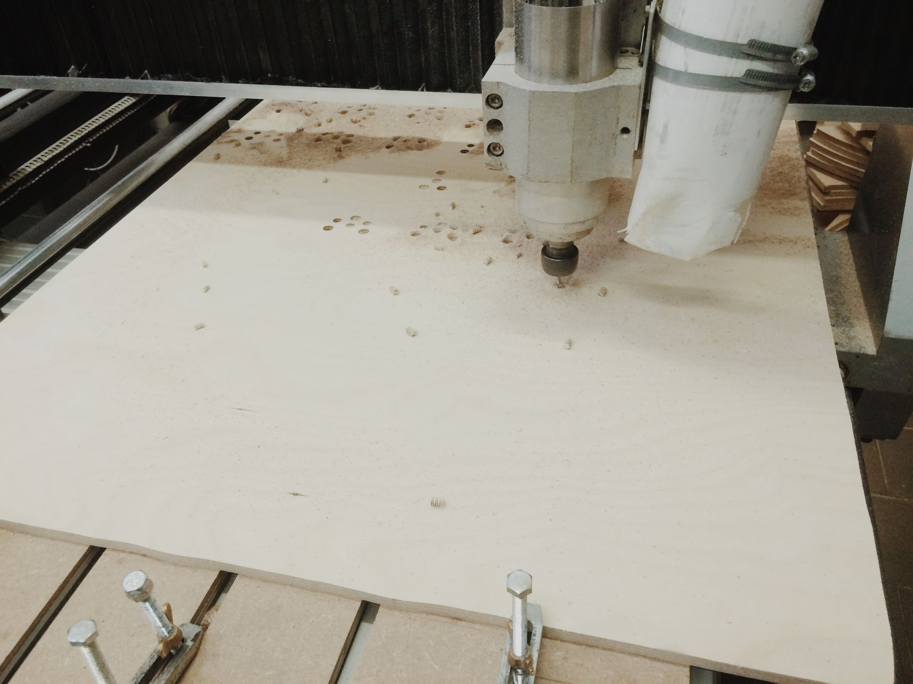
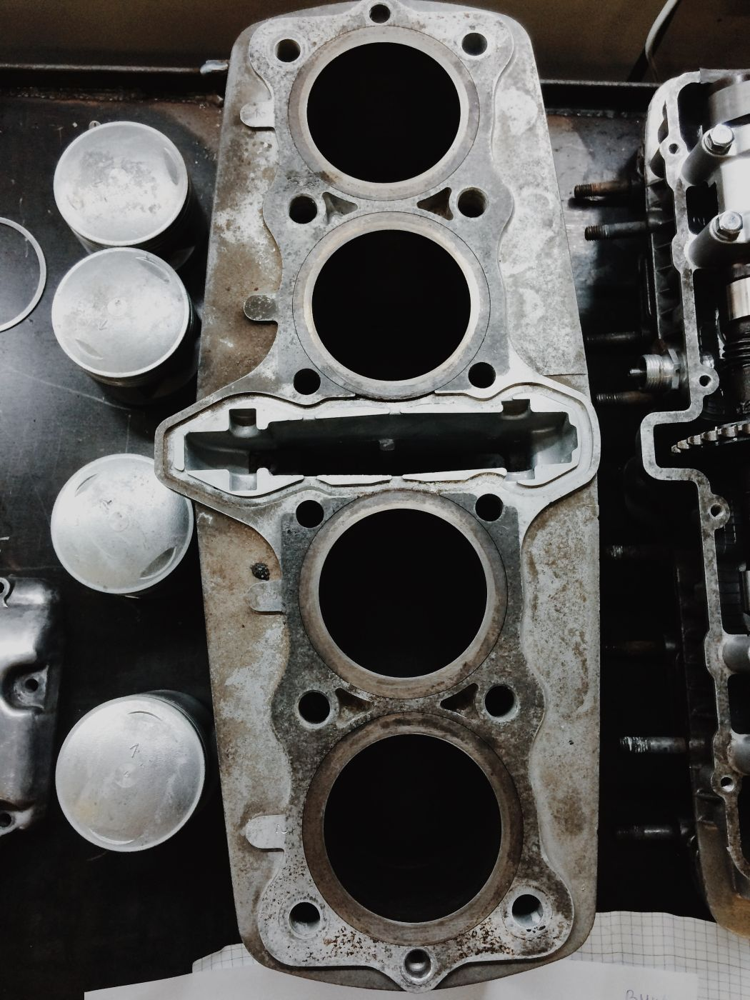

Недавно мы опубликовали [обзор мастерских проекта Про.Движение](/workshop/catalog/pro-dvizhenie/) и обещали дополнить некоторые недостающие детали. Очень кстати оказался [День открытых ворот](/practice/event/den-otkrytyh-vorot/), который Конфедерация успешно провела в субботу 25 апреля. Мы с удовольствием вновь оказались на территории Кристалла и собрали всю недостающую информацию о внутреннем устройстве мастерских серьезной металлообработки. Нам выпал отличный шанс увидеть мастеров и сложное оборудование за работой, делимся с вами нашими наблюдениями.

В прошлый раз мы лишь окинули взором одно из важнейших помещений мастерских — кузницу. Теперь мы ознакомились с наполнением этого цеха и увидели оборудование в действии. Слева у стены установлен **кузнечный горн**, где происходит нагрев стальных заготовок. Несложное устройство в виде массивного стола с решетчатым **горновым гнездом**, над которым устраивается из огнеупорного кирпича очаг. В качестве топлива используется каменный или обычный древесный уголь, а для достижения нужной интенсивности пламени снизу в гнездо подаётся поток воздуха из специального вентилятора. Такое устройство позволяет разогревать сталь до **более чем 1300°С**, чего вполне достаточно для её размягчения.

После того, как заготовка достаточно нагрелась, её можно ковать. Для этого здесь предусмотрено несколько наковален разного размера с различными приспособлениями для сгибания и прочей обработки горячего металла. Помимо ручного кования молотком на наковальне, резидентам мастерской доступен большой механический **кузнечный молот**, значительно облегчающий обработку металла. Также в кузне можно найти всевозможные щипцы, клещи, ножницы. Незаменимым помощником кузнеца оказался и пневматический молоток, работающий от воздушного компрессора.

Удалось увидеть в действии и многое другое. Мы увидели процесс ковки аккуратной вогнутой чаши из стального листа на кузнечных молотах общего цеха мастерской. **Никита Custo** не только представил велосипеды своей работы, но и продемонстрировал мастерство **аргонодуговой сварки алюминия** на примере треснувшей велорамы. На авторских велосипедах мог прокатиться каждый желающий, стоит признаться, ездить на них — одно удовольствие. На улице была хорошая погода и нам удалось понаблюдать за удивительно простым и эффективным процессом **плазменной резки металла**. Воздушный компрессор и специальный инвертор дают возможность резать довольно толстую листовую сталь почти как бумагу.

Большое помещение в дальней части мастерской теперь расчищено и подготовлено к въезду еще одного конфедерата проекта Про.Движение. Рядом оказалась открыта дверь **проекта ИСБМ**, занимающегося 3D-печатью и сложным ЧПУ фрезерованием дерева и других материалов. Оборудование этого проекта позволяет создавать вещи удивительной сложности, первичная разработка которых может занимать недели. Сложности в разработке программы для станка с лихвой компенсируются точностью обработки и возможностью легкого повторения изделий. Все резиденты мастерских частенько обращаются сюда с всевозможными проектами по резке дерева.

Ну и, напоследок, несколько сочных фотографий из мотомастерской **CusMos**, где ребята эффектно разложили разобранный мотодвигатель и можно было в деталях изучить его устройство. Да и сами мотоциклы поражают обилием неожиданных конструктивных решений.

