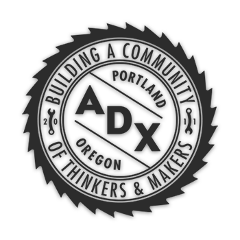

> Представляем вашему вниманию перевод основной информации с сайта еще одной американской открытой мастерской – ADX, расположенной в Портлэнде, штат Орегон. http://www.adxportland.com/

https://vimeo.com/50714619

# Об ADX

ADX — это центр сотрудничества, где лица и организации творят и учатся. Делясь инструментами, знаниями и опытом, мы делаем вещи лучше — работаем сообща. Наше творческое пространство, учебный центр и производственная площадка позволяют каждому реализовать свои идеи. В нашем здании площадью 14 000 кв. футов дизайнеры высокого профиля работают бок о бок со студентами, пенсионеры делятся знаниями с новичками, а предприниматели сотрудничают с теми, для кого создание вещей — только хобби.

# Публичные туры

Заинтересованы в нашем пространстве, возможностях, классах или мастерских? Приходите и присоединяйтесь к нашим регулярным вводным экскурсиям, проходящим три раза в неделю.

- Понедельник: 18:00
- Среда: 10:00
- Пятница: 10:00

Группы больше 4 человек согласовывают время посещения с нами. Возможна организация персональных экскурсий и туров вне графика.

### Техника безопасности

Все наши члены обязательно изучают технику безопасности, чтобы иметь возможность работать в мастерской уверенно и безопасно. Присоединяйтесь к регулярным введениям в технику безопасности, проводимыми 3 раза в неделю.

- Вторник: 18:00
- Четверг: 10:00
- Суббота: 10:00

# Членство

Являетесь ли вы профессионалом или только пробуете свои силы, членство в ADX даёт вам доступ к инструментам, пространству и сообществу для успешной реализации ваших проектов. Мы предлагаем несколько уровней членства.

## Уровни членства

Все уровни включают полный доступ к The Bridge Digital Design Lab, библиотеле инструмента, общему рабочему пространству, выгодам партнёрства, скидкам на классы и услуги такие как 3D печать и лазерная резка.

### Членство в сообществе

Стань частью нашего творческого сообщества и получай доступ к мастерским по необходимости.

#### $50 в месяц

Доступ к деревянной и металлической мастерской, а также к ремесленной лаборатории "Куб" по необходимости за отдельную плату..

### Абонемент Ремесленной лаборатории

Неограниченный доступ в ремесленную лабораторию "Куб". Доступ в мастерские по необходимости за отдельную плату.

#### $80 в месяц

### Абонемент свободного времени

Доступ ко всем мастерским в свободное от основной работы время в будни с 17:00 и все выходные.

#### $150 в месяц

### Неограниченный абонемент

Уделяйте серьезное внимание вашим проектам, пользуясь свободным доступом в мастерские 7 дней в неделю с утра до вечера.

#### $200 в месяц

# Классы

Смените офисный стол на верстак и попробуйте что-то новенькое. Мы предлагаем классы по деревообработке, металлообработке, обивке, 3D-дизайну, лазерной резке, 3D-печати и многому другому. С ADX вы будете учиться в обстановке взаимопомощи, где размер классов достаточно мал чтобы дать вам достаточно времени для личной работы с нашими умелыми инструкторами. Мы также предлагаем особые групповые занятия для школ и организаций.

Нестандартные классы стоят от $60/час для членов сообщества и от $75/час для гостей пространства.

# Мастерская деревообработки

- Отрезная и ленточная пилы
- Токарный станок
- ЧПУ фрезер
- Ленточный и барабанный шлифовальные станки
- Фуговальный и строгальный станки
- Верстаки
- Хранение материалов
- и многое другое!

# Мастерская металлообработки

- MIG & TIG сварочные аппараты
- Плазменный резак
- Ленточная пила
- Сверлильный станок
- Точильный станок
- Верстаки
- Вертикально-фрезерный станок
- и многое другое!

# "Мост"

- Стационарные компьютеры
- Рабочие столы
- Лазерный резак
- 3D принтер
- Программы для моделирования
- Программы Autodesk
- Офисная канцелярия
- и многое другое!

# "Куб"

- Инструмент для ювелирных работ
- Промышленная швейная машина
- Инструменты для обивки
- Шитьё одежды
- Небольшая кузница
- Шелкография
- Верстаки
- и многое другое!

https://www.youtube.com/watch?v=DBC0fA9G7Cg
