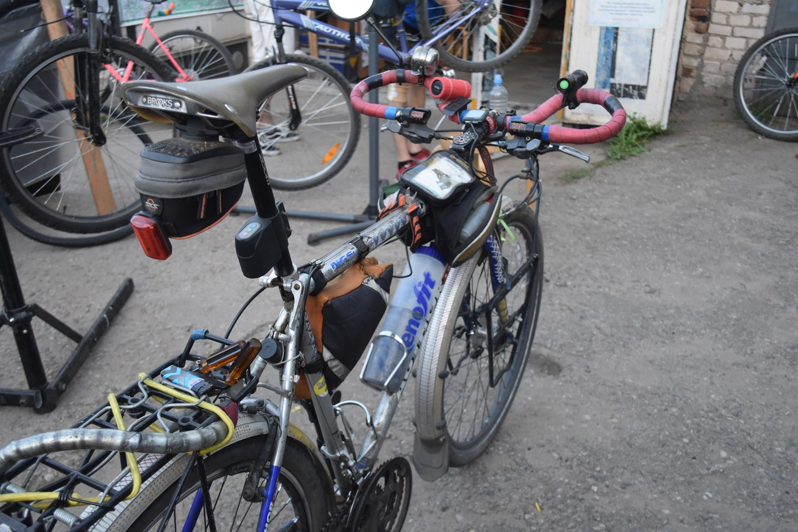
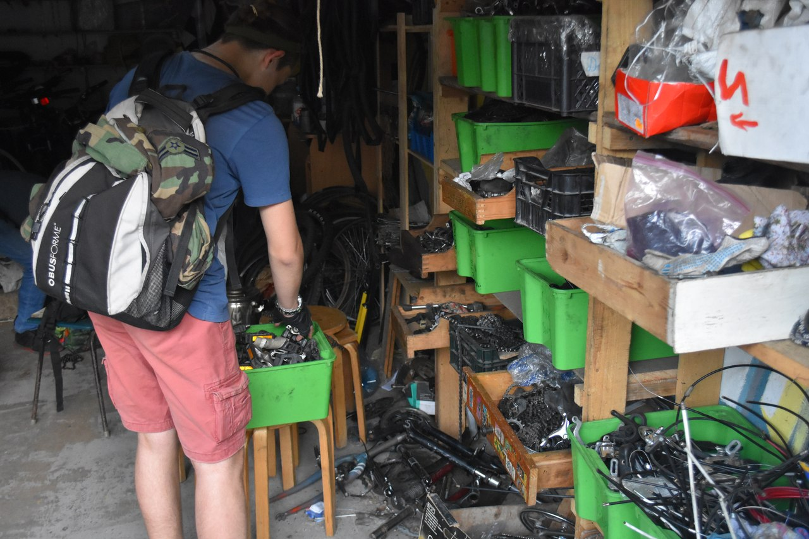
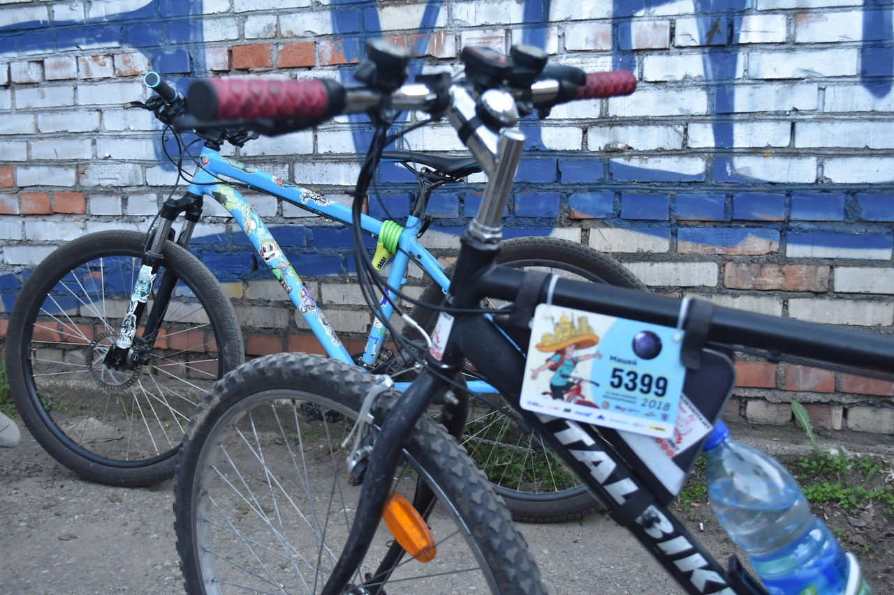

##### [OneTimer.by](http://onetimer.by/News/Article/VeloKukhnya-neobychnyy-garazh-na-prospekte) побывал в гостях у проекта [«ВелоКухня»](http://bikekitchen.by/be). Спросите, а что это за проект? Если не говорить заумными словами, то это небольшой гараж, где дежурят волонтеры и куда могут прийти все желающие починить своего «железного коня» либо собрать новый!

Вчера нам удалось пообщаться с основателем данного проекта \***\*Джоном Росмэном\*\***. Сам Джон родом из Нью-Йорка, некоторое время жил в России и вот уже 9 лет живет в Беларуси. 63-летний любитель велосипедов отлично выглядит и ни минуты не сомневается, что это все благодаря велосипеду.

\[caption id="attachment_6484" align="aligncenter" width="1280"\] На фото Кирилл Кудравец (слева) и Джон Росмэн (справа)\[/caption\]

\***\*– Джон, почему и как давно решили создать такой проект?\*\***

\***\*Джон:\*\*** На самом деле, эта идея не наша, по миру уже давно существует много таких ВелоКухень. Можно сказать, что у нас самая восточная ВелоКухня. А как давно? Кирилл, сколько нам уж лет? *(интересуется Джон у одного из активных деятелей ВелоКухни)*.

\***\*Кирилл:\*\*** Уже 5 лет в этом году, то есть открылись мы в 2013.

**– Сложно было начинать?**

**Джон:** Нам очень помогло Минское велосипедное общество, которое, собственно, и является организатором данного проекта.атором данного проекта.

\***\*– Может, кто-то относится к проекту со скепсисом?\*\***

\***\*Джон:\*\*** Честно говоря, когда впервые предложили эту идею на велофоруме, люди отнеслись скептически. Считали, что инструменты будут красть, что этот проект вряд ли наберет популярность, но, как видите, мы работаем.

\***\*– В Уставе ВелоКухни есть такой пункт: «Починили – оставьте что-нибудь взамен». Часто ли люди следуют ему?\*\***

\***\*Джон:\*\*** Принцип такой есть, конечно, но кто может, тот выполняет, но конкретной обязанности что-то оставить нет.

\***\*\*\***

\***\*– А бывали случаи, когда не просто чинили велосипед, но собирали новый из имеющихся частей в гараже?\*\***

\***\*Джон:\*\*** Да, были случаи. К примеру, Кирилл и Александр *(указывает на мужчину, занятого починкой велосипеда)* собирали, и, по-моему, даже не один велосипед.

\[caption id="attachment_6483" align="aligncenter" width="1280"\] Велосипед, собранный Александром Дещенко на ВелоКухне\[/caption\]

\***\*– А проводите, как это написано у Вас на сайте, просмотры велофильмов или мастер-классы?\*\***

\***\*Джон:\*\*** Что касается велофильмов, то давно уже не организовывали просмотров, так как не совсем удобно это делать в нашем гараже. А вот мастер-классы… Кирилл, у нас давно не было мастер-классов, нужно организовать! *(смеется Джон)* Если без шуток, то мастер-классы по ремонту велосипеда очень интересные. На мой взгляд, очень важно проводить мастер-классы по проколу шин, например. Ведь мало кто знает, как действовать в такой ситуации. А у меня, к примеру, есть такой набор инструментов *(Джон показал компактно собранные запаску, заплатки, лопатки и прочий инструмент)*.

\***\*– Джон, а Вы пользуетесь общественным транспортом?\*\***

\***\*Джон:\*\*** Обычно всегда на велосипеде, но с рождением сына Марка, которому сейчас всего 3 месяца, пришлось начать пользоваться общественным транспортом, так как с таким маленьким еще нельзя на велосипед.

\***\*– Может, собираетесь участвовать в Велокарнавале, который пройдет 12 мая?\*\***

\***\*Джон:\*\*** Сам не буду, а вот жена собирается. На самом деле, велосипед – это отличный способ знакомств, это живое общение. Собственно, именно любовь к велосипедам и познакомила нас с женой. Мы участвовали в заезде, в котором 2-3 дня катались и посещали необычные библиотеки. Кстати говоря, интересное мероприятие, которое соединяет и спорт, и культуру. Так вот, так и познакомились.

\***\*\*\***

\***\*– Велосипед играет достаточно важную роль в вашей жизни. А все-таки, многие ли знают и посещают «Гараж 38»?\*\***

\***\*Джон:\*\*** На самом деле, это сезонное дело. Зимой тут очень тихо, а в сезон можем работать почти каждый день. Изначально мы активно занимались пиаром, а теперь не стремимся привлечь излишнего внимания: велолюбители сами распространяют информацию – и кому надо, тот приезжает.

Уже спустя минут 40 количество велолюбителей на ВелоКухне значительно прибавилось. Люди приезжали с разными проблемами, и одним из инициативных помощников был активист Минского велосипедного общества \***\*Александр Дещенко\*\*** – тот самый Александр, который сам собрал велосипед на ВелоКухне и с большим удовольствием катает на нем уже больше года.

\***\*Кирилл Кудравец\*\*** тоже активно помогал гостям Гаража, но нашел свободную минутку, чтобы поделиться мыслями о развитии велосипедного движения в Беларуси.

\***\*\*\***

\***\*Кирилл:\*\*** Мне кажется, что мы развиваемся по модели, которая схожа с европейской, но, к сожалению, с большим отставанием. На данный момент стараются создать велоинфраструктуру, удобную абсолютно для всех. Например, это установка подъемников для людей с ограниченными физическими способностями, звуковых пешеходов для слабовидящих людей. К слову о развитии: Джон очень любит тему инноваций, при этом постоянно твердит только об одной – беспилотный автомобиль. Джон, какие инновации нас ждут?

\***\*Джон:\*\*** Беспилотный автомобиль! *(Все смеются)*

На ВелоКухню заезжают самые разные люди, нам посчастливилось встретить председателя Минского велосипедного общества – Павла Горбунова, который мило согласился ответить на несколько вопросов.

\***\*– Павел, довольно часто возникают конфликты между пешеходами и велосипедистами. На Ваш взгляд, как можно развить велокультуру у нас в стране?\*\***

\***\*Павел:\*\*** Есть разные способы развития велокультуры. Во-первых, часть проблем решится, если будет налажена хорошая велоинфраструктура. Собственно, данный вопрос является насущным в деятельности МВО. Во-вторых, нужно просто объяснять людям, какое поведение является правильным во взаимодействии пешеходов и велосипедистов. Главное, чтобы люди нас слышали. Ещё очень важно, как люди выходят из конфликта: кто-то реагирует грубо, а кто-то относится с пониманием. Если говорить о конкретных способах развития велокультуры, то печатаем буклеты для школ, собираемся запускать короткие ролики с простыми правилами, возможно, будет пару билбордов по городу.

\***\*– Как думаете, а могут ввести сдачу правил для велосипедистов?\*\***

\***\*Павел:\*\*** Скорее всего, такого не будет, и это правильно, потому что в данном случае будет нарушаться Международная Венская конвенция, к которой Беларусь присоединилась ещё в 60-х годах. Да и вообще, лишние ограничения снизят огромную популярность к велосипедному движению, бум которой мы сейчас наблюдаем.

\***\*– Какие приоритетные направления в деятельности МВО?\*\***

\***\*Павел:\*\*** На самом деле, у МВО  много задач на ближайшие 1,5 года. Как уже говорил, активно работаем над созданием удобной велоинфраструктуры. Нас слышат, что не может не радовать. Уже как полгода помогаем другим городам правильно организовывать велодвижение. А ещё в скором времени выйдет первый велосипедный стандарт.

Павел предложил стать членами МВО, для чего нужно оплатить взнос в размере не менее 1 базовой величины и заполнить форму [на сайте](http://bike.org.by/ru/membership), после чего можно будет получить членскую карточку. И, конечно, Павел не забыть "полечить" свой велосипед, за чем, собственно, и приехал в "Гараж 38".

Посетителей у Велокухни становилось только больше. Даже приехали ребята, которые уже успели зарегистрироваться на субботний Велокарнавал и забрать свои именные карточки.

Несмотря на то, что мы на ВелоКухне ничего не чинили, уходить оттуда не хотелось: общительные ребята и позитивная атмосфера располагает.

В общем, ВелоКухня – это отличное место, где Вы сможете и велосипед починить, и новых знакомых найти, и получить массу положительных эмоций!

Автор: Анастасия Коник, журналист [OneTimer.by](http://onetimer.by/)
