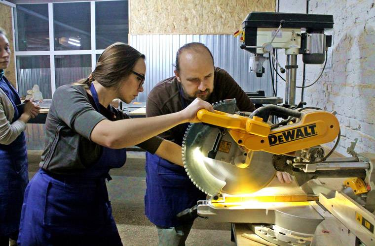
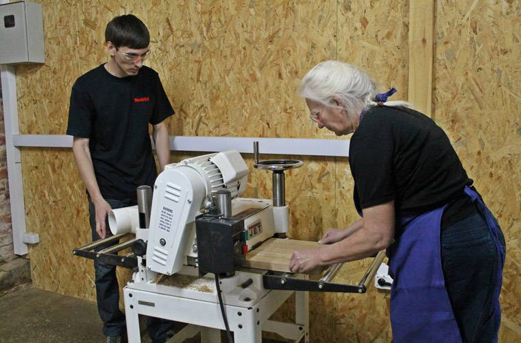

**Многие мастера, работающие с деревом или металлом, хотели бы запустить своё производство. Но их останавливает высокая цена «входа» на рынок. На оборудование, склад и аренду мастерской им необходимо несколько сотен тысяч рублей. Инженерный центр «Фабрика», открытый в сентябре 2016 года в Ростове-на-Дону, предлагает всем желающим оборудованные мастерские со всей необходимой инфраструктурой. О том, почему производство снова в моде, и зачем нужно объединять мастеров под одной крышей, [порталу Biz360.ru](https://biz360.ru/materials/kak-ustroen-kovorking-dlya-predprinimateley-masterov/) рассказал руководитель проекта «Фабрика» Алексей Санин.**

### Досье

**Алексей Санин**, 28 лет, предприниматель из Ростова-на-Дону, основатель проекта [**«Фабрика»**](http://www.fabrika-ic.ru/) (центр-коворкинг для предпринимателей-мастеров). В 2010 году с отличием окончил Донской государственный технический университет по специальности «инновационный бизнес и менеджмент», в 2013 году защитил кандидатскую диссертацию по экономике в Ростовском государственном экономическом университете. С 2013 года запустил и поучаствовал в нескольких проектах (спортивный магазин Futsal, дистрибьюторская компания BeECO, культурно-деловой центр  [Creative Space](http://www.creativespace.pro/)). В сентябре 2016 года запустил инженерный центр «Фабрика».

### Неудобные соседи

Управляющая компания, одним из партнёров которой является Алексей Санин, занимается развитием площадок для размещения креативных фирм в абсолютно разных сферах деятельности. В частности, в Ростове-на-Дону она управляет трёхэтажным культурно-деловым центром «Креативное пространство», где расположены офисы более 40 компаний. В конце 2015 года среди арендаторов стали появляться производственные фирмы - кожевенная и столярная мастерские, типография и некоторые другие. Здесь они располагали своё оборудование, пилили, сверлили и т.д.

Остальных арендаторов такое соседство не очень радовало. Архитекторам, дизайнерам и программистам для работы нужна тишина. Но терять производственные компании арендодателям тоже не хотелось. Проблему нужно было как-то решать. И Алексей Санин с коллегами решили создать для производственников отдельное пространство.

«Мы увидели тенденцию. Ещё два года назад люди хотели строить бизнес на покупке и продаже, в лучшем случае – открывать бургерные или кальянные. Сейчас многие хотят что-то производить. Когда ты сам делаешь какую-то продукцию – это уже совсем другая история. В бизнесе это называется «дополнительная добавленная стоимость». Ты сам добавляешь стоимость своему продукту и сможешь продать его намного дороже. Просто заложи туда больше фантазии и своего времени», - рассказывает Алексей.

Весной 2016 года начался поиск площадки для небольших производственных цехов и мастерских. Это было непросто, так как помещение должно было соответствовать ряду критериев. Среди основных требований – доступность транспортных путей, первый этаж, собственный подъезд для завоза материалов и оборудования.

### Цех с историей

В мае 2016 года подходящая площадка была найдена. Был взят в аренду один из цехов бывшего завода технологической оснастки, который располагался в здании 1860 года постройки, где до революции находился каретный двор крупного ростовского купца Парамонова. Завод не функционировал около 25 лет, поэтому историческое здание было в очень плохом состоянии.

Цех площадью 350 «квадратов» Алексей с коллегами расширили почти вдвое. Шестиметровые потолки дали возможность построить второй этаж, антресоли и амфитеатр. В результате получились 12 мастерских: шесть маленьких (по 10 метров) и шесть больших (от 30 до 70 метров).

Одна из стен арендуемого цеха - XIX века. Её очистили от «советской» штукатурки и обнажили кирпичную кладку. Сейчас она – гордость мастерских. Одно из условий сдачи помещений в аренду – сохранение исторической стены в нетронутом виде.

### Оборудование – по высшему разряду

Инженерный центр «Фабрика» начал работать 12 сентября 2016 года. Его пространство разбито на 12 «цехов», которые арендуют производственные компании. Общие территории используются под обучающие мероприятия. Но поработать на «Фабрике» могут не только арендаторы. Все станки, установленные в инженерном центре, сдаются в почасовую аренду всем желающим.

«В основе проекта лежала глобальная идея. По сути мы являемся инфраструктурой поддержки производственного бизнеса. Сейчас очень много говорят о том, что нужно поддерживать производство, но никаких конкретных шагов не предпринимается. И мы решили сделать это сами», - говорит Алексей.

Помощь и содействие производственникам выражено на «Фабрике» в виде условий и инфраструктуры. Например, молодой предприниматель хочет выпускать изделия из дерева. На этапе идеи многих останавливает высокая стоимость оборудования - в него нужно вложить как минимум 250-300 тысяч рублей. Кроме этого, нужна мастерская и склад. Но ведь далеко не все мастера уверены в своём успехе на рынке и готовы сразу на такие серьёзные вложения.

В инженерном центре «Фабрика» площадки под производство можно арендовать со станками и необходимыми инструментами. Никаких дополнительных расходов, кроме арендной платы и затрат на материалы, предприниматель не несёт

«Мастер пользуется нашим оборудованием, выпускает свою продукцию, пытается её продать. И если у него получается, идёт дальше. Мы предоставляем условия, твоё дело – попробовать, и при этом за небольшие деньги. Не надо рисковать, брать кредит, не надо продавать машины. Просто приди и попробуй, а дальше будет видно», - объясняет Алексей Санин.

> #### Вложения в проект «Фабрика» составили около 6 млн. рублей. При этом весь объём инвестиций является частным капиталом - заёмных либо государственных денег в проекте нет

Чтобы арендаторам и гостям было на чём работать, основатели проекта приобрели парк оборудования стоимостью более 1 миллиона рублей. Этих денег хватило на шесть больших станков по работе с деревом: торцовочно-усовочные и погружные пилы, рейсмусовый, сверлильный, токарный и другие станки. Также было закуплено более 20 «мелких» электроинструментов (лобзики, шуруповерты, дюбельные фрезы и т.д.).

Акцент на работе с деревом сделали потому, что на этот материал сегодня серьёзный спрос. «Дерево сейчас очень модно и востребовано. Сейчас деревянные изделия для ресторанов и баров пользуются большей популярностью, чем металлические», - утверждает Алексей.

Для «Фабрики» закупили современные швейцарские и американские станки таких известных брендов, как Festool, Jet, DeWаlt. Таким образом, основатели проекта продемонстрировали будущим арендаторам серьёзность своих намерений.

«Ставка на бренды и надёжность при закупках станков сработала на все 100%. Предприниматели, заходя к нам, говорят: «У вас крутое оборудование». Мы его предоставляем для всех желающих, но в первую очередь – для наших резидентов», - рассказывает Алексей Санин.

«Мало кто верит, что это всё можно было сделать без государственного участия. В России любят всё делать «сверху вниз». А у нас подход «снизу вверх». Мы сначала поговорили с теми, кому это может быть интересно. И на основе этих условий и требований сделали для них то, что им было нужно», - вспоминает Алексей.

### Бросаем «якоря»

Следующим ключевым моментом стало привлечение «якорных» арендаторов. По плану ими должны были стать предприниматели со специфическим оборудованием, которого нет на «Фабрике».

Один из таких арендаторов - компания, имеющая лазерный резчик-гравёр и большой фрезерный станок площадью 3х2 метра. Эти станки работают с деревом и композитом, делают гравировку по дереву, которая сейчас очень популярна. Такие изделия, как, например, меню на доске с гравировкой, заказывают рестораны и бары.

> #### Стоимость аренды мастерской в 10 кв.м. составляет 10 000 рублей в месяц, а мастерской в 32 кв.м. – 26 000 рублей в месяц

В качестве второго «якоря» основатели «Фабрики» целенаправленно искали центр 3D-печати с собственным оборудованием. Нашли ребят-энтузиастов, которые занимаются популяризацией технологии 3D-печати и сканирования. Они разместили на «Фабрике» свою мастерскую. Сейчас все посетители и резиденты могут пользоваться их услугами.

«3D-принтеры до сих пор очень дорогие. И мы с ребятами из центра 3D-прототипирования разрабатываем программу обучения на их машинах, чтобы сделать оборудование более доступным. Наши резиденты сами планируют собирать такие принтеры. Фактически они уже это делают: покупают составляющие в Китае, США и  России, а потом собирают их, правда, пока только для себя. В дальнейшем, возможно, они будут заниматься сборкой под своим брендом», - говорит Алексей.

### Резиденты

«Фабрика» работает всего чуть больше двух месяцев, но из 12 имеющихся мастерских занято уже 10. Никого, кроме двух «якорных» резидентов, основатели проекта специально не искали, остальные резиденты пришли сами. Некоторые из них забронировали площади ещё до открытия центра.

Площадки сдаются по договору краткосрочной аренды на 11 месяцев. Но основатели проекта хотят, чтобы резиденты оставались с ними как можно дольше. Единственное условие со стороны арендодателей – соблюдать внутренние правила и делать качественную продукцию.

Один из резидентов изготавливает деревянные подносы, на которых подают мясо. Их покупают рестораны и бары. Проработав два месяца на «Фабрике», он понял, что ему становится тесно на 10 квадратных метрах. Сейчас он докупает новое оборудование и планирует переехать в 30-метровую мастерскую.

Другой резидент собирает на территории «Фабрики» светящиеся металлические конструкции: буквы с лампочками, лампы для дома, офиса, отелей, ресторанов.

Кроме них, на «Фабрике» есть мастера, занимающиеся небольшим ручным производством. Например, скульптор, которая создаёт изделия из глины под заказ и на продажу. Есть мастер по работе с кожей, который делает браслеты и портмоне. В принципе, они могут оборудовать рабочее место и дома. Но работа в домашних условиях сопряжена с неудобствами, поэтому они предпочитают арендовать мастерскую.

«Работать дома грязно и не особо удобно - нужно убирать отходы производства по всей квартире. На «Фабрике», помимо прочего, есть душевые. Люди могут поработать, помыться и прийти к нам же на вечерние мероприятия – лекции и мастер-классы. Мы их проводим почти каждый вечер», - замечает Алексей Санин.

Кроме того, играет роль сообщество и доступность оборудования. К примеру, любой арендатор может поработать с фрезой или с 3D-принтером. Услуги всех резидентов доступны другим арендаторам по особому, более низкому тарифу.

### Заказы со стороны

Ещё одно направление работы «Фабрики» - выполнение производственных заказов от компаний, не являющихся резидентами. Таких заказов довольно много. Среди клиентов много предприятий общественного питания - ресторанов и кофеен. Также продукцию «Фабрики» заказывают рекламные агентства, отели и другие заведения.

> #### Когда инженерный центр получает заказы, он распределяет их среди своих резидентов. За это «Фабрика» получает от них небольшой процент за привлечение клиентов

«Это мы называем маркетинговой поддержкой резидентов. Помимо того, что мы рекламируем продукцию каждого из них, мы еще «притягиваем» заказы со стороны и доставляем их нашим арендаторам», - говорит Алексей.

### Ремесло «для души»

Ещё один из вариантов монетизации для инженерного центра – сдача станков в аренду всем желающим. Клиент бронирует в интернете токарный станок, и в выбранное им время больше станок никто не использует.

Стоит такая услуга от 50 рублей в час и пользуется большой популярностью среди тех, кто время от времени мастерит что-то «для души» или по мере необходимости. Например, если человек хочет вместе с сыном за три часа сделать скворечник, он может просто приехать на «Фабрику» с пустыми руками и его обеспечат всем необходимым: материалом, инструментами, оборудованием. Уборка рабочего места также входит в стоимость аренды станка.

«Таких людей, которые хотели бы впервые после школы поработать на станке, на самом деле очень много. У одного предпринимателя есть компания, а для себя, для удовольствия, он делает будки для собак. Делал их на балконе. Жена узнала про «Фабрику» и привела его к нам. Он хранит всё у нас, пользуется нашим оборудованием и не заваливает теперь свою квартиру стружками и опилками», - приводит пример Алексей Санин.

### Учиться, учиться и ещё раз учиться

«Фабрика» - это не только станки и мастерские. Основатели проекта решили не только предоставить мастерам всю необходимую инфраструктуру, но и помочь им с обучением. Образовательные программы в инженерном центре проходят по двум направлениям - ремесло и бизнес-образование.

Для желающих научиться мастерить что-то своими руками «Фабрика» запустила 15-часовые курсы (5 дней по 3 часа). Стоимость такого курса – 5500 рублей. Слушателям предлагают обучение основам столярного и гончарного дела, а также декорирования. На столярных курсах ученики за 15 часов создают своими руками готовое изделие. Любопытно, что 70% занимающихся на столярных курсах составляют женщины от 22 до 60 лет. Три таких курса уже закончились, начинаются новые. По признанию Алексея Санина, группы набираются очень быстро.

«Самое интересное, что наши ученики на курсах делают всё сами. Мы им только даём мастера, который наставляет, рассказывает и показывает. Например, для изготовления ключницы ученики получают деревянные бруски, в процессе они могут использовать всё оборудование, которое у нас есть. Можно делать всё - распил, рейсмусование, фрезерование, шлифование, покраску. У каждого получается вещь с индивидуальным дизайном», - рассказывает Алексей.

На занятиях по гончарному делу «студенты» за два занятия создают на гончарном кругу кружку, блюдце, миску и раскрашивают их. В ближайшее время планируется запустить курс изготовления лонгбордов (большая доска для катания). «Фабрика» предоставит ученикам материалы, инструменты и мастера, а человек через пять занятий уйдёт с собственным лонгбордом.

В современном мире важно не только владеть теми или иными навыками, но и уметь их продавать. Раз в неделю на «Фабрике» проходят встречи с действующими предпринимателями. В качестве эксперта Алексей приглашает состоявшихся людей из мира бизнеса, которым можно задать любые вопросы. Вход на эти встречи бесплатный.

Сейчас «Фабрика» организует образовательные семинары для предпринимателей. Темы этих семинаров – бухучёт, налогообложение, проверки, трудовые отношения, формы господдержки. Для слушателей они также бесплатные.

Иногда устраиваются и киновечера – в зале с проектором и звуком для этого созданы все условия. На них можно посмотреть документальные и художественные фильмы о бизнесе, маркетинге, дизайне и т.д.

### Команда

Идею «открытых мастерских» Алексей и его партнёры позаимствовали в Европе. Аналогичные проекты уже действуют в Москве и в Санкт-Петербурге, но в Ростове таких до сих пор не было.

«Они круто работают, и на некоторых из них мы даже равняемся. Но мы пошли дальше. Мы сделали инфраструктурный проект для действующих предпринимателей. Я изучил этот вопрос: подобного комплекса с такой инфраструктурой в России больше нет. Обычные мастерские нацелены на людей, которые просто что-то любят делать своими руками. А мы говорим о развитии бизнеса», - объясняет разницу Алексей.

> #### Согласно бизнес-плану, основатели планируют вывести «Фабрику» на окупаемость в течение трёх лет

Развитием «Фабрики», а также «Креативного пространства» занимается управляющая компания под руководством самого Алексея и его партнёра Александра Кулешова. В компании также работают архитектор, дизайнер и менеджер по продвижению.

Кроме того, частью «Фабрики» являются ещё три человека: управляющий, администратор и мастер производства, который проводит обучающие курсы и занимается всеми вопросами изготовления продукции.

### Что дальше

Основатели проекта «Фабрика» планируют несколько направлений для дальнейшего развития. Первое из них – это расширение на территории бывшего завода технологической оснастки. Его площадь – около 8000 квадратных метров, и других арендаторов, кроме «Фабрики», там пока нет.

В качестве альтернативы прорабатывается вариант создания открытых мастерских по всему Ростову-на Дону. «Когда мы увидим, что люди поняли, как этим пользоваться, мы готовы делать нечто подобное в других местах», - говорит Алексей. Не исключается появление «Фабрики» и в других городах России.

В ближайшие недели на «Фабрике» запускают обучающий курс для детей по столярному мастерству с минимальным набором опасного оборудования. Цель – привить детям навыки ручного труда. На занятиях ребята будут делать скворечники. Уже достигнута договорённость с администрацией города, что курсы для ребят будут проходить на постоянной основе. Также администрация предоставит места для размещения скворечников, которые сделают дети.

В более отдалённых планах – создание в регионе большого производственно-образовательного кластера. На одной большой площадке Алексей хочет объединить людей, выпускающих продукцию, предоставляющих услуги, а также обучающих ведению бизнеса.

«У нас много где учат маркетингу и менеджменту, но нигде не учат собственно бизнесу, - утверждает Алексей. – В следующем году хотим на площадках фабрики сделать небольшой бизнес-университет, с азов до более серьёзных вещей. Также мне бы очень хотелось представить «Фабрику» в какой-нибудь столице Европы».

