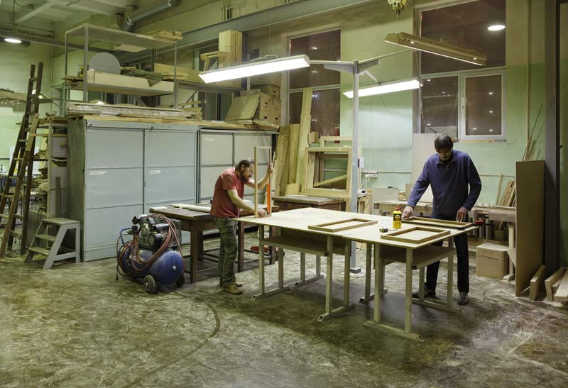
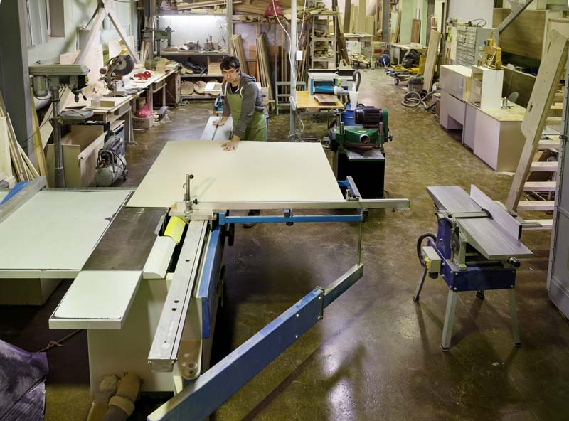

Продолжаем цитировать материалы интернет-журнала о дизайне и архитектуре BERLOGOS. На этот раз это интервью с основателем открытой столярной мастерской «Дар труда» Олегом Фараджуллаевым и с администратором мастерской, дизайнером Романом Бондаревым.

**– В мире появляется все больше столярных мастерских, работающих по принципу коворкинга. Я правильно понимаю, что «Дар труда» – одна из первых таких мастерских в России?**

Олег Фараджуллаев (О.Ф.):

– По сути да. Тогда она называлась «Двор Сотрудней». Мы открылись три года назад и были если не первые, то одни из первых.

Сначала нас было двое: я и Константин Скворцов. Мы с ним учились в одном вузе: он – на факультете астрофизики, я – математики. Наша юность пришлась на 90-е годы, когда по специальности никто не работал, поэтому мы оба перешли в издательский бизнес. Я занимал менеджерские позиции, а Костя работал дизайнером в крупном сетевом агентстве Saatchi&Saatchi. Потом он уволился и пошел работать с деревом. Это было уже лет 10 назад. К тому моменту, как мы стали много общаться и задумали открывать свою мастерскую, он уже очень много чего умел. Я же все это время занимался бизнесом и в работе с деревом был новичком.

****

**– Как вы пришли к формату коворкинга?**

О.Ф.:

– У Кости зрела идея такой мастерской еще с 2005 года. Он думал: «Почему нет такого места, куда можно прийти и поработать руками?» В 2012 мы решились на эту авантюру.

_Олег Фараджуллаев_

Первое помещение у нас было в подвале у метро «Чистые пруды». Представьте себе сырой, холодный, плохо проветриваемый подвал с дырой в кирпичной стене вместо двери. Первые три дня мы были заняты проходом: с отбойным молотком выдалбливали основу под дверь, при том, что стены были метровые в толщину. Через три дня нам предложили другое место на «Чистых прудах», более цивилизованное – бывшую столярную мастерскую в огромном подвале на 200 метров. Мы сняли из них 30 и начали работать. Через 3-5 месяцев мы занимали уже 90 метров.

****

**– Расскажите, какие инвестиции у вас были, какое конкретное оборудование вы закупили в первую очередь?**

О.Ф.:

– У меня и у Кости были личные запасы – около полумиллиона рублей. Он на момент открытия уже был опытным мастером и смог решить, что закупать. В основном, это был ручной инструмент: шуруповерты, отвертки, электролобзики, а также циркулярная пила, сверлильный станок и ленточная пила.

На начальном этапе можно четко представлять, сколько инвестировать в технику, а вот сколько инвестировать в аренду – можно только догадываться. Неизвестно, сколько людей придет арендовать рабочие места вначале, сколько их будет через месяц и через год. Нам очень помогло сарафанное радио. Без поддержки друзей и знакомых было бы очень сложно.

В первую очередь нужно задать себе вопрос: «Зачем это все нужно?» На одном праздном интересе долго не продержишься. Хотя у меня именно так и было. Но спустя месяц я понял, что эта идея выражается в конкретных цифрах и в ощутимых вложениях: денег, времени, себя.

**– Формат коворкинга появился с самого начала?**

О.Ф.:

– Место исходно открывалось как коворкинг, хотя слова такого не было. Мы назывались общественная мастерская. Как перебрались на новое место, в цеха НИИ ДАР на Преображенке, решили называться производственным коворкингом. Сути это не меняет.

Все работают над разного уровня проектами. Кто-то только учится, а кто-то уже мастерит гитары или шкафы. Есть люди с образованием, есть – без. Общее между резидентами то, что все имеют свои идеи, и приходят они к нам за тем, как их реализовать: за технологией.

Общая мастерская – как промежуточная точка между наемной работой и своей мастерской, стартовая площадка.

****

**– Итак, какие форматы работы у вашей мастерской?**

О.Ф.:

– Коворкинг, производство и образовательные программы. Планируем развиваться в сторону выездных мероприятий и фестивалей. Большая часть людей вообще не знают, что бывают такие места, как «Дар труда».

**– В каком виде сейчас производство?**

Роман Бондарев (Р.Б.):

– Производство тесно связано с деятельностью коворкинга. Заказы, как правило, выполняют те же люди, что арендуют у нас рабочие места. Если мы видим, что человек качественно выполняет свои проекты, если у него интересные идеи, которые он в состоянии грамотно реализовать, мы начинаем предлагать ему заказы мастерской, и он получает статус мастера.

Получается так, что наш резидент с одной стороны наш клиент, а с другой – он наш подрядчик.

**– Кто к вам обращается – напрямую заказчики или дизайнеры?**

Р.Б.:

– Обращаются преимущественно сами заказчики – как организации, так и просто люди. Также мы работаем с несколькими дизайнерами интерьеров, которые периодически подкидывают нам интересные заказы. Собственного дизайн-отдела у нас пока что нет, этот аспект вообще проработан слабо – большинство мастеров, к сожалению, далеки от понимания дизайн-процессов, и эстетическая составляющая у многих работает на уровне вкусовщины. Поэтому иногда приходится выкручиваться, ведь, если у заказчика нет четкого видения концепции, а мы не сможем ему ее предложить, то в итоге может получиться совсем не то, что ему хотелось изначально.

О.Ф.:

– Наша функция при работе с очередным проектом – в первую очередь сугубо инженерная. Многие современные дизайнеры, зачастую разрабатывают «голые» концепты, формы, слабо привязанные к реальности. Нам же приходится делать непродуманные узловые детали максимально похожими на начальный чертеж.

Например, как-то нам поступил заказ от команды трех молодых архитекторов. Они сделали для парка Горького проект, который должен был стать их презентацией в Вене: 4 деревянных бокса. Самый большой – 7 на 4 метра – до сих пор стоит в Парке Горького на катке в качестве сувенирного ларька.

Нам нужно было разработать инженерные решения. Главная сложность заключалась в том, что это были мобильные конструкции: они должны были быть сборно-разборные, как конструктор. Эта функция накладывает гигантское ограничение в проектировании.

Р.Б.:

– При решении таких задач часто помогает прототипирование – создание масштабных моделей. И многие к нам приходят именно, чтобы сделать прототип. Помимо столярного инструментария, для этого сейчас у нас есть небольшой лазерный станок, который вырезает детали и позволяет, например, сделать макет.

О.Ф.:

– Важно понимать, что такой прототип люди делают самостоятельно. Если человек обращается к нам с заказом прототипа, мы выставляем за это немаленькую сумму, потому что любое новое изделие нужно тестировать и переделывать несколько раз. Мы можем посоветовать что-то нашим резидентам, но считаем, что все же лучше и выгоднее потратить время и силы и сделать прототип самому. Стоимость работы самого лазерного станка намного ниже, чем стоимость разработки.

**– Когда речь заходит о большом тираже – это уже не к вам?**

О.Ф.:

– Если человек планирует запуск своей линейки – значит, он растет. Как ни печально для нас, но самый хороший результат для нашего резидента – это когда он уходит от нас, потому что здесь ему не хватает места и человек дозрел до своей мастерской. На этом мы, можно считать, свою миссию выполнили.

**– Дерево – исконно русский материал. Для вас и для тех, кто приходит к вам, дерево – это поиск идентичности или удобства в работе?**

О.Ф.:

– Дерево – совершенно неудобный, непослушный материал. Оно постоянно меняется, живет своей жизнью. Стоит только измениться влажности – оно уже все в волнах. Его нужно правильно сушить, обрабатывать, особенно массив.

Фанера в этом смысле меньше подвержена деформации за счет нескольких тонких слоев, которые уравновешивают форму. А вот дуб выровнять очень тяжело.

Р.Б.:

– Дерево действительно живой материал: оно пахнет, при работе его ощущаешь. А люди сейчас тянутся к истокам, ко всему натуральному и экологичному.

Существует такое наблюдение, что у нас часто из цельного дерева делают заборы, настилы на пешеходных переходах и евро-поддоны, а мебель – из ДСП, МДФ и прочего клееного мусора.

**– Как вы закупаете материалы?**

О.Ф.:

– Мы закупаем только фанеру, потому что она – самый ходовой товар. Остальное мастера заказывают и привозят сами.

Р.Б.:

– Бывает, люди везут издалека старые доски, мореные или выеденные насекомыми. В Москве на складах таких нет, ведь классика состаренного дерева – это части старых лодок. Мореные доски привозят из теплых южных стран, где половина населения имеет свои лодки. Старые суденышки разбирают и продают по частям. В России такого добра практически нет, но в деревнях еще можно достать амбарные доски: элементы старых сараев, заборов или домов. Сейчас такой материал в тренде – очень многие делают из него различные интерьерные изделия.

О.Ф.:

– Мы закупаем покрытие. Раньше это были лак и морилка. Теперь все преимущественно используют органические масла и воск. Для них не нужна покрасочная камера: масла не такие едкие и пахучие.

****

**– Какое дерево подходит для производства мебели лучше всего?**

О.Ф.:

– В продаже чаще всего можно встретить хвойные деревья, например, сосну. Но сосна – материал дешевый. Она очень мягкая и ворсится, поэтому ее для мебели использовать не стоит. Гораздо лучше подходят ясень или клен – гладкие и упругие, как керамика, деревья.

Р.Б.:

– В России растет очень мало ценных пород деревьев. Например, у нас мог бы разводиться орех или клен, но этим никто всерьез не занимается.

Дуб растет, но в основном сам по себе. А вот, например, в Америке специально для столярного назначения существуют целые плантации дорогого дерева! Ведь те же яблони и груши можно выращивать по-разному – если в первые годы не собирать урожай, то они перестают давать плоды, и все соки идут в рост древесины. У нас же плодовые разводят исключительно в садах – конечно, само по себе это не плохо, но такое дерево в столярке не работает. Селекцией занимаются планомерно, что в России пока не выгодно. Поэтому мы либо поливаем химией сады, либо просто рубим сосновый лес и продаём его в Финляндию и Китай.

**– Роман, имеет ли значение дизайнерский опыт в столярном мастерстве?**

Р.Б.:

Надо понимать, что дизайнер только создает образ, его контакт с объектом – чисто виртуальный, в отличие от свободного ремесленника – столяра, гончара или стекольщика.

Дизайнер, если работает в какой-то компании или бюро, часто просто отрисовывает концепт и не задумывается, что с ним будет дальше. Он может увидеть результат где-то через год-полтора, может не увидеть никогда.

В своей мастерской дизайнер – первоиспытатель. Делая стул, он разрабатывает прототип и сразу его тестирует, насколько он удобный. Как в старые времена.

Раньше не было ни дизайна, ни ПТУ. Мастера сидели, делали что-то в своих лавочках, там же и продавали. Знания, профессия, лавочка – все передавалось по наследству от отца к сыну. Потом появилось конвейерное производство, большие фабрики, стали появляться компании, которые брали в штат умельцев. Сейчас век индустриализации прошел. Идет движение в обратную сторону: к малому бизнесу, к возрождению маленьких лавочек и мастерских.

**– Как вы считаете, старинные столярные знания еще существуют?**

Р.Б.:

– Знания ушли, о многом мы даже не подозреваем. Сейчас в основном столяров где обучают? В ПТУ. Поэтому более образованными считаются не столяры, а реставраторы.

В ПТУ образование сформировано под систему, в которой у всех есть четкая схема работы. Между дизайнерами и мастерами  постоянно происходят конфликты, потому что дизайнеры по-своему видят концепт, а мастер смотрит на проект, думает: «Так нельзя делать», «Так не делают. Сделаю-ка я, как надо делать, по-грамотному». Часто даже не говорят ничего, просто переделывают концепт под нормы ПТУ образования. Мастера старой советской закалки – они вообще не любят разговаривать. Во многом эта узкая специализация не дает взглянуть шире на вещи. Начинающие дизайнеры потом долго находятся в шоке от такого опыта взаимодействия: коммуникации ноль.

У нас таких конфликтов с дизайнером-заказчиком не возникает, мы готовы обсуждать, идти на коммуникацию. Можем объяснить, как лучше сделать, предложить альтернативы, компромиссы. У нас более свободный, творческий процесс, мы готовы пробовать что-то новое и находить решение.

О.Ф.:

– Это вопрос формализации процесса. Мастер, когда он ведет идею от начала до конца, видит всю картину и в силах сохранить эстетику. Когда же общение формализовано, оно с одной стороны менее конфликтно, с другой – менее инициативно. Есть большая технологическая цепочка, в рамках которой любое звено очень важно, но всей картинкой, по сути, не обладает никто. Каждый отвечает лишь за свой участок работы.

В крупных компаниях в такой цепочке, например, есть один человек – специалист по подбору материалов. Он выбирает, из какого дерева будут сделаны элементы конструкции, следит за закупкой материала. У него нет полной картины, он может исказить начальную идею дизайнера. С другой стороны, он не продумывает узловые соединения и может даже не знать, чем и как изделие покрасят, а значит, далек от конечного результата. Чем крупнее компания, тем больше посредников, тем длиннее цепочка и больше изменений, коверкающих начальную мысль.

**– С какими трудностями сталкиваются дизайнеры при работе в открытой мастерской?**

Р.Б.:

– Многие не умеют организовывать свой труд. Люди привыкли приходить на работу, получать задачу и выполнять ее, ничего, по сути, не решая. Когда ты ни от кого не зависишь – приходится самому все делать. Никакой регулярной зарплаты, отпускных, больничных тут нет.

Вторая проблема – нужно быть и мастером, и инженером, и дизайнером, и рекламщиком. Тут помогает система коворкинга: люди сами решают, кто за что отвечает: кто заказы приносит, кто – рисует чертежи, кто мастерит.

**– В Китае производить дешевле всего. Считаете ли вы, что рабочая сила должна быть дешевой?**

О.Ф.:

– Хороший вопрос! Согласитесь, приятнее прийти в лавку к мастеру и купить у него то, что было сделано им же буквально вчера, но на авторскую мебель нужны деньги, а в мире есть тенденция на быструю смену вещей. А у нас сейчас в культуре заложено экономить, потому что необходимо постоянно покупать все новые и новые предметы, а денег на все не хватает.

Экономить – значит использовать дешевые материалы и рабочую силу. Поэтому мы покупаем мебель из ДСП, а не из массива. Поэтому это мебель с фабрики, а не из мастерской. Экономить принято и на доставке, и на своем времени.

Р.Б.:

– Сейчас люди, в том числе дизайнеры, начали понимать, что дешево – значит некачественно. Те, кто работает с дешевым производством, сталкиваются с тем, что приходится все досконально проверять. Если самому не приехать и не проконтролировать – может в итоге дороже выйти.

В стране не так давно стал просыпаться здоровый патриотизм. В 90-е годы никто в здравом уме не поддерживал то, что производилось у нас – всем хотелось иностранного. Сейчас этот стереотип ломается, и фраза «Поддержи отечественного производителя» наконец-то приобретает правильный окрас.

Кризис отечественному производству только на руку. Меня уже в течение года спрашивают «Что, наверное, пропали заказы?» А ко мне наоборот начали приходить богатые люди, которые раньше покупали итальянскую мебель, а теперь она им не по карману. Они уже начинают изучать наш рынок, понимают, что не все так плохо и можно купить хорошую мебель в два раза дешевле.

Текст: Кушаковская Мария

Оригинал статьи: [BERLOGOS](http://www.berlogos.ru/interview/oleg-faradzhullaev-obshaya-masterskaya-promezhutochnaya-tochka-mezhdu-naemnoj-rabotoj-i-svoej-masterskoj-startovaya-ploshadka/)
